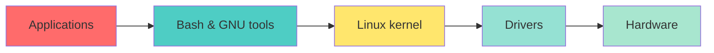

<a name="linux-context-compact" id="linux-context-compact"></a>

# 🐧 Why GNU/Linux still matters
## Compact context before the main modules

You are not here to memorize dates - but **fifty years of design choices** explain why the shell, permissions, and `systemd` behave the way they do.

---

# The story behind your Linux server

This section summarizes **what you actually use** when you SSH into a Linux box - not a history exam, but the **why** behind the terminal, permissions, and `systemd`.

---

# 1. Unix (1969)

Researchers at **Bell Labs** create Unix.

At the time, operating systems are **huge and complicated**. Unix brings something different:

- **Multi-user** - several people on the same machine
- **Multitasking** - several programs at once
- **Files, processes, permissions** - the model you still use
- **Small commands you chain together**

```bash
cat users.txt | grep admin | sort
```

---

# That philosophy still runs today

Pipes, redirection, and tiny tools doing one job well - **every shell session** in this course builds on that Unix idea.

---

# 2. GNU (1983)

**The problem:** Unix was **not free** - companies owned it.

Richard Stallman launches the **GNU project** to recreate a **free** Unix.

GNU ships almost everything you type in a terminal:

`bash` · `ls` · `cp` · `mv` · `grep` · `find` · `tar` · `gcc`

**Most of what you type in a shell** comes from the **GNU/Linux userland** (GNU tools, **uutils** on Ubuntu 26.04+, findutils, util-linux…) - but that userland still had **no working kernel** until Linux arrived.

---

# 3. Linux (1991)

**Linus Torvalds** creates Linux.

Linux is **not** a full operating system - it is **only the kernel**.

The kernel owns:

- **CPU** scheduling
- **RAM** management
- **Disk** I/O
- **Network** stack
- **Hardware drivers**

```bash
cat file.txt
```

---

# What the kernel does for `cat`

When you run `cat file.txt`, the kernel:

1. **Reads** the file from disk
2. **Loads** the data into RAM
3. **Returns** it to the `cat` program

Userland asks; the kernel talks to hardware.

---

# 4. GNU + Linux = GNU/Linux

| Piece | What it provides |
|-------|------------------|
| **GNU/Linux userland** | `bash`, `grep`, `find`, `cp`, `mv`, `gcc` - GNU, uutils, findutils… |
| **Linux** | Memory, processes, network, drivers, CPU scheduling - the kernel |

**GNU/Linux** = GNU tools **+** Linux kernel.

That is why some people say **GNU/Linux**, not just **Linux**.

---

# 5. POSIX userland - the important phrase

**POSIX** = the Unix standard.

When you run:

`ls` · `cp` · `mv` · `grep` · `find` · `chmod`

…you use **POSIX-compatible tools**.

So **Ubuntu**, **Debian**, **Rocky**, **Alma**, **RHEL**, **SUSE** behave **almost the same** at the shell - same DNA, different packaging.

---

# Monolithic kernel - one big program in memory

The Linux kernel holds **directly** (one address space):

- Memory management
- Network stack
- File systems (VFS)
- Device drivers
- CPU scheduler



---

# Everything in this course rests on two bricks

When you run:

```bash
docker run nginx
kubectl get pods
systemctl restart nginx
```

---

# Under the hood - always the same stack

**GNU/POSIX commands** → **Linux kernel** → **drivers** → **CPU / RAM / disk / network**

**Takeaway:** this course uses **POSIX commands** + a **Linux kernel** that talks to hardware through drivers.

Next: **where files live on disk** - the root directory tree.

---

# From the story to this course

Each beat of the Unix → GNU → Linux arc shows up **somewhere in this course**:

| Idea from the story | Where you practice it |
|---------------------|------------------------|
| **Multi-user** (1969) | Users, groups, `sudo` - Module 1 |
| **GNU tools in the shell** | Every lab: `grep`, `find`, `chmod`, `tar`… |
| **systemd & services** | Units, targets, `journalctl` - Day 1 |
| **Kernel, VFS, permissions** | Files, storage, AppArmor / SELinux |
| **Network stack & drivers** | IP, firewall, LVM - Day 2 |
| **Services on top of the OS** | OpenLDAP, SNMP - Day 3 |

---

# Linux filesystem hierarchy (FHS) 🗂️ (1/4)

**All paths branch from** `🌳 /` - **system directories** (commands & boot)

<div class="text-sm">

| Directory | What it holds |
|-----------|---------------|
| `/bin` | Essential commands - `ls`, `cp`, `cat`… |
| `/boot` | Boot loader files - kernel, grub |
| `/dev` | Device files - `sda`, `tty`, `null` |
| `/etc` | System configuration - `passwd`, `fstab`, nginx |

</div>

---

# Linux filesystem hierarchy (FHS) 🗂️ (2/4)

**System directories** - libraries, admin tools & virtual FS

<div class="text-sm">

| Directory | What it holds |
|-----------|---------------|
| `/lib` | Shared libraries - `.so` files for `/bin` |
| `/sbin` | Admin binaries - `fdisk`, `mkfs`, `reboot` |
| `/proc` | Process info (virtual) - `cpuinfo`, `meminfo` |
| `/tmp` | Temporary files - cleared on reboot |

</div>

---

# Linux filesystem hierarchy (FHS) 🗂️ (3/4)

**User and data directories** - homes, programs, variable data

<div class="text-sm">

| Directory | What it holds |
|-----------|---------------|
| `/home` | User home directories - `/home/alice`, `/home/bob` |
| `/usr` | User programs + libraries - `bin`, `lib`, `share`, `local` |
| `/var` | Variable data - logs, mail, spool, `www` |
| `/opt` | Optional / third-party - custom installs |

</div>

---

# Linux filesystem hierarchy (FHS) 🗂️ (4/4)

**Data, mounts & runtime**

<div class="text-sm">

| Directory | What it holds |
|-----------|---------------|
| `/srv` | Service data - web, FTP content |
| `/mnt` | Temporary mounts - admin manual mounts |
| `/media` | Removable media - USB, CD-ROM |
| `/run` | Runtime data - PIDs, sockets (tmpfs) |

</div>

**Rule of thumb:** config → `/etc` · logs → `/var/log` · your files → `/home` · programs → `/usr/bin`

---

# Ready for the hands-on path 🎯

Let's begin with **base commands**, then users, permissions, and the rest of the main modules.
