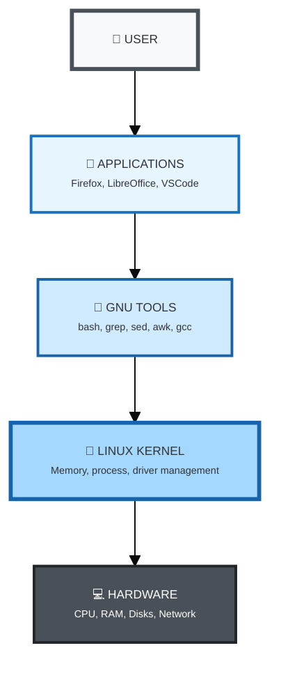
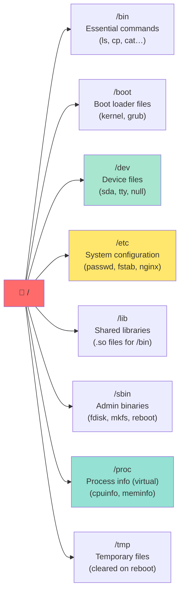
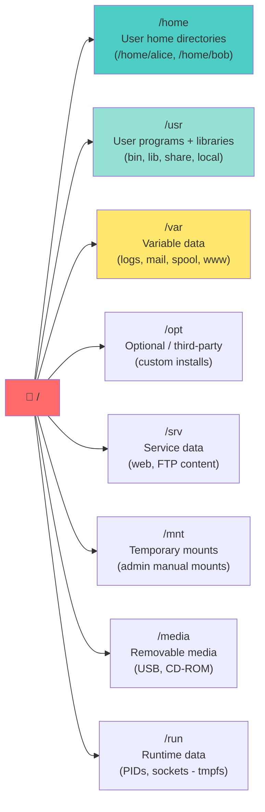

<a name="introduction-unix-linux" id="introduction-unix-linux"></a>

# 🧱 Module 1
## Introduction and Unix/Linux refresher

### Discovering the Unix/Linux ecosystem

---

# What is Unix? 🖥️

Unix is an operating system born in 1969 at Bell Labs (AT&T).

**Main creators:**
- **Ken Thompson** and **Dennis Ritchie**
- Initially developed in assembly, then rewritten in C (1973)

**Revolutionary features:**
- Multi-user and multitasking
- Portability thanks to the C language
- Modular, simple architecture

---

# Analogy: Unix is like... 🏗️

Think of Unix as **the foundations of a house**:

- **Solid**: proven for over 50 years
- **Universal**: used in almost all modern builds
- **Invisible**: you don’t see them, but everything rests on them

Today, Unix and its descendants are everywhere:
- Web servers (Google, Facebook, Amazon...)
- Smartphones (Android, iOS)
- Supercomputers
- Connected devices

---

# From Unix to Linux 🐧

**The problem in the 80s–90s:**
- Unix was proprietary and expensive
- Universities wanted a free system for teaching

**The GNU revolution (1983):**
- Richard Stallman starts the GNU project (GNU’s Not Unix)
- Goal: create a free Unix-compatible OS
- Development of tools: bash shell, gcc compiler, editors...

---

# The birth of Linux (1991) 🎂

**Linus Torvalds**, a 21-year-old Finnish student:

> "I'm doing a (free) operating system (just a hobby, won't be big and professional like gnu)"

**The Linux kernel:**
- Initially developed for his personal computer
- Combined with GNU tools → GNU/Linux
- Released under the GPL (free and open source)

---

<div class="grid grid-cols-2 gap-8">

<div class="-mt-10">

#### Layered architecture

<small>



</small>

</div>

<div>

#### The two essential parts

<small>

**🔧 GNU (GNU project)**
- Command-line tools
- Compilers and libraries
- Shell (bash)
- System utilities

**🐧 Linux (kernel)**
- Interface with hardware
- Memory management
- Process scheduling
- Device drivers

**= GNU/Linux** 🎯
A complete, working operating system

</small>

</div>

</div>

---

# Linux distributions 📦

A **distribution** = Linux + GNU tools + software + package manager

**Main families:**

**Debian/Ubuntu** (apt)
- Stable, large community
- Great for beginners and servers
- Ubuntu, Debian, Linux Mint, Pop!_OS

**Red Hat/Fedora** (dnf/yum)
- Enterprise, certifications
- RHEL, CentOS, AlmaLinux, Rocky Linux, Fedora

---

# Linux distributions (continued) 📦

**Arch** (pacman)
- Rolling release, minimal
- For advanced users
- Arch Linux, Manjaro, EndeavourOS

**SUSE** (zypper)
- European enterprise
- openSUSE, SLES

**Others**
- Gentoo (source compilation)
- Alpine (ultra-light, containers)
- NixOS (reproducibility)

---

# Why so many distributions? 🤔

**Analogy: restaurants** 🍽️

They all serve food (Linux), but:
- **Fast food** (Ubuntu): quick, easy, popular
- **Fine dining** (Arch): customizable, for connoisseurs
- **Company canteen** (RHEL): reliable, professional support
- **Food truck** (Alpine): light, mobile, efficient

**Principle:** the core (Linux kernel) is the same; only the packaging changes!

---

# Unix philosophy 🧘

**"Everything is a file"**
- Devices are files (`/dev/sda`, `/dev/tty`)
- Configuration = text files
- Processes = files under `/proc`

**KISS (Keep It Simple, Stupid)**
- Simple programs that do one thing well
- Combine tools with pipes `|`

---

# Examples of Unix philosophy 🔧

**One program = one job**

```bash
# Bad: one program that does everything
super_tool --search --sort --count file.txt

# Unix way: combine simple tools
cat file.txt | grep "pattern" | sort | wc -l
```

**Advantage:** flexibility and reusability

---

# Architecture of a Linux system 🏛️

<small>

**4 main layers:**

1. **Hardware**
   - CPU, RAM, disks, network cards

2. **Kernel**
   - Hardware management
   - Memory and process management
   - Device drivers

3. **Shell**
   - Interface between the user and the kernel
   - Interprets commands

4. **User applications**
   - Programs you use

</small>

---

# The Linux kernel in detail 🎯

**Main roles:**

**Process management**
- Create, schedule, terminate
- Inter-process communication (IPC)

**Memory management**
- Allocate/free memory
- Virtual memory (swap)
- Disk cache

---

# The Linux kernel in detail (continued) 🎯

**File system management**
- VFS (Virtual File System)
- Support for ext4, xfs, btrfs, NFS, etc.

**Device management**
- Device drivers
- Access to devices via `/dev`

**Network management**
- TCP/IP stack
- Network interfaces
- Firewall (netfilter/iptables)

---

# The shell: your interface to the system 🐚

**What is a shell?**
- A program that interprets your commands
- The interface between you and the kernel

**Popular shells:**
- **bash** (Bourne Again Shell): the most common
- **zsh** (Z Shell): modern, plugins
- **fish** (Friendly Interactive Shell): user-friendly
- **sh** (Bourne Shell): the original historical shell

---

# The shell: analogy 💬

The shell is like an **interpreter at an international meeting**:

- You speak in "human language" (commands)
- The interpreter translates to the kernel in "machine language"
- The kernel runs and returns a response
- The interpreter shows you the result

**Example:**

```bash
$ ls -la
# You: "show me the files"
# Shell: translates to system calls
# Kernel: lists the files
# Shell: prints formatted output
```

---

# The Unix/Linux file system 📁

**Unified hierarchy:**
- Everything starts at the root `/`
- No drive letters (C:, D:) like Windows
- Disks are "mounted" in the tree

**Principle:** one tree, one entry point

---

# Linux filesystem hierarchy (FHS) 🗂️ (1/2)

### System directories - what they hold

<div class="text-xs">



</div>

---

# Linux filesystem hierarchy (FHS) 🗂️ (2/2)

### User and data directories

<div class="text-xs">



</div>

**Rule of thumb:** config → `/etc` · logs → `/var/log` · your files → `/home` · programs → `/usr/bin`

---

# Refresher: essential commands (1/4) 🔧

**Navigation:**

```bash
pwd                  # Print working directory
cd /path             # Change directory
cd ..                # Go up one level
cd ~                 # Go to your home
cd -                 # Previous directory
```

---

# Refresher: essential commands (2/4) 🔧

**List and display:**

```bash
ls                  # List files
ls -l               # Detailed list
ls -la              # Include hidden files
ls -lh              # Human-readable sizes (K, M, G)
cat file.txt        # Show contents
less file.txt       # Page through a file (q to quit)
head file.txt       # First 10 lines
tail file.txt       # Last 10 lines
tail -f file.log    # Follow a file in real time
```

---

# Refresher: essential commands (3/4) 🔧

**Files and directories:**

```bash
cp source dest      # Copy
cp -r dir1 dir2     # Copy a directory
mv source dest      # Move/rename
rm file             # Remove a file
rm -r folder        # Remove a directory
rm -rf folder       # Force (WARNING: dangerous!)
mkdir new_dir       # Create a directory
mkdir -p a/b/c      # Create a tree
touch file.txt      # Create an empty file
```

---

# Refresher: essential commands (4/4) 🔧

**Search and filters:**

```bash
find /path -name "*.txt"        # Find files
find /home -type f -size +100M  # Files > 100 MB
grep "pattern" file.txt         # Search in a file
grep -r "pattern" /dir          # Recursive search
grep -i "pattern" file          # Case-insensitive
which command                    # Locate an executable
whereis command                  # Binary, source, man
```

---

# Pipes: combining commands 🔗

**The pipe `|`:** connects one command’s output to another’s input

```bash
# Count lines in a file
cat file.txt | wc -l

# Find a process
ps aux | grep "nginx"

# 10 largest files in the directory
ls -lh | sort -k5 -h | tail -10

# Extract and sort data
cat /etc/passwd | cut -d: -f1 | sort
```

**Analogy:** like an assembly line-each tool does its part.

---

# Redirections: stdin/stdout/stderr 📤📥

**Redirect output:**

```bash
ls -la > list.txt           # Overwrite file
ls -la >> list.txt          # Append
command 2> errors.txt       # Redirect stderr
command &> all.txt          # Redirect both stdout and stderr
command > /dev/null 2>&1    # Discard all output
```

---

# Redirections: stdin/stdout/stderr (continued) 📤📥

**Redirect input:**

```bash
sort < list.txt             # Read from a file
wc -l < file.txt            # Count lines
```

---

# Permissions: basics 🔒

**Each file has:**
- An **owner**
- A **group**
- **Permissions** for: owner, group, others

**Permission types:**
- `r` (read)
- `w` (write)
- `x` (execute)

```bash
-rw-r--r--  1 alice  users  1024 Jan 10 10:30 file.txt
drwxr-xr-x  2 alice  users  4096 Jan 10 10:31 folder/
```

---

# Changing permissions 🔐

```bash
chmod 755 script.sh          # rwxr-xr-x
chmod u+x script.sh          # Add execute for user
chmod g-w file.txt           # Remove write for group
chmod o-r file.txt           # Remove read for others

chown alice:users file       # Change owner and group
chown alice file             # Change owner only
chgrp users file             # Change group only
```

---

# Processes: basics 🏃

**What is a process?**
- A running program
- Each process has a unique PID (Process ID)

```bash
ps                           # Your session’s processes
ps aux                       # All processes
top                          # Live view
htop                         # Improved (install if needed)
pgrep nginx                  # Find PID of a process
```

---

# Managing processes 🎮

```bash
command &                    # Run in background
jobs                         # List background jobs
fg                           # Bring to foreground
bg                           # Send to background
Ctrl+Z                       # Suspend
Ctrl+C                       # Interrupt

kill 1234                    # Terminate PID 1234
kill -9 1234                 # Force kill (SIGKILL)
killall nginx                # Kill all nginx
pkill -f "name_pattern"      # Kill by name/pattern
```

---

# Text editors: nano/vim 📝

**nano:** simple and intuitive

```bash
nano file.txt
# Ctrl+O: save
# Ctrl+X: quit
# Ctrl+K: cut line
# Ctrl+U: paste
```

**vim:** powerful but a learning curve

```bash
vim file.txt
# i: insert mode
# Esc: command mode
# :w: save
# :q: quit
# :wq: save and quit
# :q!: quit without saving
```

---

# Environment variables 🌍

**Important system variables:**

```bash
echo $HOME                   # Home directory
echo $USER                   # Username
echo $PATH                   # Executable search paths
echo $SHELL                  # Default shell
echo $PWD                    # Current directory

export MY_VAR="value"        # Set a variable
env                          # List all variables
printenv                     # Same
```

---

# PATH: where are commands? 🔍

**PATH:** list of directories the shell searches for commands

```bash
echo $PATH
# Typical result:
# /usr/local/bin:/usr/bin:/bin:/usr/sbin:/sbin

# Add a directory to PATH
export PATH=$PATH:/my/new/path

# Make permanent (~/.bashrc or ~/.zshrc)
echo 'export PATH=$PATH:/my/new/path' >> ~/.bashrc
source ~/.bashrc
```

---

# Shell configuration files 🔧

**Why two different files?**

| File | When read? | What goes there? |
|---------|-------------------|----------------------|
| `~/.bash_profile`<br>`~/.zprofile` | On **login** (SSH, login) | Environment variables (PATH) |
| `~/.bashrc`<br>`~/.zshrc` | **Each new terminal** | Aliases, functions, prompt |

**💡 In short:**
- `.bash_profile` = once when you log in
- `.bashrc` = every time you open a terminal

---

# Shell configuration: examples 🛠️

**In `~/.bash_profile` (or `~/.zprofile` for Zsh):**

```bash
# Environment variables
export PATH=$PATH:~/bin
export EDITOR=vim
```

**In `~/.bashrc` (or `~/.zshrc` for Zsh):**

```bash
# Aliases
alias ll='ls -lah'
alias update='sudo apt update && sudo apt upgrade'

# Custom function
mkcd() {
    mkdir -p "$1" && cd "$1"
}
```

**Apply changes:**

```bash
source ~/.bashrc     # Bash
source ~/.zshrc      # Zsh
```

---

# Help and documentation 📚

**Getting help:**

```bash
man ls                       # Manual for ls
man -k "keyword"             # Search man pages
info ls                      # Info pages (alternative to man)
ls --help                    # Quick help
whatis ls                    # Short description
apropos "keyword"            # Search by keyword
```

**Manual sections:**
- Section 1: User commands
- Section 5: File formats
- Section 8: Administration commands

---

# Bash keyboard shortcuts ⌨️

**Navigation:**

```
Ctrl+A          # Start of line
Ctrl+E          # End of line
Ctrl+U          # Delete to start
Ctrl+K          # Delete to end
Ctrl+W          # Delete previous word
Ctrl+R          # Search history
Ctrl+L          # Clear screen (like clear)
```

---

# Command history 📜

```bash
history                      # Show history
history | grep "ssh"         # Search history
!123                         # Run command #123
!!                           # Repeat last command
!$                           # Last arg of previous command
sudo !!                      # Re-run last with sudo

# Interactive search
Ctrl+R                       # Then type letters
```

---

# Aliases: custom shortcuts 🔖

```bash
# Temporary alias
alias ll='ls -lah'
alias ..='cd ..'
alias ...='cd ../..'
alias update='sudo apt update && sudo apt upgrade'

# Make permanent (~/.bashrc)
echo "alias ll='ls -lah'" >> ~/.bashrc
source ~/.bashrc

# List aliases
alias

# Remove alias
unalias ll
```

---

# Beginner tips 💡

**1. Read error messages**
- They often contain the fix

**2. Use tab completion**
- Saves time and avoids typos

**3. Be careful with `rm -rf`**
- No trash from the shell!
- Always double-check before deleting

**4. Back up your data**
- Before any major change

---

# Beginner tips (continued) 💡

**5. Practice in a safe environment**
- Virtual machine or Docker container

**6. Take notes**
- Build your own cheat sheet

**7. Practice regularly**
- The command line becomes natural with use

**8. Read the docs**
- `man` is your best friend

---

# Going further 🚀

**Useful resources:**

- **Linux Journey**: interactive tutorials
- **OverTheWire**: games to learn Linux
- **ExplainShell**: explains shell commands
- **TLDR pages**: simplified alternatives to man

**Communities:**
- Ubuntu/Debian/Arch forums
- Stack Overflow
- Reddit: r/linux, r/linuxquestions
- IRC: #linux on libera.chat

---

# Module 1 recap ✅

**What you learned:**

<small>

- ✅ Unix history and birth of Linux
- ✅ Unix philosophy ("everything is a file", modularity)
- ✅ Linux system architecture (kernel, shell, apps)
- ✅ File system layout
- ✅ Essential basic commands
- ✅ Pipes and redirections
- ✅ Basic permissions
- ✅ Processes and how to manage them
- ✅ Environment variables
- ✅ Help and documentation

</small>

---

# Work environment 🐳

**For the rest, you need a Linux terminal!**

**Simple option: Docker** (no heavy VM)

1. **Install Docker Desktop:**
   - Windows: https://docs.docker.com/desktop/install/windows-install/
   - Mac: https://docs.docker.com/desktop/install/mac-install/
   - Linux: https://docs.docker.com/desktop/install/linux-install/

2. **Create a `docker-compose.yml` file:**

```yaml
services:
  ubuntu:
    image: ubuntu:24.04
    container_name: unix-training
    stdin_open: true
    tty: true
    command: /bin/bash
```

---

# Start the environment 🚀

**Three commands, that’s it:**

```bash
# Start Ubuntu container
docker-compose up -d

# Open a Linux shell
docker exec -it unix-training bash

# Exit: Ctrl+D or
exit
```

**Stop/remove:**

```bash
docker-compose down       # Stop
docker-compose down -v    # Stop and remove everything
```

**💡 That’s it!** We’ll spend ~90% of the time in the terminal-no need for a full graphical VM.

---

# Next step 🎯

**Module 2: Essential basic commands**

- Navigating the file system
- Files and directories
- Search with find and grep
- Viewing files
- Advanced redirections and pipes

---
layout: default
---

# Questions? 🤔

Ask now if you have questions!

Post your questions on <ExternalLink href="https://questions.andromed.fr">questions.andromed.fr</ExternalLink> (access code **29062026**) so I can centralize and answer them.

The next module goes deeper into users and permissions.
