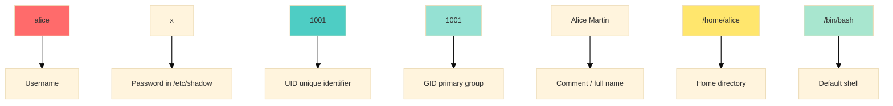
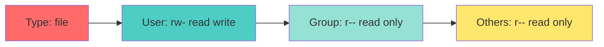

<a name="gestion-systeme-utilisateurs" id="gestion-systeme-utilisateurs"></a>

# 👥 Module 1 - Users, groups & sudo

---

# Why manage users? 👥

**Unix/Linux is multi-user by design**

Picture an apartment building:
- Each tenant (user) has a key (password)
- Each has their own apartment (home directory)
- Some areas are shared (shared folders)
- The janitor (root) has access to everything

**Goals of this area:**
- Security: who can do what?
- Separate data per user
- Organization: work groups

---

# The root user: super-admin 👑

**root**: the all-powerful user (UID 0)

**Powers:**
- Access to all files
- Change any configuration
- Install software
- Manage users
- Reboot or shut down the system

**⚠️ With great power comes great responsibility**

```bash
# Danger! Can destroy the system
rm -rf /
# Not functional in modern systems - a security layer prevents this kind of action.
```

---

# Never work as root! 🚨

**Why?**

1. **Human error**: a typo can be fatal
2. **Security**: malware would have full rights
3. **Logs**: hard to see who did what
4. **Best practice**: use `sudo` for admin tasks

**Analogy:**
Staying logged in as root all the time is like driving a sports car at 200 km/h in the city: possible, but dangerous!

---

# sudo: run as root 🔑

**sudo**: "**S**uper**U**ser **DO**"

**The problem:**
- Some commands need root (administrator) rights
- Logging in as root is dangerous (one mistake = disaster)

**The solution:**
- `sudo` runs **one command** with root rights
- Logs show who ran what
- Security: no need for the root password

---

# Ubuntu default: your user, not root 🐧

On current **Ubuntu** (desktop & **Server**), **root is locked** - you log in as **your user**; the installer puts you in **`sudo`**.

```bash
sudo passwd -S root    # L = Locked (expected)
groups                   # johndoe : … sudo …
```

- **Usual:** `sudo <command>` - one command, logged  
- **Need a root shell:** `sudo -i` - temporary, then `exit`  
- **Unlock root?** `sudo passwd root` works - **avoid** on modern systems

---

# Why sudo instead of root? 🤔

**Logging in as root directly:**
```bash
su -        # Bad practice ❌
```

**Issues:**
- ❌ You are root for EVERYTHING (dangerous)
- ❌ No record of who did what
- ❌ Easy to forget you are root
- ❌ One mistake can destroy the system

---

# Advantages of sudo ✅

**Using sudo:**
```bash
sudo apt update    # Good practice ✅
```

**Benefits:**
- ✅ Root only for that command
- ✅ Full trace in the journal (`journalctl -t sudo` on Ubuntu)
- ✅ You stay a normal user afterward
- ✅ Can restrict allowed commands
- ✅ Session timeout (15 min by default - sudo remembers your password)

---

# Basic sudo usage 💻

```bash
sudo apt update                          # Run one command as root
sudo -i                                  # Temporary root shell - exit when done
sudo -u alice cat /home/alice/file.txt   # Run as another user, not root
sudoedit /etc/hosts                      # Edit a protected file safely
sudo -l                                  # List what the current user may run with sudo
```

---

# Login system files 📄

**Key system files:**

`/etc/passwd`: user information

```bash
alice:x:1001:1001:Alice Martin:/home/alice:/bin/bash
bob:x:1002:1002:Bob Smith:/home/bob:/bin/bash
```

Format: `username:x:UID:GID:comment:home:shell`

---

# Decoding /etc/passwd 🔍

**Format:** `alice:x:1001:1001:Alice Martin:/home/alice:/bin/bash`



**Notable UIDs:**
- 0: root
- 1–999: system accounts
- 1000+: regular users

---

# The /etc/shadow file 🔒

Contains encrypted passwords (readable only by root)

```bash
alice:$6$rounds=5000$salt$hashedpassword:19000:0:99999:7:::
```

**Format:**

```bash
username:password_hash:last_change:min:max:warn:inactive:expire:reserved
```

**Fields:**
- `last_change`: days since 1970-01-01 of last password change
- `min`: minimum days between changes
- `max`: maximum days before expiration
- `warn`: days of warning before expiration
- `inactive`: days after password expiry before the account is disabled
- `expire`: account expiration date (days since 1970-01-01; empty = never)
- `reserved`: not used today

---

# The /etc/group file 👥

Defines groups and their members

```bash
users:x:100:
developers:x:1010:alice,bob,charlie
admins:x:1020:alice
docker:x:999:alice,bob
```

**Format:** `group_name:x:GID:member_list`

**Why groups?**
- Simplify permission management
- Organize users by project or department
- Share access to resources

---
layout: new-section
---

# 🧪 Live coding - Module 1

### Users, groups, sudo - build alice & bob from scratch

---

# Create a user: useradd 🆕

```bash
# Simple method (Ubuntu/Debian: -m creates the home directory)
sudo useradd -m alice

# Full method
sudo useradd -m -s /bin/bash -c "Alice Martin" -G sudo,developers alice

# Important options:
# -m: create home directory
# -s: set shell
# -c: comment (full name)
# -G: extra groups
# -d: specify home directory
# -u: specify UID
```

---

# Create a user: adduser 🆕

**Interactive alternative (Debian/Ubuntu):**

```bash
sudo adduser alice
```

This command:
- Creates the user
- Creates the home directory
- Prompts for the password
- Prompts for information (name, phone, etc.)
- Sets up permissions

**Easier for beginners!**

---

# Set a password 🔑

**Ubuntu 26.04 lab:** on a fresh VM install, `sudo passwd alice` should work. If you get *Authentication token manipulation error*, check that `/etc/shadow` permissions are correct (`sudo chmod 640 /etc/shadow`).

```bash
# Set a user's password
sudo passwd alice

# Change your own password
passwd

# Force change on next login
sudo passwd -e alice

# Lock an account
sudo passwd -l alice

# Unlock an account
sudo passwd -u alice
```

---

# Modify a user: usermod 🔧

```bash
# Change shell
sudo usermod -s /bin/zsh alice

# Change home directory
sudo usermod -d /home/newdir alice

# Add to extra groups
sudo usermod -aG docker,sudo alice

# Change UID
sudo usermod -u 2000 alice

# Change username
sudo usermod -l newalice alice

# Lock account
sudo usermod -L alice

# Unlock
sudo usermod -U alice
```

---

# ⚠️ Option -aG vs -G

**Critical difference:**

```bash
# BAD: replaces ALL groups
sudo usermod -G docker alice
# → alice is only in 'docker'

# GOOD: append to existing groups
sudo usermod -aG docker alice
# → alice keeps groups AND gains 'docker'
```

**Think of it as:**
- `-G`: reset the list
- `-aG`: append

---

# Delete a user: userdel 🗑️

```bash
# Delete account only
sudo userdel alice

# Delete account AND home directory
sudo userdel -r alice

# Check before deleting
ls -la /home/alice
ps -u alice  # Check if processes are running
```

**⚠️ Note:**
- Files owned by the user elsewhere remain
- Running processes should be stopped

---

# Manage groups 👥

**Create a group:**

```bash
sudo groupadd developers
sudo groupadd -g 2000 project_team  # With specific GID
```

**Modify a group:**

```bash
sudo groupmod -n newname oldname     # Rename
sudo groupmod -g 3000 developers     # Change GID
```

**Delete a group:**

```bash
sudo groupdel developers
```

---

# Group membership 🎫

```bash
# Add a user to a group
sudo usermod -aG developers alice
sudo gpasswd -a alice developers     # Alternative

# Remove a user from a group
sudo gpasswd -d alice developers

# List a user's groups
groups alice
id alice

# Temporarily switch primary group
newgrp developers
```

---
layout: new-section
---

# ✅ Live coding done - Module 1 · users & groups

**You built on the VM:** `developers` group · `alice` & `bob` · `id` / `groups` · sudo for alice

**Verify at home:** `getent passwd alice bob` → two lines · `groups` contains `sudo`

**Next:** permissions theory - ACL live comes later in Module 3 slides

---

# Primary vs extra groups 🔀

**Primary group:**
- One per user
- Defined in `/etc/passwd`
- New files you create use this group

**Extra groups** (called *supplementary* in man pages):
- Many possible
- Listed in `/etc/group`
- Grant additional access

```bash
id alice
# uid=1001(alice) gid=1001(alice) groups=1001(alice),27(sudo),999(docker)
#                     ↑ primary          ↑ extra groups
```

---

# Grant sudo to a user 👤

```bash
sudo usermod -aG sudo alice    # Ubuntu/Debian
```

---

# Group change - new login required

Adding a group updates `/etc/group`, but **your current shell keeps the old groups**.

- ❌ `source ~/.bashrc` - **does not** apply extra groups  
- ✅ Log out and back in (SSH, GUI, `su - alice`)  
- ✅ Or `newgrp sudo` / `newgrp wheel` for **this shell only**

---

# Edit sudoers with visudo 🔧

**Always use `visudo` - a syntax error locks everyone out of sudo.**

```
user HOSTS=(TARGET_USERS) COMMANDS
```

---

# Example 1: Full sudo rights 👑

```
alice ALL=(ALL:ALL) ALL
```

---

# Example 2: Limit to certain commands 🎯

```
charlie ALL=(ALL) /usr/bin/apt, /usr/bin/apt-get
```

---

Imagine a example with our alice 

```bash
sudo usermod -aG sudo alice
```

Alice is part of the sudo group, so she can use the sudo command to run any command with root rights.

But we tell her : 

```bash
alice ALL=(ALL) /usr/bin/apt, /usr/bin/apt-get
```

---

it's make no sense because alice can already use the sudo command to run any command with root rights she already can run the two commands but in fact she can run any command she wants because she is sudo and sudo is :

```bash
sudo ALL=(ALL) ALL
```

Good practice : remove Alice from sudo group , this time she will still be able to run her two commands with sudo , but no other sudo command (like cat /etc/shadow for example). 

In the case of a log reading, it is better to add her in the **'adm'** group which is the group that allows a journalist to read logs without making critical actions.

---

We could have done this without adm group : 

```
alice ALL=(ALL) /usr/bin/cat
```

but if we do this she will be able to use sudo cat everywhere, even in critical places like /etc/shadow for example , it's illogic and not a good practice.

Or we can do this : 

```
alice ALL=(ALL) /usr/bin/cat
```

but if we do this she will be able to use sudo cat everywhere, even in critical places like /etc/shadow for example , it's illogic and not a good practice.

---

Or we can do this : 

```
alice ALL=(ALL) /usr/bin/cat /var/log/nginx/access.log
```

buts it's crappy , it's NOT a real permission language on arguments

trap example :

* "the file is in /var/log/nginx"
* "it's safe"
* "it's a logical pattern"


---

# Example 3: Group permissions 👥

```
%ops ALL=(ALL:ALL) ALL
```

> % is used to specify a group

```bash
sudo visudo -f /etc/sudoers.d/alice # -f for specify the file to edit (permit to create the file if it doesn't exist)
sudo visudo -c # -c for check the syntax of the file
```
---

# Example 4: NOPASSWD (no password) 🤖

Use **only when needed** - for a **bot user** or **one fixed command**. Never `NOPASSWD: ALL`.

```
deploy ALL=(ALL) NOPASSWD: /usr/bin/systemctl restart myapp
backup ALL=(ALL) NOPASSWD: /usr/local/bin/backup.sh
```

Without `NOPASSWD`, sudo asks for the user's **password** each time (after the timeout).

---

# Sudo session timeout ⏱️

After `sudo` works once, Ubuntu **remembers your password** for **15 minutes** (default).

```
# File: /etc/sudoers.d/alice
Defaults:alice timestamp_timeout=30
Defaults:alice timestamp_timeout=-1   # never ask again - bad for normal users
```

```bash
sudo visudo -f /etc/sudoers.d/alice
sudo visudo -c
sudo -k    # forget password now (shared PC)
```

For everyone: `Defaults timestamp_timeout=15` in `/etc/sudoers` (edit with `visudo` only).

---

# Sudo logs: audit trail 📜

```bash
sudo -l
sudo journalctl -t sudo                   # Ubuntu (journald - primary)
sudo journalctl | grep sudo               # broader search
# Optional if rsyslog writes auth.log:
sudo grep sudo /var/log/auth.log
```
---

# Sudo recap 📝

**What we covered:**

✅ Why use sudo instead of root

✅ **Simple**: add user to the `sudo` group (Ubuntu)

✅ **Advanced**: edit `/etc/sudoers` with `visudo`

✅ Distribution differences

✅ Limit allowed commands

✅ **NOPASSWD** - no password (one command only)

✅ **Session timeout** - how long sudo remembers your password

✅ Logs show who used sudo

✅ Security practices

---

# Unix permissions: the basics 🔐

**3 action types:**
- **r** (read): read
- **w** (write): write
- **x** (execute): execute

**3 user categories:**
- **u** (user): owner
- **g** (group): group
- **o** (others): others

**Example:** `-rw-r--r--  1 alice  developers  1024 Jan 10 10:30 file.txt`



---

# View permissions: `ls -l` 👀

**The go-to command** to inspect type, owner, group, and `rwx` on any file. For more detail: `stat file.txt` (inode, timestamps, etc.).

```bash
ls -l file.txt
ls -la /home/alice          # -a = include hidden files

# -rw-r--r--  1 alice  developers  1024 Jan 10 10:30 file.txt
#  │└─ u g o ─ permissions (user · group · others)
#  └─ type (- file, d directory, l symlink…)
```

---

# Permissions in octal notation 🔢

**Each trio = one digit:**

```
r (4) + w (2) + x (1) = 7
r (4) + w (2)         = 6
r (4)         + x (1) = 5
r (4)                 = 4
        w (2) + x (1) = 3
        w (2)         = 2
                x (1) = 1
                      = 0
```

**Common examples:**
- `644` : rw-r--r-- (text file)
- `755` : rwxr-xr-x (executable script)
- `700` : rwx------ (private file)
- `777` : rwxrwxrwx (everyone can do everything - DANGEROUS)

---

# Changing permissions: chmod 🔧

**Symbolic notation:**

```bash
chmod u+x script.sh          # Add execute for user
chmod g-w file.txt        # Remove write for group
chmod o-r secret.txt         # Remove read for others
chmod a+r public.txt         # Add read for all
chmod u=rwx,g=rx,o=r file    # Set explicitly
```

---

# Changing permissions: chmod (continued) 🔧

**Octal notation:**

```bash
chmod 644 file.txt        # rw-r--r--
chmod 755 script.sh          # rwxr-xr-x
chmod 700 private.txt        # rwx------
chmod 600 ~/.ssh/id_rsa      # rw------- (private SSH key)
```

**Recursive:**

```bash
chmod -R 755 /var/www/html   # Applies to all files
```

---

# Permissions on directories 📁

**Directory specifics:**

- **r** : list contents (`ls`)
- **w** : create/remove files inside
- **x** : enter the folder (`cd`)

**Practical example:**

```bash
# You can cd in if you know a filename,
#   but you cannot ls the folder
chmod 711 /home/alice/secret
```

---

# Change owner and group: chown/chgrp 👤

```bash
# Change owner
sudo chown alice file.txt

# Change owner and group
sudo chown alice:developers file.txt

# Group only
sudo chgrp developers file.txt

# Recursive
sudo chown -R alice:developers /project

# Keep current group with:
sudo chown alice: file.txt
```

---

# umask: default permissions 🎭

**umask**: mask that defines permissions for new files and directories

**The problem:** when you create a file, what permissions should it get?

**The solution:** umask sets the default permissions automatically

**Important:** umask **removes** permissions; it does not add them!

---

# How does umask work? 🧮

**umask works by SUBTRACTION:**

```
Maximum permissions - umask = Final permissions
```

**Default maximum permissions:**
- **Files** : 666 (rw-rw-rw-)
- **Directories** : 777 (rwxrwxrwx)

**umask removes permissions from these maxima**

---

# umask conversion table 📊

| umask | Files (666-umask) | Dirs (777-umask) | Description |
|-------|---------------------|---------------------|-------------|
| 0000  | 666 (rw-rw-rw-)    | 777 (rwxrwxrwx)    | Everything allowed ⚠️ |
| 0002  | 664 (rw-rw-r--)    | 775 (rwxrwxr-x)    | Ubuntu default ✅ |
| 0022  | 644 (rw-r--r--)    | 755 (rwxr-xr-x)    | Classic default (many distros) |
| 0027  | 640 (rw-r-----)    | 750 (rwxr-x---)    | Restrictive |
| 0077  | 600 (rw-------)    | 700 (rwx------)    | Private 🔒 |

---

# Hands-on test: read your umask 🧪

```bash
umask
touch test1.txt
ls -l test1.txt
```

**Expected on Ubuntu 26.04:** umask `0002` → file `664` (rw-rw-r--), dir `775` (rwxrwxr-x). On other distros you may see `0022` → file `644`.
---

# Change umask permanently 💾

```bash
echo 'umask 0027' >> ~/.bashrc
source ~/.bashrc
umask
```
---

# umask recap 📝

**Remember:**

✅ umask **removes** permissions (it is a mask)

✅ Calculation: `666 - umask` for files, `777 - umask` for directories

✅ Ubuntu default umask `0002` (group writable); `0022` common elsewhere

✅ umask 0077: private (only owner accesses)

✅ Temporary: `umask 0027` in the terminal

✅ Permanent: add `umask 0027` to `~/.bashrc`

---

# Important system groups 🎖️

**sudo/wheel**: system administration
- Can use sudo

**docker**: use Docker without sudo
- Access to Docker socket

**www-data**: web server
- Owns web files

**systemd-journal**: read systemd logs

**adm**: read logs in /var/log

---

# User management best practices ✅

1. **Never work as root directly**
   - Always use sudo

2. **Minimum rights**
   - Grant only what is needed

3. **Prefer groups over individual users**
   - Easier to manage

4. **Disable unused accounts**
   - `sudo usermod -L old_user`

---

# User management best practices (continued) ✅

5. **Audit regularly**

```bash
# Who logged in recently?
last

# Who is logged in now?
who
w

# Sudo command history
sudo journalctl -t sudo
```

6. **Strong password policy**
   - Expiration, complexity, length

---

# Check user logins 📊

```bash
# Recent logins
last -10

# Failed logins (journald - default on Ubuntu)
sudo journalctl -t sshd -p err --since today
# lastb (optional): apt install wtmpdb

# Logged-in users
who
w

# How long a user has been idle
w

# Login history for a user
last alice

# List real users
awk -F: '$3>=1000 {print $1}' /etc/passwd
```

---
layout: new-section
---

# ✅ Live coding done - Module 1 · umask & audit

**You ran on the VM:** `umask` + `touch` → file `664` · `sudo journalctl -t sudo`

**Verify at home:** `ls -l ~/test1.txt` (created by the `touch` above) · one line in sudo journal after `sudo ls /root`

**Next:** Module 1 recap, then Module 2 - systemd

---

# Module 1 recap ✅

**What you learned:**

✅ User management (useradd, usermod, userdel)

✅ Group management (groupadd, groupmod, gpasswd)

✅ Files /etc/passwd, /etc/shadow, /etc/group

✅ Unix permissions (chmod, chown, umask)

✅ Sudo and admin rights

✅ Security best practices

**Live demo on VM:** `id alice` · `sudo journalctl -t sudo -n 5` · `umask` + `touch`

**From scratch:** create `developers`, `alice`, `bob` live in front of the class - **ACL (`getfacl` / `setfacl` on `/project`) is covered in Module 3 - Storage**.
---

# Next step 🎯

**Module 2 - systemd & services**

---
layout: default
---

# Questions? 🤔

Ask your questions now!

Post your questions on <ExternalLink href="https://questions.andromed.fr">questions.andromed.fr</ExternalLink> (access code **29062026**) so I can centralize and answer them.

The next module covers systemd units, targets, and service management.

