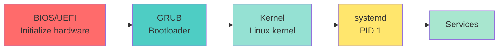

<a name="processus-services" id="processus-services"></a>

# ⚙️ Module 2 - systemd & services

---

# What is a service? 🎪

**Service (or daemon)**: a program that runs **continuously** in the background

**Process vs service:**

| Normal process | Service (daemon) |
|-----------------|------------------|
| You start it manually | Starts automatically at boot |
| Ends when you close | Runs 24/7 |
| Interactive | No direct UI |
| e.g. `vim`, `firefox` | e.g. `nginx`, `sshd`, `mysql` |

---

# Analogy: The hotel’s invisible staff 🏨

<div class="text-sm">

**Services are like hotel staff working around the clock:**

| Linux service | Hotel role | What it does |
|---------------|-------------------|---------------|
| **nginx/apache** | Front desk | Welcomes web visitors |
| **sshd** | Security | Checks badges, opens doors |
| **cron** | Housekeeping | Runs on a schedule |
| **rsyslog** | Accountant | Records everything |
| **NetworkManager** | Switchboard | Manages connectivity |
| **cups** | Mail room | Handles printing |

</div>

---

**Shared traits:**
- 🌙 Work while you sleep
- 👻 No window (invisible)
- 🔄 Auto-restart on crash

---

#### systemd: What exactly is it? 🎛️

<div class="text-xs">

**systemd** = the “conductor” of your Linux system

**Analogy: The hotel manager 🏨**

When the hotel opens (= Linux boots):
1. The manager (systemd) arrives first (PID 1)
2. Staff wake up in order:
   - Electrician first (network)
   - Then front desk (web services)
   - Finally housekeeping (scheduled tasks)
3. If someone falls ill → the manager replaces them automatically

**What systemd manages:**
- 🚀 Service startup (correct order)
- 👀 Monitoring (restart on crash)
- 📝 Logs (journald)
- ⏰ Scheduled tasks (timers)

</div>

---

#### Why systemd replaced older init systems

<div class="text-sm">

**Before (SysVinit):**
```bash
# Shell scripts in /etc/init.d/
/etc/init.d/nginx start
/etc/init.d/nginx stop
# or 
 sudo service nginx start # today this command redirect to systemctl start nginx
 sudo service nginx stop # today this command redirect to systemctl stop nginx
```
- ❌ Slow (scripts one by one)

- ❌ No service order (slow, manual)

- ❌ No automatic restart

**Now (systemd):**
```bash
sudo systemctl start nginx
sudo systemctl stop nginx
```
- ✅ Fast (parallel startup)

- ✅ Services start in the right order

- ✅ Auto-restart on failure

- ✅ Centralized logs (journalctl)

</div>

---

# systemctl: control services 🎮

```bash
# Start a service
sudo systemctl start nginx

# Stop a service
sudo systemctl stop nginx

# Restart a service
sudo systemctl restart nginx

# Reload config (no full restart)
sudo systemctl reload nginx

# Restart or reload (smart)
sudo systemctl reload-or-restart nginx
```

---

# systemctl: service state 📊

```bash
# Service status
systemctl status nginx

# Is it active?
systemctl is-active nginx

# Enabled at boot?
systemctl is-enabled nginx

# List all services
systemctl list-units --type=service

# List failed services
systemctl --failed
```

---

# Example `systemctl status` output 📋

```bash
systemctl status nginx
```

```
● nginx.service - A high performance web server
     Loaded: loaded (/usr/lib/systemd/system/nginx.service; enabled; preset: enabled)
     Active: active (running) since Mon 2025-11-06 10:00:00 CET; 2h 30min ago
       Docs: man:nginx(8)
   Main PID: 1234 (nginx)
      Tasks: 5 (limit: 4915)
     Memory: 12.5M
        CPU: 1.234s
     CGroup: /system.slice/nginx.service
             ├─1234 nginx: master process /usr/sbin/nginx
             └─1235 nginx: worker process

Nov 06 10:00:00 hostname systemd[1]: Starting A high performance web server...
Nov 06 10:00:00 hostname systemd[1]: Started A high performance web server.
```

---

# Decoding `systemctl status` 🔍

<div class="text-xs">

| Line | Meaning |
|-------|---------------|
| `● nginx.service` | **●** = loaded (🟢 green = OK, 🔴 red = error) |
| `Loaded: loaded (...; enabled)` | Unit file found + **enabled at boot** |
| `Active: active (running)` | Service **is running** |
| `since Mon 2025-11-06 10:00:00` | Running since that time |
| `Main PID: 1234` | Main process PID |
| `Tasks: 5` | Task/thread count |
| `Memory: 12.5M` | RAM used |
| `CGroup: ...` | Process tree for the service |

</div>

---

**Possible `Active:` values:**
- 🟢 `active (running)` → All good
- 🟡 `inactive (dead)` → Stopped normally
- 🔴 `failed` → Error! Check logs with `journalctl -u nginx`
- 🔵 `activating` → Starting

---

# start vs enable: the difference! ⚠️

<div class="text-sm">

**Very common beginner confusion!**

| Command | What it does | Analogy |
|----------|----------------|----------|
| `systemctl start nginx` | Start **now** | “Wake up!” |
| `systemctl enable nginx` | Start **on next boot** | “Set your alarm for tomorrow” |

**Concrete example:**

```bash
# You install nginx
sudo apt install nginx

# You start it NOW
sudo systemctl start nginx    # ✅ nginx is running

# BUT... after reboot, nginx won’t start again!
# You must also enable at boot:
sudo systemctl enable nginx   # ✅ starts automatically at boot
```

💡 **Tip:** Do both in one command!
```bash
sudo systemctl enable --now nginx   # Enable AND start
```

</div>

---

# Enable / disable at boot 🔌

```bash
# Enable at boot (does not start it now!)
sudo systemctl enable nginx

# Disable (won’t start at boot)
sudo systemctl disable nginx

# Enable AND start in one go
sudo systemctl enable --now nginx

# Disable AND stop
sudo systemctl disable --now nginx

# Mask (block ALL starts, even manual)
sudo systemctl mask nginx

# Unmask
sudo systemctl unmask nginx
```

---

# Service dependencies 🔗

**Services depend on each other**

```bash
# Dependencies of a service
systemctl list-dependencies nginx

# Who depends on this service
systemctl list-dependencies nginx --reverse

# Services only (no targets, etc.)
systemctl list-dependencies nginx --plain
```

**Example:** nginx depends on `network.target`

---

# systemd units 📦

**A unit = one config file that tells systemd *what* to manage and *how***

File name pattern: `name.type` → e.g. `nginx.service`, `multi-user.target`

| Type | What it does | Example |
|------|--------------|---------|
| **`.service`** | A background program to start, stop, restart | `nginx.service` - the web server |
| **`.timer`** | Run something on a schedule (replaces cron) | “Run backup every night at 2am” |

**`.target` - not a program. Two roles:**

- 🚦 **Boot checkpoint** - “this stage is done” → `network.target` = network is up; nginx waits for it before starting
- 📋 **Boot preset** - “start this set of services” → `graphical.target` = desktop ON; `multi-user.target` = server, no GUI

---

# Other systemd unit types 📦

**Less common day-to-day - but good to recognize when you see them:**

| Type | What it does | Example |
|------|--------------|---------|
| **`.socket`** | Wait for a network connection, then start the matching service | SSH listens on port 22 → starts `sshd` |
| **`.mount`** | Attach a disk or partition to a folder | Mount `/home` on a separate drive |
| **`.device`** | Represents a piece of hardware | A USB disk, a network interface |
| **`.path`** | Watch a file or folder; trigger an action when it changes | Start a sync when a file appears in `/incoming` |

```bash
# List all units currently loaded
systemctl list-units --all
```

---
layout: new-section
---

# 🧪 Live coding - Module 2

### Custom systemd service - Python app + unit file on the VM

---

# Our Python app 🐍

**File: `/opt/my-app/server.py`**

A tiny script that prints the current time in a loop - enough to test a custom systemd service.

```python
#!/usr/bin/env python3
import time
from datetime import datetime

while True:
    print(f"[{datetime.now():%Y-%m-%d %H:%M:%S}] Server alive")
    time.sleep(60)
```

---

# Custom systemd service 🛠️

**File: `/etc/systemd/system/my-service.service`**

**Note:** example below runs the Python app above as a systemd service.

```ini
[Unit]
Description=My custom service
After=network.target

[Service]
Type=simple
User=alice
WorkingDirectory=/opt/my-app
Environment=PYTHONUNBUFFERED=1
ExecStart=/usr/bin/python3 /opt/my-app/server.py
Restart=on-failure
RestartSec=5s

[Install]
WantedBy=multi-user.target
```

---

# Custom systemd service (continued) 🛠️

**Live demo - step by step (no heredoc):**

```bash
sudo mkdir -p /opt/my-app
sudo touch /opt/my-app/server.py
sudo chmod +x /opt/my-app/server.py
sudo nano /opt/my-app/server.py          # paste the Python block from the previous slide
sudo touch /etc/systemd/system/my-service.service
sudo nano /etc/systemd/system/my-service.service   # paste the .ini block from the previous slide
```

```bash
# Reload systemd after create/edit
sudo systemctl daemon-reload

# Enable the service
sudo systemctl enable my-service

# Start the service
sudo systemctl start my-service

# Check status
systemctl status my-service
```

**Journal :** `journalctl -u my-service -f` - one `Server alive` line **every 60 s**; `PYTHONUNBUFFERED=1` in the unit file avoids buffered stdout (otherwise only `Started` shows for a while).

---
layout: new-section
---

# ✅ Live coding done - Module 2

**You built on the VM:** `/opt/my-app/server.py` · `my-service.service` · enabled & running

**Verify at home:** `systemctl status my-service` → active · `journalctl -u my-service -n 5`

**Next:** systemd theory - service types, targets, timers

---

# systemd service types 🎭

<div class="text-sm">

- **Type=simple** - main process stays in foreground (default) → our Python `my-service`, most custom scripts
- **Type=forking** - daemon forks, parent exits → traditional Apache, classic Unix daemons
- **Type=oneshot** - runs once then exits → mount at boot, one-shot setup script (`RemainAfterExit=yes` common)
- **Type=notify** - app signals “I'm ready” via `sd_notify` → Docker, PostgreSQL, apps that need warm-up before traffic
- **Type=idle** - delayed until other boot jobs finish → low-priority background task at startup

</div>

---

# Automatic restart 🔄

```ini
[Service]
Restart=always           # Always restart
Restart=on-failure       # Only on failure
Restart=on-abnormal      # Only abnormal exit
Restart=on-abort         # Only abort signal
Restart=on-watchdog      # Only watchdog timeout

RestartSec=5s            # Wait 5s before restart
StartLimitBurst=3        # Max 3 restarts
StartLimitIntervalSec=60 # Within a 60s window
```

---

# systemd targets: “runlevels” 🎯

**Targets**: groups of services (like old runlevels)

**Main targets:**

- `poweroff.target`: shutdown
- `rescue.target`: rescue (single-user)
- `multi-user.target`: multi-user, no GUI
- `graphical.target`: multi-user with GUI
- `reboot.target`: reboot

```bash
# Current default target
systemctl get-default

# Set default target
sudo systemctl set-default multi-user.target
```

---

# Change target (runlevel) 🔀

```bash
# Switch to rescue mode
sudo systemctl isolate rescue.target

# Multi-user mode
sudo systemctl isolate multi-user.target

# Graphical mode
sudo systemctl isolate graphical.target

# Traditional equivalents:
# init 1 → systemctl isolate rescue.target
# init 3 → systemctl isolate multi-user.target
# init 5 → systemctl isolate graphical.target
```

---

# System boot 🚀

**Boot sequence:**

1. **BIOS/UEFI**: initializes hardware
2. **Bootloader (GRUB)**: loads the kernel
3. **Linux kernel**: initializes devices
4. **systemd (PID 1)**: starts services



---

# Analyze boot time ⏱️

```bash
# Total boot time
systemd-analyze

# Time per service
systemd-analyze blame

# Critical chain
systemd-analyze critical-chain

# Graph (writes an SVG)
systemd-analyze plot > boot.svg
```

---

# System logs: journald 📜

**journalctl**: view systemd logs (the system “flight recorder”)

**Analogy: Aircraft black box ✈️**

Everything that happens is recorded:
- Services starting/stopping
- Errors and warnings
- User logins
- Hardware issues

---

# journalctl: essential commands 📋

```bash
# All logs (warning: a LOT of output!)
journalctl

# Since last boot (often most useful)
journalctl -b

# One specific service
journalctl -u nginx

# Follow in real time (like tail -f)
journalctl -f

# Follow one service
journalctl -u nginx -f

# Last 50 lines
journalctl -n 50
```

💡 **Tip:** When a service fails → `journalctl -u servicename`

---

# journalctl: advanced filters 🔍

```bash
# Since one hour ago
journalctl --since "1 hour ago"

# Since a date
journalctl --since "2025-11-01"

# Date range
journalctl --since "2025-11-01" --until "2025-11-02"

# By user
journalctl _UID=1000

# By priority (error and above)
journalctl -p err

# Reverse order (newest first)
journalctl -r
```

---

# journalctl: format and export 📤

```bash
# JSON
journalctl -u nginx -o json

# Short format
journalctl -o short

# Verbose
journalctl -o verbose

# Export to file
journalctl -u nginx > nginx.log

# Journal size on disk
journalctl --disk-usage

# Clean old logs
sudo journalctl --vacuum-time=7d    # Keep 7 days
sudo journalctl --vacuum-size=500M  # Keep 500 MB
```

---

# Shutdown and reboot 🔌

```bash
# Shutdown now
sudo shutdown now
sudo poweroff
sudo systemctl poweroff

# Shutdown in 10 minutes
sudo shutdown +10

# Shutdown at a specific time
sudo shutdown 22:30

# Reboot
sudo reboot
sudo systemctl reboot
sudo shutdown -r now

# Cancel a scheduled shutdown
sudo shutdown -c
```

---

# Shutdown levels 🛑

**halt**: stops the CPU (power may still be on)

```bash
sudo halt
```

**poweroff**: cuts power

```bash
sudo poweroff
```

**reboot**: restarts

```bash
sudo reboot
```

**Difference:** subtle and hardware-dependent
- Modern practice: use `systemctl`

---

# Best practices ✅

1. **Use systemd for services**
   - Don’t start daemons by hand in production
   - Configure automatic restart

2. **Check logs regularly**
   - `journalctl -f` during deployments

3. **Use `systemctl status` and `journalctl -u`**
   - First reflex when a service fails

4. **Prefer systemd timers**
   - Over cron for system integration

---

# Module 2 recap ✅

**What you learned:**

- ✅ systemd and services (systemctl)
- ✅ start vs enable, mask
- ✅ Service dependencies and unit types
- ✅ Custom units (daemon-reload, restart policies)
- ✅ Targets (runlevels) and boot analysis
- ✅ Logs with journalctl
- ✅ Boot and shutdown

**Live demo on VM:** `systemctl status my-service` · `journalctl -u my-service -n 5` · `systemd-analyze blame | head`

**From scratch :** build `/opt/my-app/server.py` + unit file with `touch`/`nano` - see guide § Module 2.

---

# Next step 🎯

**Module 3 - Storage & LVM**

---
layout: default
---

# Questions? 🤔

Ask your questions now!

Post your questions on <ExternalLink href="https://questions.andromed.fr">questions.andromed.fr</ExternalLink> (access code **29062026**) so I can centralize and answer them.

The next module covers **Storage & LVM** (filesystems, fstab, ACLs, links).
