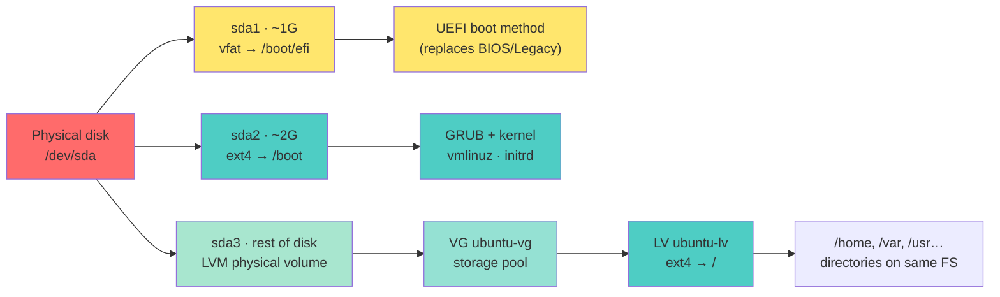

<a name="stockage-systeme-fichiers" id="stockage-systeme-fichiers"></a>

# 💾 Module 3 - Storage & LVM

---

# Understanding storage 💾

**Analogy: a library** 📚

- **Hard disk** = the whole building
- **Partition** = one floor of the library
- **File system** = how books are shelved
- **Mount** = opening access to a floor
- **File** = a book
- **Directory** = a shelf

**Without a partition and file system, a disk is unusable!**

---

# Storage hierarchy 🏗️

**Default Ubuntu install on a physical machine** - UEFI, separate `/boot`, **LVM** for `/`.

`/home` is a **directory inside `/`**, not a separate partition.



---

# Storage hierarchy - VM (virtio) 🖥️

**Same layout in a VM** - only the disk name changes: `vda` instead of `sda`.

The LV uses part of the pool; the rest stays free and can be extended later.

```bash
lsblk
```

```
NAME                      MAJ:MIN RM  SIZE RO TYPE MOUNTPOINT
vda                         253:0    0   64G  0 disk
├─vda1                      253:1    0    1G  0 part /boot/efi
├─vda2                      253:2    0    2G  0 part /boot
└─vda3                      253:3    0 60.9G  0 part
  └─ubuntu--vg-ubuntu--lv   252:0    0 30.5G  0 lvm  /
```

---

### Simple steps to create a partition:

1. Identify the disk
2. Create partitions
3. Create a file system
4. Mount to use it

---

#### Disk naming 💿

<div class="text-xs">

**SATA/SAS/USB disks:**
- `/dev/sda`: first disk
- `/dev/sdb`: second disk
- `/dev/sdc`: third disk

<br/>

<div class="text-xs">

> in a VM, the disk is named like this: `/dev/vda`, `/dev/vdb`, `/dev/vdc`

</div>

**Partitions:**
- `/dev/sda1`: first partition on disk sda
- `/dev/sda2`: second partition on disk sda

**NVMe disks (modern SSDs):**
- `/dev/nvme0n1`: first NVMe disk
- `/dev/nvme0n1p1`: first partition

</div>

---

#### Analogy: numbered lockers 🗄️

Picture a self-storage facility:
- **sda, sdb, sdc**: different lockers (disks)
- **sda1, sda2**: shelves inside locker A (partitions)
- **File system**: how you organize each shelf


---

### Concrete example:

```bash
# List your disks
lsblk

# Typical output on a modern Ubuntu PC (sda):
# sda                           (main disk 500 GB)
# ├─sda1                        (EFI 1 GB)           /boot/efi
# ├─sda2                        (boot 2 GB)          /boot
# └─sda3                        (LVM physical volume)
#   └─ubuntu--vg-ubuntu--lv     (logical volume)     /
# sdb                           (USB stick 32 GB)
# └─sdb1                        (single partition)
```

---

# List disks and partitions 📋

```bash
# List disks and partitions
lsblk

# Tree format with sizes
lsblk -f

# Show UUIDs
sudo blkid

# Detailed information
sudo fdisk -l

# Disk sizes
df -h

# Space used per directory
du -sh /home/*
```

---

# Example lsblk output 📊

```bash
lsblk
```

```
NAME                        MAJ:MIN RM   SIZE RO TYPE MOUNTPOINT
sda                           8:0    0   500G  0 disk
├─sda1                        8:1    0     1G  0 part /boot/efi
├─sda2                        8:2    0     2G  0 part /boot
└─sda3                        8:3    0   497G  0 part
  └─ubuntu--vg-ubuntu--lv   252:0    0   250G  0 lvm  /
sdb                          8:16    0     1T  0 disk
└─sdb1                       8:17    0     1T  0 part /mnt/data
nvme0n1                     259:0    0   256G  0 disk
└─nvme0n1p1                 259:1    0   256G  0 part /opt
```

**Columns:**
- `NAME`: device name
- `SIZE`: size
- `TYPE`: disk or part(ition)
- `MOUNTPOINT`: where it is mounted

---

# df: available disk space 📏

```bash
# Human-readable format
df -h

# Local file systems only
df -h -x tmpfs -x devtmpfs

# Available inodes
df -i

# File system type
df -T
```

**Example output:**

```
Filesystem                            Size  Used Avail Use% Mounted on
/dev/mapper/ubuntu--vg-ubuntu--lv     246G   45G  190G  20% /
/dev/sda2                             2.0G  128M  1.7G   8% /boot
/dev/sda1                             1.1G  6.2M  1.1G   1% /boot/efi
/dev/sdb1                             1.0T  500G  500G  50% /mnt/data
```

---

# du: disk usage 📊

```bash
# Size of a directory
du -sh /home/alice

# Breakdown of subdirectories
du -h --max-depth=1 /var

# 10 largest directories
du -h /home | sort -hr | head -10

# Exclude certain directories
du -sh --exclude="*.cache" /home/alice

# Total only
du -sh /var/log
```

---

# Partitioning: MBR vs GPT 🔀

**MBR (Master Boot Record)**: old standard (1983)
- Max 4 primary partitions
- Max 2 TB per disk
- BIOS compatible

**GPT (GUID Partition Table)**: modern (2000s)
- 128 partitions
- Disks > 2 TB
- Works well with UEFI (also works on old BIOS with a BIOS boot partition)
- Backup copy of the partition table

**2026 recommendation:** always use GPT!

---

# Creating partitions: fdisk 🔧

<div class="text-sm">

**fdisk**: classic partitioning tool

```bash
# Run fdisk on a disk
sudo fdisk /dev/sdb

# Interactive commands:
# m: help (menu)
# p: print current partitions
# g: create a new empty GPT (wipes everything!)
# o: create a new empty MBR (wipes everything!)
# n: new partition
# d: delete a partition
# t: change partition type
# w: write and quit (APPLIES changes)
# q: quit without saving
```

**⚠️ WARNING:** Changes are written only with `w`

</div>

---

# Creating partitions: gdisk/parted 🔧

**gdisk**: for GPT (like fdisk , it is just a gpt shortcut for fdisk) => interactive mode

```bash
sudo gdisk /dev/sdb
```

**parted**: supports MBR and GPT, scriptable => script mode

```bash
# Interactive mode
sudo parted /dev/sdb

# Command mode
sudo parted /dev/sdb mklabel gpt
sudo parted /dev/sdb mkpart primary ext4 0% 100%
```

---

# Practical example: add a disk 💿

**On the lab VM:** `/dev/vdb` is **reserved for the LVM live demo** later in this module. Use a hypothetical second disk (e.g. `/dev/sdb` for a USB stick, or `/dev/vdc` for a third virtio disk you would attach) for the partition/ext4 flow below.

```bash
# 1. Identify the new disk
lsblk                              # spot the new disk (e.g. /dev/sdb on a USB, /dev/vdc on a 3rd virtio disk)

# 2. Partition it (if needed)
sudo fdisk /dev/sdb                # g → n → Enter… → w  (creates /dev/sdb1)

# 3. Create a file system
sudo mkfs.ext4 /dev/sdb1

# 4. Mount it
sudo mkdir /mnt/data
sudo mount /dev/sdb1 /mnt/data

# 5. Make it persistent
sudo blkid /dev/sdb1               # copy the UUID
sudo nano /etc/fstab               # UUID=…  /mnt/data  ext4  defaults  0  2
sudo mount -a
grep /mnt/data /etc/fstab
```

---

# File systems 📂

**ext4**: Linux standard
- Stable, fast, mature
- Crash-safe writes (journal)
- Max 16 TiB per file, 1 EiB per volume
- Default on most distributions (Ubuntu)

---

# File systems (continued) 📂

**btrfs**: modern, advanced features
- Snapshots, compression
- Checksums (find disk errors)
- Online resize
- Actively developed

**tmpfs**: in RAM
- Very fast
- Cleared on reboot
- Used for /tmp, /run

---

# Create a file system 🛠️

```bash
# ext4 (Ubuntu default)
sudo mkfs.ext4 /dev/sdb1

# btrfs
sudo mkfs.btrfs /dev/sdb1

# With a label
sudo mkfs.ext4 -L "MyDocuments" /dev/sdb1
```

---

# btrfs on Ubuntu 🌿

**Ubuntu uses ext4 for `/` by default.** Use **btrfs** on a **data** disk when you want **snapshots inside the filesystem** (optional in the lab).

```bash
sudo mkfs.btrfs -L data /dev/sdb1
sudo mount /dev/sdb1 /data

sudo btrfs subvolume create /data/project
sudo btrfs subvolume snapshot /data/project /data/project-backup

sudo btrfs scrub start /data
sudo btrfs filesystem df /data
```

**vs LVM snapshot:** btrfs snapshot is **fast** - same disk, no extra logical volume.

---

# Mount a file system 🔗

```bash
# Mount temporarily
sudo mount /dev/sdb1 /mnt/data

# Mount read-only
sudo mount -o ro /dev/sdb1 /mnt/data

# Mount with options
sudo mount -o rw,noexec,nosuid /dev/sdb1 /mnt/data

# Mount all file systems from /etc/fstab
sudo mount -a

# Unmount
sudo umount /mnt/data

# Force unmount (if busy)
sudo umount -f /mnt/data
sudo umount -l /mnt/data  # lazy unmount
```

---

# Common mount options ⚙️

**Options passed with `-o` or in `/etc/fstab` - they change how the filesystem behaves.**

**Read/write mode:**

| Option | What it means | Typical use |
|--------|---------------|-------------|
| **rw** | Files can be read **and** modified | Default for data disks |
| **ro** | Read-only - nothing can be written or deleted | Backups, ISO images, “lock” a disk by mistake |

---

# Mount options - security 🔒

**Useful on untrusted mounts** (USB stick, `/tmp`, web upload folder):

| Option | What it blocks | Why it matters |
|--------|----------------|----------------|
| **noexec** | Running programs **stored on** this filesystem | A script on a USB stick can't execute if mounted with `noexec` |
| **nosuid** | “Run this file as its owner” permissions (often root) | Blocks privilege tricks via a malicious binary |
| **nodev** | Special files that represent hardware (like `/dev/sda`) | A normal file can't pretend to be a disk device |

---

# Mount options - performance ⚡

**By default, Linux updates “last accessed” timestamps on every read** → extra disk writes.

| Option | What it skips |
|--------|---------------|
| **noatime** | Don't update access time on **files** |
| **nodiratime** | Don't update access time on **directories** |

💡 Common on `/tmp`, databases, VMs - less I/O, better performance.

---

# Mount option: defaults 📋

**`defaults`** = “normal trusted local disk” - shorthand for:

`rw`, `suid`, `dev`, `exec`, `auto`, `nouser`, `async`

| Part | In practice |
|------|-------------|
| **rw, exec, suid, dev** | Opposite of `ro` / `noexec` / `nosuid` / `nodev` - programs and special permissions work as usual |
| **auto** | Mount at boot if listed in `/etc/fstab` |
| **nouser** | Only **root** can mount (normal users can't) |
| **async** | Buffer writes for speed (tiny risk if power fails mid-write) |

Override when needed: `defaults,noatime` or `defaults,ro`

---

# /etc/fstab: automatic mounts 📝

**Format:** `device mountpoint fstype options dump pass`

```bash
# UUID recommended (stable)
UUID=abc-123  /home  ext4  defaults  0  2

# Old style (can change on reboot)
/dev/sda3  /home  ext4  defaults  0  2

# tmpfs
tmpfs  /tmp  tmpfs  defaults,noatime,mode=1777  0  0
```

---

# /etc/fstab columns 📊

**1. Device**: UUID or /dev/sdX

**2. Mount point**: where to mount

**3. Filesystem type**: ext4, xfs, nfs, etc.

**4. Options**: defaults, ro, noexec, etc.

**5. Dump**: backup with dump (0 = no, 1 = yes)

**6. Pass**: fsck check order (0 = never, 1 = root, 2 = others)

---

# Find a disk's UUID 🔍

```bash
# Method 1: blkid
sudo blkid /dev/sdb1
# → UUID="abc-123-def-456"

# Method 2: lsblk
lsblk -f

# Method 3: from /dev/disk
ls -l /dev/disk/by-uuid/

# Use UUID in fstab
UUID=abc-123-def-456  /mnt/data  ext4  defaults  0  2
```

**Why UUID?** Because `/dev/sdX` can change across reboots!

---

# Test /etc/fstab without rebooting 🧪

```bash
# Edit fstab
sudo nano /etc/fstab

# Test mounts
sudo mount -a

# If error, fix immediately!
# Otherwise the system may not boot

# Verify
df -h
mount | grep /mnt/data
```

**⚠️ An incorrect fstab can prevent booting!**

---

# Hard and symbolic links 🔗

**Hard link** = a **second name** for the same file (same inode)

| Hard link | |
|-----------|--|
| Same content | yes - one inode, two names |
| Directories | no |
| Other partition | no |
| If you delete one name | file survives while other names exist |

```bash
ln file.txt hard_link.txt
```

---

# Symbolic links (~90% of daily use) 🔗

**Symlink** = a name that points to another path (*"read over there"*)

| Symbolic link | |
|---------------|--|
| Files or directories | both |
| Other partition | yes |
| Target deleted | link **broken** |

```bash
ln -s TARGET LINK_NAME
```

---

# Nginx: `sites-available` → `sites-enabled` 🔗

Nginx reads **`sites-enabled/`** only. The real file lives in **`sites-available/`**.

| State | `sites-available/` | `sites-enabled/` |
|-------|--------------------|------------------|
| Site **off** | `mywebsite` | *(empty)* |
| Site **on** | `mywebsite` | `mywebsite` → `.../sites-available/mywebsite` |

One file - edit **`sites-available/mywebsite`** and nginx sees it (**not a copy**).

```bash
# Enable
ln -s /etc/nginx/sites-available/mywebsite \
      /etc/nginx/sites-enabled/mywebsite

# Disable (link only - config file stays)
rm /etc/nginx/sites-enabled/mywebsite
```

---

# Link analogy 🎭

**Hard link:** two keys, one door - same inode, same data.

**Symbolic link:** a signpost (*"config is in `sites-available/` →"*) - remove the sign from `sites-enabled/`, the file is still there.

---

# Comparing links 🔬

```bash
# Create a file
echo "Content" > original.txt

# Hard link
ln original.txt hard.txt

# Symbolic link
ln -s original.txt sym.txt

# Compare inodes
ls -li
# 12345 original.txt
# 12345 hard.txt         ← same inode
# 12346 sym.txt → original.txt
```

#### What is an inode?

> An inode (index node) is an internal structure file systems use to store almost all metadata about a file, except its name and its data content.

---

### An inode stores for example:

- 📏 File size
- 👤 Owner (UID) and group (GID)
- 🔐 Permissions (rwx)
- 🕒 Timestamps (change time, modification, last access)
- 📍 Where data blocks live on disk
- 🔗 Link count for this file

❗ The file name is NOT in the inode  
The name lives in the directory (which maps names → inodes).

To show the inode of a file or directory:

```bash
# file
ls -i file.txt
# directory
ls -di folder/
```

---

# Extended permissions: ACLs 🔐

**ACL** (Access Control Lists): finer than classic rwx alone

**The problem with classic permissions:**

```
-rw-r----- 1 alice devs 1024 report.txt
              │      │
              │      └── only one group (devs)
              └── only one owner (alice)
```

**What if:**
- Bob (not in devs) needs to read this file?
- Charlie (not in devs) needs to modify it?
- Impossible with classic permissions alone!

---

# ACL: the flexible solution 🎯

**Analogy: access badge** 🏢

<div class="text-sm">

| System | Analogy | Limitation |
|--------|---------|------------|
| **Classic permissions** | Building key | One key = one door = same for everyone |
| **ACL** | Electronic badge | Each person has their own access |

**With ACLs you can say:**
- "Alice can read AND write"
- "Bob can only read"
- "Charlie can do nothing"
- "Group 'devs' can do everything"
- **All on the SAME file!**

</div>

---

# ACL syntax: full breakdown 📖

<div class="text-xs">

**Format: `TYPE:NAME:PERMISSIONS`**

| Part | Meaning | Examples |
|------|---------|----------|
| **TYPE** | `u` = user, `g` = group, `o` = others | `u`, `g`, `o` |
| **NAME** | User or group name | `alice`, `bob`, `devs` |
| **PERMISSIONS** | Combination of r, w, x | `r`, `rw`, `rwx`, `rx` |

</div>

---

<div class="text-xs">

**Concrete examples:**

| Entry | Meaning |
|-------|---------|
| `u:alice:r` | **U**ser alice → read only |
| `u:bob:rw` | **U**ser bob → read + write |
| `g:devs:rwx` | **G**roup devs → read + write + execute |
| `o::r` | **O**thers → read only |

</div>

---

# Install and use ACLs 🛠️

```bash
# Install ACL tools
sudo apt install acl

# Check whether ext4 has ACL enabled (default on Ubuntu)
sudo tune2fs -l /dev/sdXY | grep "Default mount options"
# Should list acl among defaults
```

---

# Essential ACL commands 📋

**`getfacl`** = **GET** file ACL (view ACLs)

```bash
getfacl file.txt
```

**`setfacl`** = **SET** file ACL (change ACLs)

```bash
# -m = modify (add or change an ACL)
setfacl -m u:alice:r file.txt      # alice can read
setfacl -m u:bob:rw file.txt       # bob can read+write
setfacl -m g:devs:rwx folder/      # group devs has full access
```

---
layout: new-section
---

# 🧪 Live coding - Module 3 · ACL

### Shared folder `/project` - exclude bob with `setfacl`

---

# Concrete example: exclude one user 📁

<div class="text-xs">

**Scenario:** alice and bob are **both** in group `developers`. The folder `/project` belongs to `developers` → normally both have access. **But** you want **bob excluded** from this specific folder - without removing him from the group (he keeps his other `developers` rights everywhere else). With classic `chmod` this is **impossible**. ACLs can do it.

```bash
sudo mkdir /project
sudo chown root:developers /project
sudo chmod 770 /project              # group has full access

sudo setfacl -m u:bob:--- /project   # deny bob specifically

# Verify
getfacl /project
su - bob -c 'ls /project'           # Permission denied!
su - alice -c 'ls /project'         # Works (she is in developers)
```

**Result:** bob is still in `developers` but **cannot** access `/project`!

</div>

---
layout: new-section
---

# ✅ Live coding done - Module 3 · ACL

**You built on the VM:** `/project` · `chmod 770` · `setfacl -m u:bob:---`

**Verify at home:** `getfacl /project` shows `user:bob:---` · bob denied, alice OK

**Next:** multiple groups & ACL union, then advanced ACL reference, LVM theory

---

# Multiple groups: permissions combine 🔀

**Question:** if you belong to **several groups**, what are your effective rights on a file?

**Rule:** permissions are **combined** — the final result is the **union** of all allowed permissions from every matching entry (capped by the **ACL mask**, if present).

<div class="text-sm">

| You are in… | Group ACL on file | Your effective right |
|-------------|-------------------|----------------------|
| `DEVOPS` only | `g:DEVOPS:r--` | read |
| `CREATORS` only | `g:CREATORS:-w-` | write |
| **both** `DEVOPS` **and** `CREATORS` | both entries above | **read + write** |

</div>

---

# Case study: Alice, Bob & `file.txt` 📄

<div class="text-sm">

**Setup:**

- **Alice** creates `file.txt` → owner **alice**, primary group **alice**
- Classic permissions: owner only — **others have no rights**
- **Bob** belongs to two groups: **`DEVOPS`** and **`CREATORS`**

**Goal:** grant group access with **`setfacl`** (SET file Access Control List) — not classic `chmod` alone.

</div>

---

# Case study: group ACLs on `file.txt` 🛠️

```bash
# Alice owns the file; others have no classic rights
ls -l file.txt
# -rw------- 1 alice alice ... file.txt

# Grant DEVOPS read, CREATORS write
sudo setfacl -m g:DEVOPS:r file.txt
sudo setfacl -m g:CREATORS:w file.txt

getfacl file.txt
```

---

# Case study: Bob gets read **and** write ✍️

<div class="text-sm">

Bob is in **`DEVOPS`** → **read** from `g:DEVOPS:r--`

Bob is also in **`CREATORS`** → **write** from `g:CREATORS:-w-`

**Combined:** Bob effectively has **read + write** on `file.txt` — even though each group only got one permission.

**This is why Mateusz's question matters:** group ACLs **add up** across all your groups.

</div>

---

# Case study: restrict Bob to read only 🔒

**Need:** Bob stays in both groups, but on **this file** he must **not** write.

**Fix:** a **user-specific** ACL entry overrides the group union for Bob:

```bash
sudo setfacl -m u:bob:r file.txt
```

---

# Case study: verify Bob is read-only ✅

```bash
getfacl file.txt
# ...
# group:DEVOPS:r--
# group:CREATORS:-w-
# user:bob:r--        ← Bob limited to read on this file

su - bob -c 'cat file.txt'    # OK
su - bob -c 'echo x >> file.txt'   # Permission denied
```

**Takeaway:** group ACLs **combine**; a **`u:NAME:`** entry sets an explicit ceiling for one user.

---

# Advanced ACLs 🎯

```bash
# Remove one ACL entry
setfacl -x u:alice file.txt

# Remove all ACLs
setfacl -b file.txt

# Recursive ACLs
setfacl -R -m u:alice:rx /project/

# Default ACL (for new files)
setfacl -d -m u:alice:rw /project/

# Copy ACLs from one file
getfacl file1.txt | setfacl --set-file=- file2.txt
```

---

# ACL example 📝

```bash
# Create shared directory
sudo mkdir /shared
sudo setfacl -m u:alice:rwx /shared
sudo setfacl -m u:bob:rx /shared
sudo setfacl -m g:devs:rwx /shared

# Default ACLs for children
sudo setfacl -d -m u:alice:rwx /shared
sudo setfacl -d -m g:devs:rw /shared

# Verify
getfacl /shared
```

---

# getfacl output 📋

```bash
getfacl /shared
```

```
# file: /shared
# owner: root
# group: root
user::rwx
user:alice:rwx
user:bob:r-x
group::r-x
group:devs:rwx
mask::rwx
other::r-x
```

---

# getfacl output line by line 🔍

<div class="text-xs">

| Line | Meaning |
|------|---------|
| `# file: /shared` | Path to file or directory |
| `# owner: root` | File owner |
| `# group: root` | Owning group |
| `user::rwx` | **Owner** (root) permissions → rwx |
| `user:alice:rwx` | **ACL**: alice has rwx |
| `user:bob:r-x` | **ACL**: bob has r-x (read + execute, no write) |
| `group::r-x` | **Owning group** (root) permissions |
| `group:devs:rwx` | **ACL**: group devs has rwx |
| `mask::rwx` | **Maximum** effective ACL permissions |
| `other::r-x` | **Everyone else** |

**The `+` in `ls -l` means ACLs:**
```bash
ls -l /shared
drwxrwxr-x+ 2 root root 4096 ... /shared
          │
          └── "+" = this entry has ACLs
```

</div>

---

# Check disk health: fsck 🔍

**fsck**: file system check (find and fix errors)

```bash
# Check a partition (must be unmounted!)
sudo umount /dev/sdb1
sudo fsck /dev/sdb1

# Force check
sudo fsck -f /dev/sdb1

# Repair automatically
sudo fsck -y /dev/sdb1

# Schedule fsck on next mount (ext4)
sudo tune2fs -c 1 /dev/sdb1
# On systemd Ubuntu, prefer kernel param fsck.mode=force if you must force at boot
```

**⚠️ Never fsck a mounted partition!**

---

# Resize a file system - grow 📏

**Two layers:** grow the **partition** first, then the **filesystem**.

```bash
# 1. Extend the partition (free space must be right behind it!)
sudo growpart /dev/sdb 1
sudo partprobe

# 2. Grow the ext4 filesystem to fill the partition
sudo resize2fs /dev/sdb1
```

---

# Resize a file system - shrink 📏

**Order is reversed:** shrink the **filesystem** first, then the **partition**.

```bash
# 1. Unmount
sudo umount /dev/sdb1

# 2. Check
sudo e2fsck -f /dev/sdb1

# 3. Shrink the filesystem (example: 50G)
sudo resize2fs /dev/sdb1 50G

# 4. Shrink the partition to match
sudo parted /dev/sdb resizepart 1 50G
sudo partprobe
```

---

# FAQ - partitions & disk space 💬

**Self-study** - right after **Resize** (steps 1–4 = partition + filesystem layers).

**Common questions** when experimenting on `/dev/vdb` (e.g. two partitions + free space at the end).

**We don't drill every case in class.** Read this if you get stuck - **LVM** (next section) is the flexible answer.

---

# FAQ - split a partition in two? ✂️

**Can I split an existing partition in 2 without deleting it?**

- ❌ Not as a single “split” action in **fdisk**
- ✅ In practice: **shrink** the existing partition → **create** a new one in the freed space
- 👉 The partition does **not** split by itself - you make it smaller, then use what's left

---

# FAQ - why GParted shrinks without delete? 🔧

**Why can GParted reduce a partition without delete?**

It chains **two** steps:

1. **Resize the filesystem** (`resize2fs` on ext4)
2. **Resize the partition** (change the end sector)

👉 It changes **size**, not structure - it coordinates both layers for you.

---

# FAQ - why fdisk wants delete/recreate? 🗑️

**Why does fdisk push delete/recreate?**

Because **fdisk**:

- Does **not** move partitions on disk
- Does **not** reorganize blocks
- Edits the partition table in “raw” mode

👉 To change boundaries, it often **deletes the table entry** and writes a new one - risky if you skip backup or shrink the filesystem first.

---

# FAQ - why can't I just “add 2G”? 📐

**Why can't I just add 2 GB to a partition?**

A partition = one **contiguous** zone: `start sector` → `end sector`

Free space must sit **immediately after** that partition. If 2 GB is at the **end of the disk** but not adjacent to the partition you want to grow → **impossible** with a simple extend.

---

# FAQ - what does resize2fs do? 📏

**What is `resize2fs` for exactly?**

- ✅ Grow or **shrink an ext4 filesystem** (content layer)
- ❌ Does **not** resize partitions (`fdisk`, `parted`, `growpart`)
- ❌ Does **not** create free space on the physical disk

👉 **Two layers:** partition = outer fence · filesystem = books inside. `resize2fs` only adjusts from **inside** - the partition table must match separately.

---

# FAQ - 2 partitions + free space 💾

**Case:** two partitions on `vdb` + 2 GB free at the end - how to use it?

| Case | Where is the free space? | What works |
|------|--------------------------|------------|
| ✅ **1** | **Right after** the partition you want to grow | `growpart` / `fdisk` extend + `resize2fs` |
| ❌ **2** | **Between** two partitions | Can't grow either neighbor directly |
| ✅ **3** | Messy layout | Backup · delete/recreate · GParted **move** - or **LVM** (next) |

💡 Trailing free space after the **last** partition = case **1** for that partition only.

---

# FAQ - delete, GParted, layers 🧱

**Does deleting a partition erase data?**

- ✅ **Yes** on a formatted partition - unless you **backup/clone** first

**Why is GParted “more powerful” than fdisk?**

Combines filesystem + partition resize · automates risky steps · can **move** partitions

**Why doesn't Linux handle this automatically?**

- **Partition table** = low-level disk layout
- **Filesystem** = layer on top
- Responsibilities are **separated on purpose** (LVM adds flexibility above both)

---

# FAQ - simple takeaway ✅

- **Partition** = disk layout → `fdisk`, `parted`, `growpart`
- **Filesystem** = data inside → `mkfs.ext4`, `resize2fs`, `fsck`
- **GParted** = chains both (+ can move partitions)
- **Free space** ≠ usable everywhere - must be **adjacent** to grow
- **Next:** **LVM** - avoid fighting the partition table

---

# LVM: flexible storage 🎛️

**LVM** = **L**ogical **V**olume **M**anager - a layer between disks and mount points.

**Classic partitions:** sizes are fixed at creation. `/` is full but `/home` is empty? Too bad.

**With LVM:** you build a **storage pool** and **flexible partitions** you can grow - often without reboot.

---

# LVM vs classic partitions 🆚

<div class="text-sm">

| | Classic partition | LVM |
|---|---|---|
| **Size** | Fixed | Can grow (sometimes shrink) |
| **Add a disk** | Hard | Add to the pool |
| **Snapshot** | No | Yes |

**Picture it:** classic = fixed concrete pools. LVM = one big pool with **movable walls**.

**Good for:** servers, databases before upgrades, any setup that grows over time.

</div>

---

# Three levels: disk → pool → partition 🧱

<div class="text-sm">

```
  /dev/vda3   /dev/vdb          ← disks
       \         /
        pvcreate               ← mark disks for LVM
            │
       vgcreate ubuntu-vg      ← storage pool (VG)
            │
       lvcreate ubuntu-lv      ← flexible partition (LV) → /dev/ubuntu-vg/ubuntu-lv
```

**Names in commands:** PV = disk ready for LVM · VG = pool · LV = what you mount

</div>

---

# LVM 3-layer model - visual overview 🗺️


---
layout: new-section
---

# 🧪 Live coding - Module 3 · LVM

### Add `/dev/vdb`, extend the pool, grow `/` live

---

# Live lab - your VM already uses LVM 🧪

**On the lab VM**, Ubuntu installed `/` on LVM: `ubuntu-vg` → `ubuntu-lv`.

```bash
lsblk            # vda3 → ubuntu--vg-ubuntu--lv → /
sudo pvs         # /dev/vda3 is a PV in ubuntu-vg
sudo vgs         # ubuntu-vg has ~30G free
df -h /          # / is ~30G
```

---

# Live lab - "no reboot" but I had to stop my VM? ⚠️

### Two different layers

**Normal confusion.** LVM grows volumes **without rebooting Linux** - but **UTM / VirtualBox** often require you to **power off the VM** to attach a new virtual disk.

| Layer | Who | Job |
|-------|-----|-----|
| **Hypervisor** | UTM, VirtualBox… | Plug virtual hardware (disks) |
| **Guest OS** | Linux | See `/dev/vdb`, run LVM |

**LVM works on layer 2.** Your lab reboot is layer 1.

---

# Live lab - attach disk in UTM / VirtualBox 🛠️

### Before the commands - in the hypervisor UI

1. **Stop** the VM (no hot-add disk in desktop hypervisors)
2. **Add** a 20G virtio disk
3. **Start** the VM → only then `lsblk` shows `/dev/vdb`

**Takeaway:** one VM restart to **deliver** the disk - then `pvcreate` / `lvextend -r` need **no OS reboot**.

---

# Live lab - add a second disk 🛠️

**Once `/dev/vdb` is visible** (after hypervisor attach + VM boot):

```bash
lsblk                          # → vdb (20G, no partitions)
sudo pvcreate /dev/vdb         # mark vdb for LVM
sudo vgextend ubuntu-vg /dev/vdb   # add it to the existing pool
sudo pvs                       # two PVs: vda3 + vdb
```

---

# Live lab - grow `/` live (the "wow" moment) 📈

**Why LVM matters:** grow the root filesystem - **while the server is running**, no reboot, no data loss.

**Remember:** you may have rebooted the **VM** to attach `vdb` - that is the hypervisor. Everything below runs **hot inside Linux**.

```bash
df -h /          # BEFORE: ~30G

sudo lvextend -r -L +10G /dev/ubuntu-vg/ubuntu-lv /dev/vda3
# -L +10G  = add 10 GB
# -r       = resize the filesystem automatically
# /dev/vda3 = force allocation on vda3 (safe if vdb is removed later)

df -h /          # AFTER: ~40G - root grew live!
```

---
layout: new-section
---

# ✅ Live coding done - Module 3 · LVM

**You built on the VM:** `pvs` / `vgs` · `pvcreate` + `vgextend` on `/dev/vdb` · `lvextend -r` on `/`

**Verify at home:** `df -h /` ~40G · `sudo pvs` → 2 PVs in `ubuntu-vg`

**Next:** LVM reference - snapshots, RAID, best practices

---

# Grow on a real server 📈

Same workflow at scale - add a disk, extend the pool, grow the volume.

```bash
sudo pvcreate /dev/sdb
sudo vgextend my_vg /dev/sdb
sudo lvextend -r -L +500G /dev/my_vg/my_lv
```

---

# Useful LVM commands 📋

<div class="text-xs">

| Goal | Command |
|------|---------|
| Mark disk for LVM | `pvcreate /dev/sdb` |
| Create pool | `vgcreate my_vg /dev/sdb` |
| Create LV | `lvcreate -L 50G -n my_lv my_vg` |
| Add disk to pool | `vgextend my_vg /dev/sdc` |
| Grow LV | `lvextend -r -L +10G /dev/my_vg/my_lv` |
| Quick status | `pvs`, `vgs`, `lvs` |

**Path to mount:** `/dev/VG_NAME/LV_NAME` (example: `/dev/ubuntu-vg/ubuntu-lv`)

</div>

---

# LVM snapshots - not a backup ⚠️

### Common misconception

An LVM snapshot is **not** a backup on another disk or in the cloud.

It is a **frozen view** of the logical volume at **one instant** - moment A.

**Analogy:** a photograph of a shelf - if the shelf collapses later, the photo does not restore the goods.

---

# LVM snapshots - Copy-on-Write (CoW)

### What gets stored between moment A and B

**At creation (moment A):**
- LVM records metadata: "snapshot = LV state right now"
- No full data copy - fast and space-efficient

**After creation (moments B, C, D…):**
- The original LV keeps receiving writes normally
- **Only blocks that change** since A are saved into the snapshot area

---

# LVM snapshots - moment A vs moment B

| | Original LV (`my_lv`) | Snapshot (`snap_data`) |
|--|------------------------|---------------------------|
| **Moment A** - `lvcreate -s` | Live data; reference frozen | Empty - reserved space for future deltas |
| **Moment B** - app writes | Current truth (evolves) | Stores **overwritten** blocks since A |

**Reading the snapshot** = data as at moment A (unchanged blocks from LV; changed blocks from snapshot copy).

---

# LVM snapshots - create one 📸

```bash
sudo lvcreate -L 20M -s -n snap_data /dev/my_vg/my_lv
```

---

# LVM snapshots - limits & real backup

### Why snapshot ≠ backup

- Lives on the **same volume group** - disk/VG failure takes both
- Snapshot space can **fill up** if too much changes after A
- Not a long-term archive - it tracks **deltas since one instant**

**Good for:** rollback before an upgrade, consistent read for export.

**Real backup:** `rsync`, `restic`, `borg`, or your backup tool - separate media, retention policy.

---

# LVM snapshots - mount & merge (reference)

Mount, merge (`lvconvert --merge`), and cleanup: optional in production - **not part of the student exercise**.

See **LVM - go deeper** slides for `lvconvert --merge` links.

---

#### RAID: Redundant Array of Independent Disks 💾💾

<div class="text-[9px]">

**RAID 0**: speed (data split across disks)
- One disk dies = lose everything

**RAID 1**: mirror (same data on 2+ disks)
- One disk can fail (with 2 disks)

**RAID 5**: shared recovery data
- Min 3 disks, survives 1 dead disk

**RAID 6**: extra recovery data
- Min 4 disks, survives 2 dead disks

**RAID 10**: mirror + split (fast and safe)
- Min 4 disks

</div>

---

# Best practices 📋

1. **Always use UUID in /etc/fstab**
   - `/dev/sdX` names can change

2. **Test fstab before reboot**
   - `sudo mount -a`

3. **Back up before risky operations**
   - Partitioning, resize, etc.

4. **Monitor disk space regularly**
   - Alerts around 80% usage

---

# Best practices (continued) 📋

5. **Use LVM for flexibility**
   - Easier growth
   - Snapshots before risky changes (**rollback aid - not a backup**)

6. **ACLs for complex permissions**
   - Often easier to maintain than chmod alone

7. **noatime for performance**
   - Especially on servers

8. **RAID or backups for critical data**
   - Not "RAID is enough" without backups!

---

# LVM - go deeper (optional reading) 📚

**Not for the exam - for production and self-study after the basics.**

| Topic | Why it matters | Read more |
|-------|----------------|-----------|
| **Thin provisioning** | Allocate "100G" without using 100G on disk until data is written | [lvmthin(7)](https://man7.org/linux/man-pages/man7/lvmthin.7.html) · [thin-provisioning(7)](https://man7.org/linux/man-pages/man7/thin-provisioning.7.html) |
| **Cache (SSD + HDD)** | Hot blocks on fast tier, cold on slow disks | [lvmcache(7)](https://man7.org/linux/man-pages/man7/lvmcache.7.html) |
| **RAID in LVM** | Mirror / stripe across PVs inside the VG | [lvmraid(7)](https://man7.org/linux/man-pages/man7/lvmraid.7.html) |
| **Snapshots & merge** | Rollback before upgrade (not long-term backup); `lvconvert --merge` | [lvcreate(8)](https://man7.org/linux/man-pages/man8/lvcreate.8.html) · [Red Hat - snapshots](https://docs.redhat.com/en/documentation/red_hat_enterprise_linux/9/html/configuring_and_managing_logical_volumes/creating-and-managing-lvm-snapshots_configuring-and-managing-logical-volumes) |

---

# LVM - go deeper (continued) 📚

<div class="text-xs">

| Topic | Why it matters | Read more |
|-------|----------------|-----------|
| **Move / replace a PV** | Disk dying - evacuate extents with `pvmove`, then `vgreduce` | [pvmove(8)](https://man7.org/linux/man-pages/man8/pvmove.8.html) · [vgreduce(8)](https://man7.org/linux/man-pages/man8/vgreduce.8.html) |
| **Encrypted LVM (LUKS)** | Full-disk or LV encryption under LVM | [Ubuntu - LUKS + LVM](https://help.ubuntu.com/community/FullDiskEncryptionHowto) · [cryptsetup(8)](https://man7.org/linux/man-pages/man8/cryptsetup.8.html) |
| **Boot from LVM root** | `/` on `ubuntu-vg/ubuntu-lv` (your VM already does) | [Debian wiki - LVM](https://wiki.debian.org/LVM) |
| **Thin pool monitoring** | Pool full → all thin LVs freeze; watch **`Data%`** and **`Meta%`** | [lvs(8)](https://man7.org/linux/man-pages/man8/lvs.8.html) · `lvs -a -o +data_percent,metadata_percent` |

**Upstream references:** [LVM HOWTO (TLDP)](https://tldp.org/HOWTO/LVM-HOWTO/) · [LVM2 README (sourceware)](https://sourceware.org/git/?p=lvm2.git;a=blob;f=README)

**Rule of thumb:** master **PV → VG → LV → filesystem resize** first; add thin/cache/RAID only when a real capacity or performance problem needs it.

</div>

---

# Module 3 recap

**What you learned:**

- Disk and partition naming
- Partitioning (fdisk, gdisk, parted)
- File systems (ext4, btrfs, tmpfs) - **overlayfs** has its own brief slide right after the LVM exercises
- Mounting and /etc/fstab
- Symbolic and hard links
- ACLs (extended permissions)
- LVM (pool + flexible partition, grow, snapshot)
- RAID (theory)
- Disk space management (df, du)
- **FAQ (self-study):** fdisk vs `resize2fs` vs GParted, free space traps - before LVM

**Practice (self-study):** read the **partition FAQ** if `/dev/vdb` puzzles you · then 🎯 **LVM exercise slides**

**Live demo on VM:** `lsblk` · `df -h /` · `sudo pvs` · `sudo vgs` · grow `/` live with `lvextend -r` · `getfacl /project`

---

# Next step 🎯

**🎯 LVM exercises** (next slides) → **overlayfs brief** → **Module 4 - Security & MAC**

---
layout: default
---

# Questions?

Ask now if anything is unclear.

Post your questions on <ExternalLink href="https://questions.andromed.fr">questions.andromed.fr</ExternalLink> (access code **29062026**) so I can centralize and answer them.

The next slides cover the **LVM student exercises**, then a short **overlayfs** hook, then **Module 4 - Security & MAC** (AppArmor).
