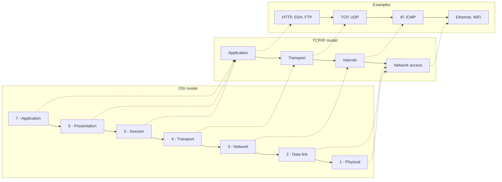
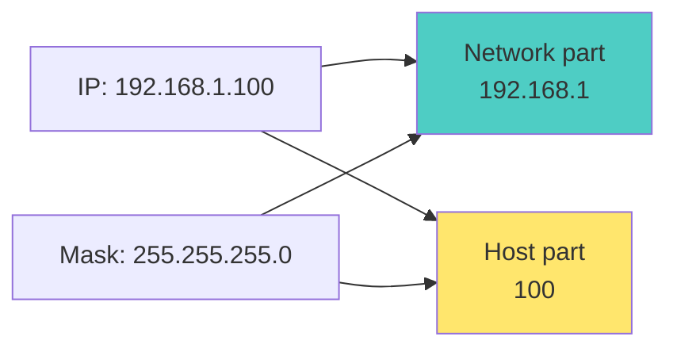
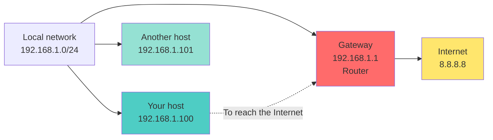
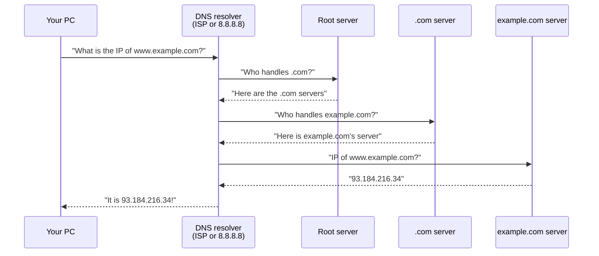
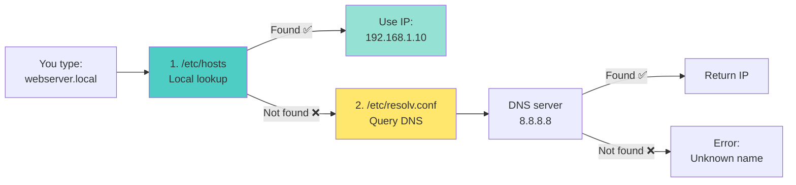
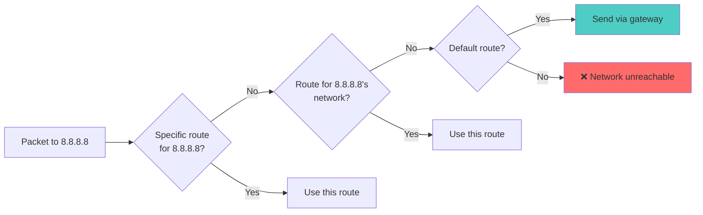
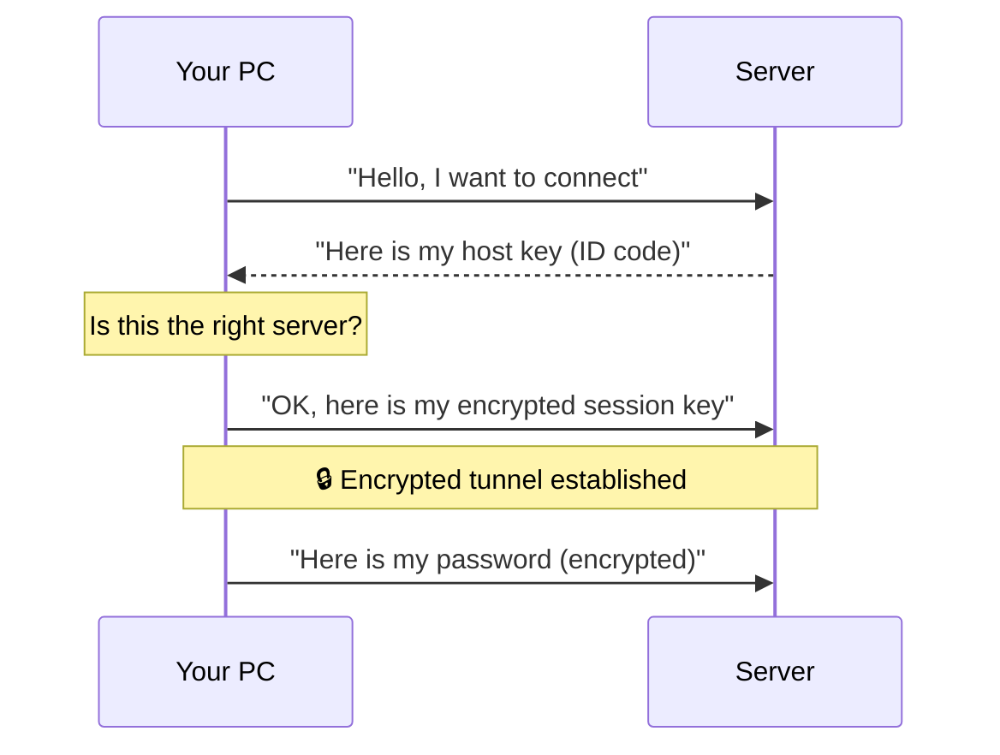

<a name="reseau" id="reseau"></a>

# 📡 Module 5 - Network

---

# The network: a mail analogy 📮

**Think of the network like the postal system:**

- **IP address** = your home’s street address
- **Subnet mask** = ZIP/postal code (defines the neighborhood)
- **Gateway** = local post office
- **DNS** = phone book (name → address)
- **Port** = apartment number
- **Router** = mail sorting center
- **Firewall** = guard who filters mail

---

# OSI vs TCP/IP models 🏗️



**In practice we use the TCP/IP model**

---

### Network models: the letter analogy 📬

<small>

| Step | OSI layer | What it does | Mail analogy |
|------|-----------|--------------|--------------|
| 7 | **Application** | You write the message | ✍️ Write the letter |
| 6 | **Presentation** | Format, encryption | 🔐 Seal the envelope |
| 5 | **Session** | Start the conversation | 📞 Choose who to write to |
| 4 | **Transport** | Split into numbered chunks | 📦 Number pages if long |
| 3 | **Network** | Add addresses | 🏠 Sender/recipient address |
| 2 | **Data link** | Prepare for local transport | 📮 Put in the mailbox |
| 1 | **Physical** | Transmit on the wire | 🚚 Truck carries bits |

</small>

---

### OSI model: upper layers (4–7) 📚

<div class="text-sm">

**Layer 7 - Application** — what YOU see
- HTTP (web), FTP (files), SMTP (mail), SSH (remote shell)
- 💡 *Your browser, mail client...*

**Layer 6 - Presentation** — translation and formatting
- SSL/TLS encryption, compression, encoding (UTF-8)
- 💡 *Makes data readable for the receiver*

**Layer 5 - Session** — manage the conversation
- Open, maintain, close sessions
- 💡 *"Hello, I'd like to talk to..."*

**Layer 4 - Transport** — end-to-end reliability
- TCP (reliable, ordered) or UDP (fast, no guarantee)
- 💡 *"I check everything arrived"*

</div>

---

### OSI model: lower layers (1–3) 🔌

<div class="text-sm">

**Layer 3 - Network** — routing and IP addressing
- IP protocol: logical addressing
- 💡 *"How do I get from Paris to Tokyo?"*

**Layer 2 - Data link** — local communication
- MAC address (burned into the NIC)
- Error detection, local flow control
- 💡 *"Talk to the immediate neighbor"*

**Layer 1 - Physical** — bits on the wire
- Ethernet cables, fiber, WiFi radio
- 💡 *The medium that carries 0s and 1s*

**Memory trick:** "**A**ll **P**eople **S**eem **T**o **N**eed **D**ata **P**rocessing"

</div>

---

# TCP/IP: the practical model 🌐

<div class="text-sm">

**Why TCP/IP instead of OSI?**

OSI is **theoretical** (designed to teach).
TCP/IP is **practical** (designed for the Internet).

| TCP/IP | OSI equivalent | Protocols | Analogy |
|--------|----------------|-----------|---------|
| **Application** | 5, 6, 7 | HTTP, SSH, DNS, FTP | The app you use |
| **Transport** | 4 | TCP, UDP | Mail carrier guarantees delivery |
| **Internet** | 3 | IP, ICMP | Global addressing system |
| **Network access** | 1, 2 | Ethernet, WiFi | Truck and physical road |

</div>

---

<div class="text-sm">

**In practice you work with:**
- 🖥️ **Application**: `curl`, browser, `ssh`
- 🔢 **Transport**: ports (22, 80, 443)
- 🌍 **Internet**: IP addresses (`192.168.1.100`)
- 🔌 **Network access**: `eth0`, `enp0s1`, RJ45 cable

</div>

---

# Network communication flow 🔄

<div class="text-sm">

**Example: sending an email**

1. **Application** → user writes and sends email (SMTP)
2. **Transport** → data split into segments (TCP)
3. **Internet** → each segment gets source/destination IP
4. **Network access** → packets sent on the physical network

**Reverse on receive** ⬅️

- Each layer strips its header
- Data rises back to the destination app
- Email is rebuilt and displayed

**💡 Tip:** each layer talks only to its neighbor — like floors in a building!

</div>

---

# IP addresses: what are they? 🏠

**An IP address is your machine’s postal address on the network.**

Without an IP address you cannot:
- ❌ Receive data
- ❌ Send data
- ❌ Be identified on the network

---

**Two versions both exist:**

| | IPv4 | IPv6 |
|---|------|------|
| **Introduced** | 1983 | 1998 |
| **Bits** | 32 bits | 128 bits |
| **Format** | `192.168.1.100` | `2001:db8::1` |
| **Addresses** | ~4.3 billion | so many we don't run out |
| **Status** | Running out | Growing use |

---

# IPv6 in brief 🚀

**Why IPv6?**

~4.3 billion IPv4 addresses vs **20+ billion** connected devices → shortage!

**Format:** 8 groups of 4 hex digits

```
2001:0db8:85a3:0000:0000:8a2e:0370:7334
```

**Simplified notation:**

```
Full:      2001:0db8:0000:0000:0000:0000:0000:0001
Short:     2001:db8::1
```

- Leading zeros can be dropped (`0db8` → `db8`)
- Zero groups replaced by `::` (once only)

**Today:** IPv4 still dominates local networks (`192.168.x.x`); IPv6 grows on mobile and cloud.

---

# IPv4 in detail: parts of an address 🔍

**Format: four numbers from 0 to 255, separated by dots**

```
    192    .    168    .     1     .    100
   └─┬─┘       └─┬─┘       └─┬─┘       └─┬─┘
  Octet 1    Octet 2    Octet 3    Octet 4
```

---

**Each octet = 8 bits = value 0 to 255**

```bash
# In binary, 192.168.1.100 is:
11000000.10101000.00000001.01100100
```

---

**Phone analogy 📞**

```
   +33      1     23    45    67    89
   └┬┘     └┬┘   └───────┬──────────┘
  Country Region   Local number

  192.168   .1     .100
  └──┬──┘   └┬┘    └─┬─┘
  Network Sub-   Host
         net
```

---

#### Private IP ranges (lab & office) 🏠

<div class="text-xs">

**These ranges are for local networks only** - not used directly on the public Internet:

- **`192.168.x.x`** - home, lab, small office (most common) → e.g. `192.168.1.25`
- **`10.x.x.x`** - large internal networks → e.g. `10.50.120.45`
- **`172.16.x.x` – `172.31.x.x`** - medium internal networks → e.g. `172.20.15.100`

**Loopback**: `127.0.0.1` (this machine only)
  - 🔄 Test a local web server → `http://127.0.0.1:8080`

</div>

---

# Subnet mask 🎭

**Mask**: defines which part is network vs host



**CIDR notation:** `/24` = `255.255.255.0`

---

# Understanding the subnet mask 🎓

<div class="text-sm">

**What does it mean?**

The mask defines **which part of the IP identifies the network** and **which part identifies the host**.

**Example with `192.168.1.100` and mask `255.255.255.0` (/24)**

```bash
IP :      192  .  168  .   1   .  100
Mask :    255  .  255  .  255  .   0

         [    Network    ] [Host]
         192.168.1         .100
```

- **Network part** (`192.168.1`) → all machines on the same LAN
- **Host part** (`100`) → one specific machine

**In practice:** with this mask, `192.168.1.100` can talk directly to:
- ✅ `192.168.1.1` (same network)
- ✅ `192.168.1.50` (same network)
- ❌ `192.168.2.100` (other network → needs a router)

</div>

---

# Common CIDR masks 📊

<div class="text-sm">

**Format `/XX` = number of bits for the network**

| CIDR | Mask | Usable addresses | Use case | Example network |
|------|------|------------------|----------|-----------------|
| `/8` | `255.0.0.0` | 16 777 216 | Very large networks | `10.0.0.0/8` |
| `/16` | `255.255.0.0` | 65 536 | Large networks | `172.16.0.0/16` |
| `/24` | `255.255.255.0` | 254 | Standard LAN | `192.168.1.0/24` |
| `/30` | `255.255.255.252` | 2 | Point-to-point link | `10.0.0.0/30` |

**Why 254 and not 256 in /24?**

- **Network address**: `192.168.1.0` → reserved (identifies the network)
- **Broadcast address**: `192.168.1.255` → reserved (message to all)
- **Usable hosts**: `192.168.1.1` to `192.168.1.254`

</div>

---

# Neighborhood analogy: CIDR masks 🏘️

<div class="text-sm">

**Think of IP addresses as street numbers in neighborhoods:**

| CIDR | Analogy | Number of "houses" |
|------|---------|---------------------|
| `/24` | **Small neighborhood** 🏠 | 254 houses (1–254) |
| `/16` | **Whole city** 🏙️ | 65 534 houses |
| `/8` | **Megacity** 🌆 | 16 million houses |
| `/30` | **Duplex** 🏡 | 2 houses (direct link) |

**Example with /24:**

```
Neighborhood: 192.168.1.x  (x = house number)

🏠 House 0    → Reserved ("Welcome to the neighborhood")
🏠 Houses 1–254 → Usable (your machines)
🏠 House 255  → Reserved (broadcast to everyone)
```

**Smaller `/XX` = bigger neighborhood!**

</div>

---

# Default gateway 🚪

**Gateway**: the router that lets you leave the local network



**Analogy:** the entrance to your neighborhood

---

### Understanding the gateway 🚪

<div class="text-sm">

**What is a gateway?**

The **router** that bridges your local network and the outside world (Internet).

**Concrete flow:** you want `google.com` from `192.168.1.100`:

1. **Your host** checks: "Is Google on my LAN (`192.168.1.x`)?"
   - ❌ No → Google is on the Internet

2. **Your host** sends the packet to the **gateway** (`192.168.1.1`)
   - 💬 "Router, please forward this to Google"

3. **The gateway**:
   - Receives the packet
   - Changes source IP (private → public via NAT)
   - Forwards to the Internet
   - Returns the reply to your host

**Summary:** without a gateway you are stuck on the local network! 🔒

</div>

---

# Full network config scenario 💻

<div class="text-xs">

**Scenario:** home office on a domestic network

**Your host configuration:**

```bash
IP address:     192.168.1.50
Mask:           255.255.255.0  (/24)
Gateway:        192.168.1.1
DNS:            8.8.8.8
```

| Element | Meaning | Analogy |
|---------|---------|---------|
| **192.168.1.50** | Your address on the LAN | Your house number |
| **255.255.255.0** | Talk directly to `192.168.1.1`–`.254` | Your neighborhood |
| **192.168.1.1** | Router to leave the network | Neighborhood exit |
| **8.8.8.8** | Google DNS for name lookup | Phone book |

</div>

---

<div class="text-xs">

**Communication examples:**

- 💬 Reach `192.168.1.10` (network printer) → ✅ direct (same network)
- 💬 Reach `192.168.1.100` (NAS) → ✅ direct (same network)
- 💬 Reach `google.com` → ❌ not on the LAN
  - → Ask DNS: "IP of google.com?" → `142.250.185.46`
  - → Send packet to gateway (`192.168.1.1`)
  - → Gateway forwards to the Internet

</div>

---

# DNS: Domain Name System 🌐

**Why DNS exists?**

Computers use **IP addresses** (142.250.185.46)
People prefer **names** (google.com)

**DNS performs the mapping!** 📖

```
You type:     google.com
DNS maps to:  142.250.185.46
Your PC:      "OK, I'll contact 142.250.185.46"
```

**Analogy: the phone book 📞**
- You look up "Local pizza" → the book gives 01 23 45 67 89
- You look up "google.com" → DNS gives 142.250.185.46

---

# How DNS works 🔄

**When you type `www.example.com` in your browser:**



---

# DNS hierarchy 🏛️

**DNS is an inverted tree:**

```
                    . (root)
                    │
        ┌───────────┼───────────┐
        │           │           │
       com         org         fr
        │           │           │
    ┌───┴───┐      │       ┌───┴───┐
  google  amazon  wikipedia  gouv  example
    │       │       │         │       │
   www    aws     www       service  www
```

**Levels:**
- **Root (.)** — 13 worldwide servers
- **TLD** — `.com`, `.org`, `.fr`, `.net`
- **Domain** — `google.com`, `example.fr`
- **Subdomain** — `www.google.com`, `mail.google.com`

---

# DNS record types 📋

<div class="text-sm">

| Type | Meaning | Example | Use |
|------|---------|---------|-----|
| **A** | IPv4 address | `93.184.216.34` | Server IP |
| **AAAA** | IPv6 address | `2606:2800:220:1::` | IPv6 server IP |
| **CNAME** | Alias | `www` → `example.com` | Name redirect |
| **MX** | Mail exchanger | `mail.example.com` | Email server |
| **NS** | Name server | `ns1.example.com` | Authoritative DNS |
| **TXT** | Free text | `v=spf1 include:...` | SPF, DKIM checks |
| **PTR** | Reverse | `34.216.184.93.in-addr.arpa` | IP → name |

</div>

---

<div class="text-sm">

```bash
# All records
dig example.com ANY

# Mail servers only
dig example.com MX
```

</div>

---

# Recommended public DNS servers 🌍

| Provider | Primary | Secondary | Benefits |
|----------|---------|-----------|----------|
| **Google** | `8.8.8.8` | `8.8.4.4` | Fast, reliable |
| **Cloudflare** | `1.1.1.1` | `1.0.0.1` | Fast, privacy-focused |
| **Quad9** | `9.9.9.9` | `149.112.112.112` | Blocks malware domains |
| **OpenDNS** | `208.67.222.222` | `208.67.220.220` | Optional parental filter |

**Which to choose?**
- 🚀 **Speed**: Cloudflare (`1.1.1.1`)
- 🔒 **Security**: Quad9
- 🏢 **Enterprise**: internal DNS + public backup

```bash
time dig @1.1.1.1 google.com
time dig @8.8.8.8 google.com
```

---

# View network configuration 🔍

```bash
# Modern method (since ~2010)
ip addr
ip a

# Old method (needs `apt install net-tools`)
ifconfig

# IPv4 addresses only
ip -4 addr

# IPv6 addresses only
ip -6 addr

# Show a specific interface
ip addr show eth0
```

---

# Sample `ip addr` output 📋

```bash
ip addr
```

```
1: lo: <LOOPBACK,UP,LOWER_UP> mtu 65536
    inet 127.0.0.1/8 scope host lo
    inet6 ::1/128 scope host

2: eth0: <BROADCAST,MULTICAST,UP,LOWER_UP> mtu 1500
    inet 192.168.1.100/24 brd 192.168.1.255 scope global eth0
    inet6 fe80::a00:27ff:fe4e:66a1/64 scope link
```

---

# Decoding `ip addr` line by line (1/2) 🔍

**Line 1: `1: lo: <LOOPBACK,UP,LOWER_UP> mtu 65536`**

| Element | Meaning |
|---------|---------|
| `1:` | Interface index (order of appearance) |
| `lo` | Interface name (loopback) |
| `<LOOPBACK>` | Interface type (internal loop) |
| `UP` | Interface **enabled** at OS level |
| `LOWER_UP` | Cable plugged / link present |
| `mtu 65536` | Max packet size (65 KB for loopback) |

---

**Flags inside `< >` matter:**
- `UP` = enabled → without it, the interface does not work!
- `LOWER_UP` = physical link OK → missing = cable unplugged
- `BROADCAST` = can send to all devices on the LAN
- `MULTICAST` = can send to a group of devices

---

# Decoding `ip addr` line by line (2/2) 🔍

**Line: `inet 192.168.1.100/24 brd 192.168.1.255 scope global eth0`**

| Element | Meaning |
|---------|---------|
| `inet` | **IPv4** address (`inet6` = IPv6) |
| `192.168.1.100` | Your IP address |
| `/24` | Subnet mask (`255.255.255.0`) |
| `brd 192.168.1.255` | **Broadcast** address (message to all) |
| `scope global` | Usable **everywhere** on the network |
| `eth0` | Interface this IP is bound to |

---

| Scope | Meaning | Example |
|-------|---------|---------|
| `global` | Routable everywhere | `192.168.1.100` (LAN) |
| `link` | Link-local only | `fe80::...` (IPv6 link-local) |
| `host` | This machine only | `127.0.0.1` (localhost) |

💡 **No `inet` line → no IPv4 on that interface!**

---

# Network interface names 🔌

**Why are the names odd?**

It used to be simple: `eth0`, `eth1`, `wlan0`...
Problem: order could **change after reboot**! 😱

**Modern approach: predictable names (systemd)**

Names are based on **physical location** of the hardware.

---

# Interface naming decoded 🔍

<div class="text-sm">

**Structure: `<type><location>`**

| Prefix | Meaning | Example |
|--------|---------|---------|
| `en` | **E**ther**n**et (wired) | `enp0s3` |
| `wl` | **W**ire**l**ess (WiFi) | `wlp3s0` |
| `ww` | **W**ireless **W**AN (4G/5G) | `wwan0` |
| `lo` | **Lo**opback | `lo` |

**Location suffix:**

| Suffix | Meaning | Full example |
|--------|---------|--------------|
| `o<N>` | **O**n-board (motherboard) | `eno1` = onboard Ethernet #1 |
| `p<bus>s<slot>` | **P**CI bus X, **S**lot Y | `enp0s3` = PCI bus 0, slot 3 |
| `s<slot>` | Hot-plug **S**lot | `ens33` = slot 33 (VMware) |

**Examples:**
- `enp0s3` → Ethernet, PCI bus 0, slot 3 (VirtualBox)
- `ens33` → Ethernet, slot 33 (VMware)
- `enp0s1` → Ethernet, PCI bus 0, slot 1 (QEMU/KVM lab VM)

</div>

---

# Find your interface name 🎯

```bash
# List all interfaces
ip link show

# Typical output:
# 1: lo: <LOOPBACK,UP>
# 2: enp0s3: <BROADCAST,MULTICAST,UP>
# 3: wlp2s0: <BROADCAST,MULTICAST>
```

---

**Tip: quick identification**

```bash
# Interface with an IP (likely the main one)
ip -br addr

# Result:
# lo        UNKNOWN  127.0.0.1/8
# enp0s3    UP       192.168.1.100/24   <-- This one!
```

---

💡 **Common names in VMs:**
- **VirtualBox**: `enp0s3`, `enp0s8`
- **VMware**: `ens33`, `ens34`
- **QEMU/KVM**: `enp0s1`, `enp1s0`, `ens3`

---

# Persistent configuration: Netplan (modern Ubuntu) 🆕

**Netplan** is the default network configuration stack on Ubuntu (since 17.10)

**On this training VM:** interface is **`enp0s1`** (QEMU/KVM). Check yours with `ip -br link` before editing.

**File: `/etc/netplan/*.yaml`** (often `00-installer-config.yaml` on Ubuntu Server) - replace `enp0s1` with your interface.

```yaml
network:
  version: 2
  renderer: networkd
  ethernets:
    enp0s1:
      dhcp4: false
      addresses:
        - 192.168.1.100/24
      routes:
        - to: default
          via: 192.168.1.1
      nameservers:
        addresses:
          - 8.8.8.8
          - 8.8.4.4
```

---

# Netplan: line by line (1/2) 📖

**Root and renderer:**

```yaml
network:
  version: 2
  renderer: networkd
  ethernets:
    enp0s1:
```

- `network:` → root of the network config file
- `version: 2` → Netplan v2 format (current standard)
- `renderer: networkd` → use **systemd-networkd** (Ubuntu Server default)
- `ethernets:` → section for wired interfaces
- `enp0s1:` → interface to configure (check with `ip a`)

---

# Netplan: line by line (2/2) 📖

**Static IP settings:**

<div class="text-sm">

```yaml
      dhcp4: false
      addresses:
        - 192.168.1.100/24
      routes:
        - to: default
          via: 192.168.1.1
      nameservers:
        addresses:
          - 8.8.8.8
          - 8.8.4.4
```

</div>

| Line | Meaning |
|------|---------|
| `dhcp4: false` | Disable automatic IP (DHCP) |
| `addresses: - 192.168.1.100/24` | Fixed IP with /24 mask |
| `routes: - to: default via: ...` | Default gateway (router) |
| `nameservers:` | DNS servers to use |

---

# Netplan: apply commands 🚀

```bash
# Apply configuration
sudo netplan apply
```

```bash
# Test before applying (auto undo after 120s)
sudo netplan try
```

```bash
# Generate config and show errors
sudo netplan generate
```

```bash
# Show current configuration
sudo netplan get
```

⚠️ **Warning**: A YAML syntax error can cut off the network!

---

# DHCP: automatic configuration 🤖

**DHCP**: Dynamic Host Configuration Protocol

```yaml
# Netplan
network:
  version: 2
  ethernets:
    eth0:
      dhcp4: true
```

**The DHCP server automatically provides:**
- IP address
- Subnet mask
- Default gateway
- DNS servers

---

# Netplan on Ubuntu Server 🐧

**This course uses Netplan** - YAML files in `/etc/netplan/`:

```bash
sudo nano /etc/netplan/01-netcfg.yaml
sudo netplan apply
```

**Note:** Ubuntu **Desktop** may use **NetworkManager** (GUI Wi‑Fi). **Server labs = Netplan only.**

---

# DNS configuration 🌐

<div class="text-sm">

**Two important files for DNS names:**

**1. `/etc/resolv.conf` - DNS server configuration**

```bash
cat /etc/resolv.conf
```

```
nameserver 8.8.8.8
nameserver 8.8.4.4
search example.com
```

**2. `/etc/hosts` - Local resolution (checked first)**

```bash
cat /etc/hosts
```

```
127.0.0.1       localhost
127.0.1.1       my-hostname
192.168.1.10    webserver.local webserver
192.168.1.20    database.local db
```

**⚠️ `/etc/resolv.conf` is often managed automatically by systemd-resolved or NetworkManager**

</div>

---

# /etc/hosts vs /etc/resolv.conf - what’s the difference? 🤔

<div class="text-sm">

**Name resolution order:**



</div>

---

**Summary:**

| File | Role | Priority | Use case |
|---------|------|----------|-------------|
| **`/etc/hosts`** | Direct name → IP map | ✅ **1st** (highest) | Fast local names, aliases, tests |
| **`/etc/resolv.conf`** | DNS servers to query | 2nd (if hosts misses) | Internet name resolution |

---

# Test connectivity: ping 🏓

```bash
# Ping an IP
ping 8.8.8.8

# Ping a hostname
ping google.com

# Limit packet count
ping -c 4 google.com

# Interval between pings (seconds)
ping -i 0.5 google.com

# Flood ping (root required, careful!)
sudo ping -f 192.168.1.1
```

---

**What ping tests:**
- Network connectivity
- Round-trip time (latency)
- Packet loss

---

# Interpreting ping results 📊

```bash
ping -c 4 google.com
```

```
PING google.com (142.250.185.46) 56(84) bytes of data.
64 bytes from par21s04-in-f14.1e100.net (142.250.185.46): icmp_seq=1 ttl=115 time=15.2 ms
64 bytes from par21s04-in-f14.1e100.net (142.250.185.46): icmp_seq=2 ttl=115 time=14.8 ms
64 bytes from par21s04-in-f14.1e100.net (142.250.185.46): icmp_seq=3 ttl=115 time=15.1 ms
64 bytes from par21s04-in-f14.1e100.net (142.250.185.46): icmp_seq=4 ttl=115 time=15.0 ms

--- google.com ping statistics ---
4 packets transmitted, 4 received, 0% packet loss, time 3005ms
rtt min/avg/max/mdev = 14.825/15.025/15.194/0.141 ms
```

---

**Key information:**
- `time` — latency (lower is better)
- `0% packet loss` — no loss (good)
- `ttl` — Time To Live (max hops remaining)

---

# Trace the path: tracepath / traceroute 🗺️

```bash
# Default on Ubuntu (no install)
tracepath google.com

# Alternative (install if needed)
sudo apt install traceroute
traceroute google.com
sudo traceroute -I google.com   # ICMP instead of UDP
```

**Shows every router along the path**

---

# Sample traceroute output 🗺️

```bash
traceroute google.com
```

```
traceroute to google.com (142.250.185.46), 30 hops max, 60 byte packets
 1  192.168.1.1 (192.168.1.1)  1.234 ms  1.123 ms  1.056 ms
 2  10.0.0.1 (10.0.0.1)  5.432 ms  5.123 ms  5.234 ms
 3  * * *
 4  142.250.185.46 (142.250.185.46)  15.123 ms  14.987 ms  15.234 ms
```

---

**Meaning:**
- Each line = one router (hop)
- `* * *` = router that does not reply (normal — firewall)
- Times in ms = latency to that hop

---

# DNS resolution: dig 🔍

**dig**: detailed DNS lookup tool

```bash
# dig is pre-installed on Ubuntu Server (bind9-dnsutils)
# If missing: sudo apt install bind9-dnsutils

# Simple lookup
dig google.com

# Short answer only
dig +short google.com

# Specific DNS server
dig @8.8.8.8 google.com

# Specific record type
dig google.com MX     # Mail servers
dig google.com NS     # Name servers
dig google.com AAAA   # IPv6
```

---

# The routing table: what is it? 🛣️

**Problem:** When your host sends a packet, how does it know where to send it?

**Answer:** It consults its **routing table**!

**Analogy: your host’s GPS 🚗**

```
You want to go from Paris to Lyon:

1. GPS checks: "Is Lyon inside Paris?" → No
2. GPS says: "Take highway A6 south"
3. You follow the directions

Your host does the same:
1. "Is 8.8.8.8 on my local network?" → No
2. "Routing table says: send to gateway 192.168.1.1"
3. Packet goes to the gateway
```

---

# Why change the routing table? 🤔

<div class="text-sm">

**Real cases where you add routes:**

**1. Corporate VPN 🏢**

```
Problem: reach internal network 10.20.0.0/16 via VPN
Solution: ip route add 10.20.0.0/16 via 192.168.1.50
```

**2. Multiple gateways 🚪**

```
Problem: dev network 172.16.0.0/16 via another router
Solution: ip route add 172.16.0.0/16 via 192.168.1.254
```

**3. Containers / VMs 🐳**

```
Docker uses 172.17.0.0/16 — Docker adds the route automatically
```

</div>

---

# How routing decisions work 🧠

**The host checks the routing table in this ORDER:**



**Rule: the most SPECIFIC route wins!**

- `/32` (one IP) > `/24` > `/16` > `/8` > `default`

---

# Routing commands 🛣️

```bash
# Show routing table
ip route
ip route show

# Default route only
ip route show default

# Old methods
route -n
netstat -rn
```

---

# Anatomy of a routing entry 🔬

```bash
ip route
```

```
default via 192.168.1.1 dev enp0s1 proto dhcp metric 100
192.168.1.0/24 dev enp0s1 proto kernel scope link src 192.168.1.100 metric 100
169.254.0.0/16 dev enp0s1 scope link metric 1000
```

---

<div class="text-xs">

| Element | Meaning |
|---------|---------|
| `default` | Default route (`0.0.0.0/0`) — if nothing else matches |
| `via 192.168.1.1` | Send packets to this gateway |
| `dev enp0s1` | Use this network interface |
| `proto dhcp` | Route learned from DHCP |
| `proto kernel` | Route created automatically by the kernel |
| `scope link` | Destination directly reachable (same network) |
| `src 192.168.1.100` | Source address for outgoing packets |
| `metric 100` | Priority (lower = preferred if several routes match) |

</div>

---

# Multi-network example 🏢

<div class="text-sm">

**Scenario:** your host must reach:
- Internet → via home router (`192.168.1.1`)
- Prod network (`10.10.0.0/16`) → via dedicated router (`192.168.1.254`)
- Dev network (`172.16.0.0/16`) → via VPN (`192.168.1.50`)

```bash
ip route

default via 192.168.1.1 dev enp0s1           # Internet
10.10.0.0/16 via 192.168.1.254 dev enp0s1    # Prod
172.16.0.0/16 via 192.168.1.50 dev enp0s1    # Dev via VPN
192.168.1.0/24 dev enp0s1 scope link         # Local LAN
```

</div>

---

<div class="text-sm">

**Where does each packet go?**

- `ping 8.8.8.8` → gateway `192.168.1.1` (default)
- `ping 10.10.5.20` → gateway `192.168.1.254` (specific route)
- `ping 172.16.100.5` → gateway `192.168.1.50` (VPN route)
- `ping 192.168.1.50` → direct (same network)

**Check which route will be used:**

```bash
ip route get 8.8.8.8
ip route get 10.10.5.20
```

</div>

---

# Add/remove routes 🛤️

```bash
# Add route to a specific network
sudo ip route add 10.0.0.0/24 via 192.168.1.254

# Delete a route
sudo ip route del 10.0.0.0/24

# Change default gateway
sudo ip route change default via 192.168.1.2

# Persistent route (Netplan - Ubuntu Server)
# In /etc/netplan/*.yaml under the interface:
#   routes:
#     - to: 10.0.0.0/24
#       via: 192.168.1.254
# Then: sudo netplan apply
```

---

# View open ports: ss 🔍

**ss**: Socket Statistics (replaces netstat)

```bash
# All listening ports
sudo ss -tuln

# With process names
sudo ss -tulnp

# TCP only
sudo ss -tln

# UDP only
sudo ss -uln

# Established connections
sudo ss -tn
```

---

**Options:**
- `-t`: TCP
- `-u`: UDP
- `-l`: listening
- `-n`: numeric (no DNS)
- `-p`: process

---

# Sample `ss` output 📋

```bash
sudo ss -tulnp
```

```
Netid  State   Recv-Q  Send-Q  Local Address:Port  Peer Address:Port  Process
tcp    LISTEN  0       128     0.0.0.0:22           0.0.0.0:*          users:(("sshd",pid=1234,fd=3))
tcp    LISTEN  0       128     0.0.0.0:80           0.0.0.0:*          users:(("nginx",pid=5678,fd=6))
tcp    LISTEN  0       128     [::]:22              [::]:*             users:(("sshd",pid=1234,fd=4))
udp    UNCONN  0       0       0.0.0.0:68           0.0.0.0:*          users:(("systemd-network",pid=9012,fd=6))
```

---

# Ports: what are they? 🚪

**Problem:** one IP address, but **many services** (web, mail, SSH...)

**How to tell them apart?** → **Ports**!

**Analogy: the apartment building 🏢**

```
IP address = building address (10 Main Street)
Port       = apartment number

192.168.1.100:22   → building .100, apt 22 (SSH)
192.168.1.100:80   → building .100, apt 80 (Web)
192.168.1.100:443  → building .100, apt 443 (HTTPS)
```

**Full connection format:**

```
source_IP:source_port  →  destination_IP:destination_port
192.168.1.50:54321    →  142.250.185.46:443
```

---

# Port categories 📊

| Category | Range | Used by | Examples |
|----------|-------|---------|----------|
| **Well-known** | 0–1023 | System services (root) | SSH (22), HTTP (80), DNS (53) |
| **Registered** | 1024–49151 | Applications | MySQL (3306), Minecraft (25565) |
| **Dynamic** | 49152–65535 | Temporary connections | Browser picks one per outbound connection |

---

### Essential ports to know 🧠

<div class="text-xs">

| Port | Service | Protocol | Purpose |
|------|---------|----------|---------|
| **22** | SSH | TCP | Secure remote login |
| **80** | HTTP | TCP | Unencrypted web |
| **443** | HTTPS | TCP | Encrypted web (TLS) |
| **53** | DNS | UDP/TCP | Name resolution |
| **67/68** | DHCP | UDP | Automatic IP assignment |
| **3306** | MySQL | TCP | MySQL database |
| **5432** | PostgreSQL | TCP | PostgreSQL database |

</div>

---

### Decoding `ss -tulnp` columns 🔍

<div class="text-sm">

**Take this line:**

```
tcp    LISTEN  0       128     0.0.0.0:22           0.0.0.0:*          users:(("sshd",pid=1234,fd=3))
```

| Column | Value | Meaning |
|--------|-------|---------|
| **Netid** | `tcp` | Protocol (tcp or udp) |
| **State** | `LISTEN` | Waiting for connections |
| **Recv-Q** | `0` | Receive queue (0 = OK) |
| **Send-Q** | `128` | Max send queue size |
| **Local Address:Port** | `0.0.0.0:22` | Listen on **all interfaces**, port 22 |
| **Peer Address:Port** | `0.0.0.0:*` | Accept from **anywhere** |
| **Process** | `sshd,pid=1234` | Program listening (SSH daemon) |

</div>

---

# Listening addresses and security 🎯

<div class="text-sm">

| Address | Meaning | Security |
|---------|---------|----------|
| `0.0.0.0:80` | Listen on **ALL** IPv4 interfaces | ⚠️ Reachable from anywhere |
| `127.0.0.1:3306` | **Localhost only** | ✅ Local access only |
| `192.168.1.100:22` | Listen on this specific IP | ⚠️ Reachable from LAN |
| `[::]:80` | Listen on **ALL** IPv6 interfaces | ⚠️ Reachable from anywhere |

**TCP states:**
- `LISTEN` — waiting for connections (server)
- `ESTABLISHED` — active connection
- `TIME_WAIT` — closing connection

</div>

---

# Test a port with nc 🔌

```bash
# Test TCP connectivity
nc -zv google.com 80

# Scan a port range
nc -zv 192.168.1.1 20-80

# Listen on a port (lab)
nc -l 12345

# Send to a port
echo "Message" | nc 192.168.1.100 12345
```

---

# Firewalls: introduction 🔥

**Firewall**: filters network traffic

**Analogy:** a nightclub bouncer
- Controls who enters and leaves
- Blocks unwanted traffic
- Allows guests

**On Ubuntu Server we use ufw** — a simple front-end. Under the hood it configures **iptables**.

---

# iptables: the traditional firewall 🛡️

**iptables** — powerful but complex (low level)

**Main chains:**
- **INPUT** — incoming traffic to this host
- **OUTPUT** — outgoing traffic from this host
- **FORWARD** — traffic passing through (routing/NAT)

**Actions:**
- **ACCEPT** — allow
- **DROP** — block silently
- **REJECT** — block with error reply

---

# iptables: minimal example 🔧

```bash
# View rules
sudo iptables -L -n -v

# Allow SSH (port 22)
sudo iptables -A INPUT -p tcp --dport 22 -j ACCEPT

# Allow established connections
sudo iptables -A INPUT -m state --state ESTABLISHED,RELATED -j ACCEPT

# Drop everything else
sudo iptables -P INPUT DROP
```

**You do not need to memorize this** — ufw generates similar rules for you.

---

# How ufw uses iptables 🔗

**ufw** = Uncomplicated Firewall — a friendly wrapper around iptables

```bash
# What ufw configured (read-only in class)
sudo iptables -L -n -v
```

**Key files in `/etc/ufw/`:**
- `ufw.conf` — global settings (enabled/disabled, logging level)
- `before.rules` — rules applied **before** your rules (includes ICMP defaults)
- `user.rules` — rules you add with `ufw allow/deny`
- `after.rules` — rules applied after user rules
- `applications.d/` — app profiles (`OpenSSH`, `Nginx Full`, ...)

---

# ufw: default policies explained 🎯

**Defaults:**
- **Incoming:** deny (block unless explicitly allowed)
- **Outgoing:** allow (host can reach the Internet)

```bash
sudo ufw default deny incoming
sudo ufw default allow outgoing
sudo ufw default deny routed   # if forwarding
```

**Consequences:**
- `curl https://google.com` → ✅ works (outgoing allowed)
- SSH from outside with no `allow 22` rule → ❌ blocked
- New listening service (e.g. port 8080) → ❌ blocked until you `ufw allow 8080`

---

# ufw: rule evaluation order 📋

**First matching rule wins** — order matters!

```bash
sudo ufw status numbered
```

```
[ 1] 22/tcp                     ALLOW IN    Anywhere
[ 2] 80/tcp                     ALLOW IN    Anywhere
[ 3] Anywhere                   DENY IN     203.0.113.51
```

- Delete by number: `sudo ufw delete 2`
- **Trap:** `ufw enable` **before** `ufw allow OpenSSH` → locked out of SSH!

**Always:** console/VM access ready · allow SSH · then enable.

---

# ufw: `limit` vs `allow` for SSH 🔐

```bash
sudo ufw allow from 192.168.1.0/24 to any port 22   # LAN only
sudo ufw limit ssh                                   # rate-limit from anywhere
```

**`ufw limit ssh`:**
- Allows SSH but **rate-limits** repeated connection attempts
- Uses iptables `recent` module under the hood
- Good protection against password brute-force on Internet-facing hosts

**Prefer `allow from subnet`** when SSH should only come from your lab LAN.

---

# ufw: application profiles 📱

```bash
sudo ufw app list
sudo ufw app info OpenSSH
sudo ufw allow 'Nginx Full'
```

---

**`app info OpenSSH`** shows the real ports (usually 22/tcp) — safer than guessing port numbers.

Profiles are defined in `/etc/ufw/applications.d/`.

---

# ufw: logging 📝

```bash
# Enable logging (medium level by default)
sudo ufw logging on

# Watch blocked/allowed traffic
sudo tail -f /var/log/ufw.log
```

---

Useful when a service "does not respond" — check if ufw blocked the packet.

---

# ufw: ICMP / ping 🏓

**Blocking ping is not always obvious:**

```bash
sudo ufw deny proto icmp    # may not block all ICMP — before.rules still applies
```

ICMP echo (ping) is often handled in **`/etc/ufw/before.rules`**, not only user rules.

**Optional (advanced lab):** edit `before.rules` to block echo-request — see network exercises.

---

# Checklist before `ufw enable` ✅

1. ✅ **`sudo ufw allow OpenSSH`** (or your SSH port)
2. ✅ Confirm interface/IP with `ip -br addr`
3. ✅ VM **console access** available (not only SSH)
4. ✅ If you changed IP: tested with **`sudo netplan try`**
5. ✅ **`sudo ufw status verbose`** — rules look correct
6. ✅ Then: **`sudo ufw enable`**

---
layout: new-section
---

# 🧪 Live coding - Module 5

### Network & ufw - allow SSH before you enable

---

# ufw: Uncomplicated Firewall 🛡️

**ufw** = easy firewall for Ubuntu

**Live demo order:** allow SSH **before** you enable - or you lock yourself out.

```bash
# Install
sudo apt install ufw

# Allow SSH first (always!)
sudo ufw allow OpenSSH

# Enable
sudo ufw --force enable

# Disable
sudo ufw disable

# Status
sudo ufw status
sudo ufw status verbose
```

---

# ufw rules 🔧

```bash
# Allow a port
sudo ufw allow 22
sudo ufw allow ssh
sudo ufw allow 80/tcp
sudo ufw allow 443/tcp

# Deny a port
sudo ufw deny 23

# Allow from a specific IP
sudo ufw allow from 192.168.1.100

# Allow a port range
sudo ufw allow 6000:6010/tcp

# Delete a rule
sudo ufw delete allow 80
```

---

# ufw: advanced rules 🎯

```bash
# Allow only from a subnet
sudo ufw allow from 192.168.1.0/24 to any port 22

# Slow down repeated tries (stop password guessing)
sudo ufw limit ssh

# Block an IP
sudo ufw deny from 203.0.113.51

# Reset all rules
sudo ufw reset

# Number rules
sudo ufw status numbered

# Delete by number
sudo ufw delete 3
```

---

# Check ufw rules (optional) 🔍

```bash
sudo ufw status verbose
```

**Lab rule:** use **ufw** only - that is enough for this course.

---

# Verify firewall + listening ports 🔧

```bash
# Rules + numbering
sudo ufw status numbered

# What is actually listening
sudo ss -tulnp

# Test from another host
nc -zv your_server 22
curl -I http://your_server
```

---

# ufw: after reboot & reload 🔧

```bash
# Rules stay after reboot once ufw is enabled
sudo ufw enable

# After editing /etc/ufw/*.rules (advanced)
sudo ufw reload

# Reset to defaults (careful!)
sudo ufw reset
```

---
layout: new-section
---

# ✅ Live coding done - Module 5

**You built on the VM:** `ufw allow OpenSSH` **before** `ufw enable` · rules + status

**Verify at home:** `sudo ufw status verbose` · SSH still works · `ss -tulnp | head`

**Next:** SSH, DNS & network theory (slides above cover `ip`, `resolvectl`)

---

# SSH: Secure Shell 🔒

**SSH**: connect to a remote machine **securely**

**Before SSH (1990s):** Telnet, rsh → everything in **plain text**! 😱
- Password visible on the network
- Commands readable
- No way to be sure you reached the real server

**With SSH:** everything is **encrypted** 🔐
- Password hidden on the network
- Server shows an ID code so you recognize it
- Data cannot be tampered with easily

---

### How SSH secures the connection 🔐

**Step 1: Encrypted tunnel setup**



---

**Step 2: Login**
- **Password**: you type it (encrypted inside the tunnel)
- **SSH key**: proof without typing a password each time

---

# SSH: basic connection 💻

```bash
# Simple connection
ssh user@server

# Different port
ssh -p 2222 user@server

# Specific private key
ssh -i ~/.ssh/my_key user@server

# Run one remote command (no interactive shell)
ssh user@server 'ls -la /var/log'

# X11 forwarding (graphical apps)
ssh -X user@server
```

**First connection? You may see:**

```
The authenticity of host 'server (192.168.1.100)' can't be established.
ED25519 key fingerprint is SHA256:xxxxxxxxxxxxxxxxxxx.
Are you sure you want to continue connecting (yes/no)?
```

→ Type `yes` the first time - SSH saves the server ID for next time

---

# SSH key login: why? 🔑

**Password downsides:**
- ❌ Easy to guess (password attacks)
- ❌ Typed every time
- ❌ Can be stolen (keylogger, phishing)

**SSH key benefits:**
- ✅ Nearly impossible to guess (long random key)
- ✅ No password typing each login
- ✅ Can protect the private key with a passphrase

---

# SSH keys: padlock analogy 🔓

**Two keys (public / private):**

```
🔐 PRIVATE key (id_ed25519)     →  Your house key (NEVER shared)
🔓 PUBLIC key (id_ed25519.pub)  →  A padlock you hand out

You give the server your padlock (public key).
The server sends a challenge locked with your padlock.
Only your private key can open it → you are authenticated!
```

**In practice:**
1. Generate a **pair** (private + public)
2. Copy the **public** key to the server
3. Each time you connect, the server checks you hold the **private** key

---

# Generate SSH keys 🔑

```bash
# Recommended in 2026: Ed25519 (secure, fast)
ssh-keygen -t ed25519 -C "my-email@example.com"

# Alternative: RSA 4096 (broad compatibility)
ssh-keygen -t rsa -b 4096 -C "my-email@example.com"
```

**What happens:**

```
Generating public/private ed25519 key pair.
Enter file in which to save the key (/home/user/.ssh/id_ed25519): [Enter]
Enter passphrase (empty for no passphrase): [optional but recommended]
Enter same passphrase again:

Your identification has been saved in /home/user/.ssh/id_ed25519       ← PRIVATE
Your public key has been saved in /home/user/.ssh/id_ed25519.pub       ← PUBLIC
```

**⚠️ GOLDEN RULES:**
- **Private** key → NEVER share, copy, or email!
- **Public** key → OK to share

---

# Copy the public key to a server 📤

```bash
# Automatic
ssh-copy-id user@server

# Specific port
ssh-copy-id -p 2222 user@server

# Manual
cat ~/.ssh/id_ed25519.pub | ssh user@server 'mkdir -p ~/.ssh && cat >> ~/.ssh/authorized_keys'

# Or paste into ~/.ssh/authorized_keys on the server
```

---

# Network troubleshooting 🔧

**Checklist:**

1. **Interface up?**
   ```bash
   ip link show eth0
   ```

2. **Correct IP?**
   ```bash
   ip addr show eth0
   ```

---

# Network troubleshooting (continued) 🔧

3. **Gateway reachable?**
   ```bash
   ping 192.168.1.1
   ```

4. **DNS working?**
   ```bash
   dig google.com
   ```

---

# Network troubleshooting (continued) 🔧

5. **Internet connectivity?**
   ```bash
   ping 8.8.8.8
   ```

6. **Firewall?**
   ```bash
   sudo ufw status
   # RHEL/Rocky alternative (not used in this Ubuntu course):
   # sudo firewall-cmd --list-all
   ```

---

# DHCP client: renew the lease 🤖

**On Ubuntu, the DHCP client requests its IP automatically.** Useful commands:

```bash
# Netplan: request DHCP on an interface
# /etc/netplan/*.yaml
#   ethernets:
#     eth0:
#       dhcp4: true

# Renew manually (Ubuntu Server - systemd-networkd)
sudo networkctl renew enp0s1    # your interface: ip -br link

# Verify what was received
ip addr show enp0s1
ip route                # gateway
resolvectl status       # DNS (systemd-resolved)
```

---

### Module 5 recap ✅

**What you learned:**

- ✅ Network models (TCP/IP, OSI) and concepts (IP, mask, CIDR, gateway, DNS)
- ✅ Static IP & DHCP client (Netplan)
- ✅ Diagnostics (ping, tracepath, dig, ss, nc)
- ✅ Routing table (ip route, multi-network scenarios)
- ✅ Ports and listening services
- ✅ Firewalls (iptables basics, ufw on Ubuntu)
- ✅ SSH and SSH keys
- ✅ Network troubleshooting

**Live demo on VM:** `ip -br addr` · `resolvectl status` · `sudo ufw status` · `sudo ss -tulnp | head`

---

# Next step 🎯

**Module 6 - Monitoring & logs**

---
layout: default
---

# Questions? 🤔

Feel free to ask your questions now!

Post your questions on <ExternalLink href="https://questions.andromed.fr">questions.andromed.fr</ExternalLink> (access code **29062026**) so I can centralize and answer them.

The next module covers performance metrics, logs, and logrotate.
