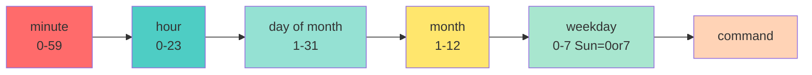

<a name="automatisation-scripts" id="automatisation-scripts"></a>

# 🤖 Module 8
## Automation, scripts, and scheduled tasks

### Automate to save time and avoid mistakes

---

# Why automate? 🤖

**Analogy: the programmable coffee maker** ☕

Without automation:
- Get up at 6am to make coffee
- Risk forgetting
- Same repetitive task every day

With automation:
- Set for 6:30am
- Coffee ready when you wake up
- Zero effort

---

#### Benefits of automation ✨

<div class="text-xs">

**1. Time savings**
- Repetitive tasks automated
- Scripts run while you sleep

**2. Reliability**
- Nothing forgotten
- Fewer human errors
- Traceability

**3. Consistency**
- Same procedure every time
- Reproducible

**4. Scalability**
- One script for 1 server = one script for 100 servers

</div>

---

# Shell scripting: basics 📝

**Script:** a text file containing commands

**First script:**

```bash
#!/bin/bash
# My first script

echo "Hello, World!"
echo "Current date: $(date)"
echo "User: $USER"
```

```bash
# Make executable
chmod +x script.sh

# Run
./script.sh
```

---

# The shebang #! 🔧

**Shebang:** first line that specifies the interpreter

```bash
#!/bin/bash      # Bash
#!/bin/sh        # POSIX shell
#!/usr/bin/env python3    # Python
#!/usr/bin/env node       # Node.js
```

**Why `/usr/bin/env`?**
- Finds the interpreter in PATH
- More portable

---

# Variables 📦

```bash
#!/bin/bash

# Define a variable
name="Alice"
age=30

# Use a variable
echo "Hello $name"
echo "You are $age years old"

# Or with braces (recommended)
echo "Hello ${name}"
echo "File: ${name}.txt"
```

**⚠️ No spaces around `=`!**

```bash
name = "Alice"    # ERROR
name="Alice"      # CORRECT
```

---

# Environment variables 🌍

```bash
#!/bin/bash

# System variables
echo "Home: $HOME"
echo "User: $USER"
echo "Path: $PATH"
echo "Shell: $SHELL"
echo "PWD: $PWD"

# Define an environment variable
export MY_VAR="value"

# In another script/program, $MY_VAR will be available
```

---

# Special variables 🎁

```bash
#!/bin/bash

echo "Script: $0"           # Script name
echo "First arg: $1"      # First argument
echo "Second arg: $2"     # Second argument
echo "All args: $@"    # All arguments
echo "Arg count: $#"    # Number of arguments
echo "PID: $$"              # Script PID
echo "Last exit code: $?"  # Last command exit code
```

**Analogy: a recipe in the kitchen** 👨‍🍳

A recipe (script) with ingredients (arguments):
- **$0**: recipe name ("Apple pie")
- **$1, $2**: ingredients ("apples", "sugar")
- **$#**: number of ingredients (2)
- **$$**: kitchen number (unique PID)
- **$?**: "did it succeed?" (0=success, other=failure)

---

#### Concrete example:

```bash
#!/bin/bash
# Script: backup.sh

if [ $# -lt 2 ]; then
    echo "Usage: $0 <source> <destination>"
    echo "Example: $0 /home/user /backup"
    exit 1
fi

echo "Backing up $1 to $2..."
tar -czf "$2/backup-$(date +%Y%m%d).tar.gz" "$1"

if [ $? -eq 0 ]; then
    echo "✅ Backup succeeded!"
else
    echo "❌ Backup error"
    exit 1
fi
```

---

# Example with arguments 📋

```bash
#!/bin/bash

echo "Argument count: $#"
echo "First argument: $1"
echo "Second argument: $2"
echo "All arguments: $@"

# Usage:
# ./script.sh alice bob
```

**Output:**

```
Argument count: 2
First argument: alice
Second argument: bob
All arguments: alice bob
```

---

# Reading user input 🎤

```bash
#!/bin/bash

echo "What is your name?"
read name

echo "Hello $name!"

# Read with prompt
read -p "Your age: " age
echo "You are $age years old"

# Silent read (password)
read -sp "Password: " password
echo
echo "Password entered (shh!)"
```

---

# Conditions: if/else 🔀

```bash
#!/bin/bash

age=25

if [ $age -ge 18 ]; then
    echo "You are an adult"
else
    echo "You are a minor"
fi
```

**⚠️ Spaces matter!**

```bash
if [ $age -ge 18 ]; then    # CORRECT
if [$age -ge 18]; then      # ERROR
```

---

# Comparison operators 🔢

**Numbers:**

```bash
-eq    # equal
-ne    # not equal
-lt    # less than
-le    # less or equal
-gt    # greater than
-ge    # greater or equal
```

**Example:**

```bash
if [ $age -ge 18 ]; then
    echo "Adult"
fi
```

---

# String comparison 🔤

```bash
=      # equal
!=     # not equal
-z     # empty string
-n     # non-empty string
```

**Example:**

```bash
#!/bin/bash

name="Alice"

if [ "$name" = "Alice" ]; then
    echo "Hello Alice"
fi

if [ -z "$name" ]; then
    echo "Empty name"
fi
```

**⚠️ Always quote variables!**

---

# File tests 📁

```bash
-e file    # exists
-f file    # regular file
-d file    # directory
-r file    # readable
-w file    # writable
-x file    # executable
-s file    # size > 0
```

**Example:**

```bash
if [ -f "/etc/passwd" ]; then
    echo "File exists"
fi

if [ -d "/home/alice" ]; then
    echo "Directory exists"
fi
```

---

# if/elif/else 🔀

```bash
#!/bin/bash

read -p "Your grade: " grade

if [ $grade -ge 16 ]; then
    echo "Very good"
elif [ $grade -ge 14 ]; then
    echo "Good"
elif [ $grade -ge 12 ]; then
    echo "Fair"
elif [ $grade -ge 10 ]; then
    echo "Pass"
else
    echo "Fail"
fi
```

---

# Logical operators 🧠

```bash
&&     # AND
||     # OR
!      # NOT
```

**Examples:**

```bash
# AND
if [ $age -ge 18 ] && [ $license = "yes" ]; then
    echo "You can drive"
fi

# OR
if [ $day = "saturday" ] || [ $day = "sunday" ]; then
    echo "Weekend!"
fi

# NOT
if [ ! -f "/tmp/lock" ]; then
    echo "No lock file"
fi
```

---

# case: switch/case 🎯

```bash
#!/bin/bash

read -p "Enter a command (start/stop/restart): " cmd

case $cmd in
    start)
        echo "Starting..."
        ;;
    stop)
        echo "Stopping..."
        ;;
    restart)
        echo "Restarting..."
        ;;
    *)
        echo "Unknown command"
        ;;
esac
```

---

# for loop 🔁

```bash
#!/bin/bash

# Iterate over a list
for fruit in apple banana orange; do
    echo "I like ${fruit}s"
done

# Iterate over files
for file in *.txt; do
    echo "File: $file"
done

# Number range
for i in {1..5}; do
    echo "Number $i"
done
```

---

# C-style for loop 🔁

```bash
#!/bin/bash

# C-style syntax
for ((i=1; i<=10; i++)); do
    echo "Counter: $i"
done

# Step by 2
for ((i=0; i<=20; i+=2)); do
    echo "Even number: $i"
done
```

---

# while loop ♾️

```bash
#!/bin/bash

# While condition is true
counter=1

while [ $counter -le 5 ]; do
    echo "Counter: $counter"
    ((counter++))
done

# Read a file line by line
while read line; do
    echo "Line: $line"
done < file.txt
```

---

# until loop 🔄

```bash
#!/bin/bash

# Until condition is true
counter=1

until [ $counter -gt 5 ]; do
    echo "Counter: $counter"
    ((counter++))
done
```

**while vs until:**
- `while`: continues while TRUE
- `until`: continues while FALSE

---

# break and continue ⏭️

```bash
#!/bin/bash

# break: exit the loop
for i in {1..10}; do
    if [ $i -eq 5 ]; then
        break
    fi
    echo $i
done
# Prints: 1 2 3 4

# continue: skip to next iteration
for i in {1..5}; do
    if [ $i -eq 3 ]; then
        continue
    fi
    echo $i
done
# Prints: 1 2 4 5
```

---

# Functions 📦

```bash
#!/bin/bash

# Define a function
greet() {
    echo "Hello!"
}

# Call the function
greet

# Function with arguments
greet_name() {
    echo "Hello $1!"
}

greet_name "Alice"
greet_name "Bob"
```

---

# Functions with return 🔙

```bash
#!/bin/bash

# Function with return (exit code 0-255)
is_even() {
    if [ $(($1 % 2)) -eq 0 ]; then
        return 0    # true
    else
        return 1    # false
    fi
}

if is_even 4; then
    echo "4 is even"
fi

# Function with echo (return a value)
add() {
    echo $(($1 + $2))
}

result=$(add 5 3)
echo "Result: $result"
```

---

# Local and global variables 🌐

```bash
#!/bin/bash

global_var="I am global"

my_func() {
    local local_var="I am local"
    echo $global_var    # Accessible
    echo $local_var     # Accessible
}

my_func

echo $global_var        # Accessible
echo $local_var         # Empty (out of scope)
```

---

# Arrays 📊

```bash
#!/bin/bash

# Define an array
fruits=("apple" "banana" "orange")

# Access element
echo ${fruits[0]}       # apple
echo ${fruits[1]}       # banana

# All elements
echo ${fruits[@]}

# Length
echo ${#fruits[@]}

# Append
fruits+=("kiwi")

# Iterate
for fruit in "${fruits[@]}"; do
    echo $fruit
done
```

---

# Arithmetic 🧮

```bash
#!/bin/bash

# Method 1: $(( ))
a=5
b=3
echo $((a + b))         # 8
echo $((a - b))         # 2
echo $((a * b))         # 15
echo $((a / b))         # 1 (integer division)
echo $((a % b))         # 2 (modulo)

# Increment
((a++))
echo $a                 # 6

# Method 2: expr (legacy)
result=$(expr $a + $b)

# Method 3: bc for decimals
echo "scale=2; 10 / 3" | bc    # 3.33
```

---

# Command substitution 💱

```bash
#!/bin/bash

# Modern: $( )
current_date=$(date)
echo "Date: $current_date"

files=$(ls -1 | wc -l)
echo "File count: $files"

# Legacy: backticks
current_date=`date`
```

---

# Strings 🧵

```bash
#!/bin/bash

name="Alice"

# Length
echo ${#name}            # 5

# Substring (start, length)
echo ${name:0:2}         # Al

# Replace
phrase="I like cats"
echo ${phrase/cats/dogs}    # I like dogs

# Uppercase
echo ${name^^}           # ALICE

# Lowercase
echo ${name,,}           # alice
```

---

# Redirection in scripts 📤

```bash
#!/bin/bash

# Redirect stdout to file
echo "Log entry" > log.txt

# Append to file
echo "Another entry" >> log.txt

# Redirect stderr
nonexistent_command 2> errors.txt

# Redirect both
command > all.txt 2>&1

# Discard errors
command 2> /dev/null
```

---

# Error handling 🚨

```bash
#!/bin/bash

# Exit on error
set -e

# Check exit code
if ! command; then
    echo "Command failed"
    exit 1
fi

# Or with $?
command
if [ $? -ne 0 ]; then
    echo "Error"
    exit 1
fi

# Exit with message
error_exit() {
    echo "Error: $1" >&2
    exit 1
}

[ -f "file.txt" ] || error_exit "Missing file"
```

---

# set: script options 🔧

```bash
#!/bin/bash

set -e    # Stop if a command fails
set -u    # Error on undefined variable
set -x    # Print executed commands (debug)
set -o pipefail    # Fail if any command in a pipe fails

# Combined (recommended)
set -euo pipefail

# Or on shebang line
#!/bin/bash -euo pipefail
```

---

# Practical script example: backup 💾

```bash
#!/bin/bash
set -euo pipefail

# Variables
SOURCE="/home/alice"
DESTINATION="/backup"
DATE=$(date +%Y%m%d_%H%M%S)
ARCHIVE="backup_${DATE}.tar.gz"

# Log function
log() {
    echo "[$(date +%Y-%m-%d\ %H:%M:%S)] $1"
}

# Verify source exists
if [ ! -d "$SOURCE" ]; then
    log "ERROR: $SOURCE does not exist"
    exit 1
fi
```

---

# Practical script example: backup (continued) 💾

```bash
# Create destination directory if needed
mkdir -p "$DESTINATION"

# Backup
log "Starting backup of $SOURCE"

if tar -czf "${DESTINATION}/${ARCHIVE}" "$SOURCE"; then
    log "Backup succeeded: ${ARCHIVE}"
else
    log "ERROR during backup"
    exit 1
fi

# Remove backups older than 7 days
find "$DESTINATION" -name "backup_*.tar.gz" -mtime +7 -delete
log "Old backups removed"

log "Backup finished"
```

---

# cron: task scheduler ⏰

**cron:** runs commands on a schedule

**Analogy: your phone alarm**
- Rings at set times
- Can repeat (daily, weekly)
- Reminds you of tasks

```bash
# Edit crontab
crontab -e

# View current crontab
crontab -l

# Remove crontab
crontab -r
```

---

# Crontab format 📋



**Format:** `* * * * * command`

**Examples:**

```bash
# Every day at 2:30 AM
30 2 * * * /path/script.sh

# Every hour
0 * * * * /path/script.sh

# Every Monday at 9 AM
0 9 * * 1 /path/script.sh
```

---

# Crontab examples ⏰

```bash
# Every 5 minutes
*/5 * * * * /path/script.sh

# Every day at midnight
0 0 * * * /path/backup.sh

# First day of month at 6 AM
0 6 1 * * /path/report.sh

# Monday to Friday at 8 AM
0 8 * * 1-5 /path/script.sh

# Saturday and Sunday at 10 AM
0 10 * * 6,7 /path/weekend.sh

# On system boot
@reboot /path/startup.sh
```

---

# Cron shortcuts 🔖

```bash
@reboot        # On boot
@yearly        # Once a year: 0 0 1 1 *
@annually      # Same
@monthly       # Once a month: 0 0 1 * *
@weekly        # Once a week: 0 0 * * 0
@daily         # Once a day: 0 0 * * *
@midnight      # Same
@hourly        # Once an hour: 0 * * * *
```

**Example:**

```bash
@daily /usr/local/bin/cleanup.sh
@hourly /usr/local/bin/check_health.sh
```

---

# Environment variables in cron 🌍

```bash
# Define variables
SHELL=/bin/bash
PATH=/usr/local/bin:/usr/bin:/bin
MAILTO=admin@example.com

# Then cron jobs
0 2 * * * /path/backup.sh
```

**⚠️ Common issue:** limited PATH in cron
- Always use absolute paths
- Or define PATH at the top of the crontab

---

# Redirection in cron 📤

```bash
# Send stdout to file
0 2 * * * /path/script.sh > /var/log/script.log

# Append to file
0 2 * * * /path/script.sh >> /var/log/script.log

# Redirect stdout and stderr
0 2 * * * /path/script.sh >> /var/log/script.log 2>&1

# Discard all output (silent)
0 2 * * * /path/script.sh > /dev/null 2>&1

# Email output (if MAILTO set)
0 2 * * * /path/script.sh
```

---

# System cron: /etc/cron.* 🗂️

**System directories:**

```bash
/etc/cron.hourly/     # Run hourly scripts
/etc/cron.daily/      # Daily scripts
/etc/cron.weekly/     # Weekly scripts
/etc/cron.monthly/    # Monthly scripts
```

**Usage:**

```bash
# Copy script into directory
sudo cp my_script.sh /etc/cron.daily/

# Make executable
sudo chmod +x /etc/cron.daily/my_script.sh
```

**Simpler than crontab for standard tasks!**

---

# anacron: for machines not 24/7 🏠

**anacron:** runs missed tasks

**Difference from cron:**
- **cron:** runs at exact times
- **anacron:** runs when the machine is on

**Useful for:**
- Laptops
- Desktops
- Frequently rebooted servers

```bash
# Configuration: /etc/anacrontab
# Period  Delay  Identifier   Command
1         5      cron.daily   run-parts /etc/cron.daily
7         10     cron.weekly  run-parts /etc/cron.weekly
@monthly  15     cron.monthly run-parts /etc/cron.monthly
```

---

# at: one-off scheduled task ⏱️

**at:** run a command once

```bash
# Install
sudo apt install at

# Enable
sudo systemctl enable --now atd

# Schedule a task
at 10:30
> /path/script.sh
> Ctrl+D

# Other formats
at now + 1 hour
at tomorrow
at 14:00 tomorrow
at 2:30 PM Friday
```

---

# Managing at jobs 🎛️

```bash
# List pending jobs
atq
# or
at -l

# View job details
at -c 1

# Remove a job
atrm 1

# Schedule from file
at -f script.sh now + 1 hour
```

---

# systemd timers: modern alternative ⏲️

**systemd timer:** modern cron replacement

**Pros:**
- systemd integration
- Logs in journalctl
- Dependencies
- Flexible scheduling

**Con:**
- More complex to configure

---

# Create a systemd timer 🛠️

**1. Create service: `/etc/systemd/system/my-script.service`**

```ini
[Unit]
Description=My maintenance script

[Service]
Type=oneshot
ExecStart=/usr/local/bin/my-script.sh
```

---

# Create a systemd timer (continued) 🛠️

**2. Create timer: `/etc/systemd/system/my-script.timer`**

```ini
[Unit]
Description=Timer for my script

[Timer]
OnCalendar=daily
OnCalendar=*-*-* 02:30:00
Persistent=true

[Install]
WantedBy=timers.target
```

---

# Create a systemd timer (continued) 🛠️

**3. Enable and start**

```bash
# Reload systemd
sudo systemctl daemon-reload

# Enable timer
sudo systemctl enable my-script.timer

# Start timer
sudo systemctl start my-script.timer

# Check status
systemctl status my-script.timer

# List all timers
systemctl list-timers
```

---

# OnCalendar syntax 📅

```ini
# Every day at midnight
OnCalendar=daily

# Every hour
OnCalendar=hourly

# Every Monday at 9 AM
OnCalendar=Mon *-*-* 09:00:00

# Every 15 minutes
OnCalendar=*:0/15

# First day of month
OnCalendar=*-*-01 00:00:00

# Validate syntax
systemd-analyze calendar "Mon *-*-* 09:00:00"
```

---

# Logs: where are they? 📜

**System logs:**

```bash
/var/log/syslog        # General system log (Debian/Ubuntu)
/var/log/messages      # System log (RHEL/Fedora)
/var/log/auth.log      # Authentication (Debian/Ubuntu)
/var/log/secure        # Authentication (RHEL/Fedora)
/var/log/kern.log      # Kernel
/var/log/dmesg         # Boot messages
/var/log/cron          # Cron logs
```

---

# Viewing logs: tail and grep 🔍

```bash
# Last lines of a log
tail /var/log/syslog

# Follow in real time
tail -f /var/log/syslog

# Last 50 lines
tail -n 50 /var/log/syslog

# Search in logs
grep "error" /var/log/syslog

# Case insensitive
grep -i "error" /var/log/syslog

# With context (3 lines before/after)
grep -C 3 "error" /var/log/syslog
```

---

# journalctl: systemd logs 📚

```bash
# All logs
journalctl

# Since last boot
journalctl -b

# Logs for a service
journalctl -u nginx

# Follow in real time
journalctl -f

# Follow a service
journalctl -u nginx -f

# Since a date
journalctl --since "2025-11-06"
journalctl --since "1 hour ago"
```

---

# journalctl: advanced filters 🔎

```bash
# By priority
journalctl -p err         # Errors
journalctl -p warning     # Warnings and above

# Time range
journalctl --since "2025-11-06 10:00" --until "2025-11-06 12:00"

# Combined
journalctl -u nginx -p err --since "1 day ago"

# By user
journalctl _UID=1000

# Kernel messages
journalctl -k

# JSON export
journalctl -u nginx -o json
```

---

# Log management: logrotate 🔄

**logrotate:** automatic log rotation

**Configuration: `/etc/logrotate.conf` and `/etc/logrotate.d/`**

**Example: `/etc/logrotate.d/nginx`**

```
/var/log/nginx/*.log {
    daily
    rotate 14
    compress
    delaycompress
    notifempty
    create 0640 www-data adm
    sharedscripts
    postrotate
        [ -f /var/run/nginx.pid ] && kill -USR1 $(cat /var/run/nginx.pid)
    endscript
}
```

---

# logrotate configuration 📝

**Common options:**

```
daily         # Daily rotation
weekly        # Weekly rotation
monthly       # Monthly rotation
rotate 7      # Keep 7 files
compress      # Compress old logs
delaycompress # Compress on next cycle
notifempty    # Do not rotate if empty
create 0644 user group  # New file permissions
size 100M     # Rotate if > 100M
```

---

# Testing logrotate 🧪

```bash
# Dry run
sudo logrotate -d /etc/logrotate.conf

# Force rotation
sudo logrotate -f /etc/logrotate.conf

# View state
cat /var/lib/logrotate/status
```

---

# Alerts and notifications 🔔

**Send email from a script:**

```bash
#!/bin/bash

# Install mailutils
sudo apt install mailutils

# Simple email
echo "Script finished" | mail -s "Notification" admin@example.com

# With attachment body from file
mail -s "Report" admin@example.com < report.txt

# In a script
if ! /path/backup.sh; then
    echo "Backup failed" | mail -s "ERROR Backup" admin@example.com
fi
```

---

# System notifications: notify-send 💬

```bash
# Install
sudo apt install libnotify-bin

# Simple notification
notify-send "Title" "Message"

# With icon
notify-send -i info "Info" "Informative message"

# Urgent
notify-send -u critical "Error" "Critical problem!"

# In a script
if [ $free_space -lt 10 ]; then
    notify-send -u critical "Disk full" "Less than 10% free space"
fi
```

---

# Example: monitoring script 📊

```bash
#!/bin/bash

# Check disk space
usage=$(df -h / | awk 'NR==2 {print $5}' | tr -d '%')

if [ $usage -gt 80 ]; then
    echo "ALERT: Disk at ${usage}%" | \
        mail -s "Disk alert" admin@example.com
fi

# Check if service is running
if ! systemctl is-active --quiet nginx; then
    echo "ALERT: Nginx is stopped" | \
        mail -s "Service down" admin@example.com
    systemctl start nginx
fi
```

---

# Scripting best practices 📋

1. **Always start with a shebang**
   ```bash
   #!/bin/bash
   ```

2. **Use set -euo pipefail**
   ```bash
   set -euo pipefail
   ```

3. **Comment your code**
   ```bash
   # This script performs a backup
   ```

4. **Use variables for repeated values**
   ```bash
   LOG_DIR=/var/log/my-app
   ```

---

# Scripting best practices (continued) 📋

5. **Check dependencies at the start**
   ```bash
   command -v rsync >/dev/null || { echo "rsync required"; exit 1; }
   ```

6. **Always quote variables**
   ```bash
   echo "$variable"    # CORRECT
   echo $variable      # Risky
   ```

7. **Use functions for repeated code**

8. **Log important actions**

---

# Scripting best practices (continued) 📋

9. **Test before deploying**
   - Always in a test environment

10. **Handle errors**
    ```bash
    command || { echo "Error"; exit 1; }
    ```

11. **Use absolute paths in cron**
    ```bash
    /usr/bin/python3 /home/user/script.py
    ```

12. **Never trust user input**

---

# Debugging scripts 🐛

```bash
# Debug mode (print commands)
bash -x script.sh

# Or in script
set -x

# Toggle on/off
set -x
commands_to_debug
set +x

# Syntax check without running
bash -n script.sh

# ShellCheck: linting tool
sudo apt install shellcheck
shellcheck script.sh
```

---

# Module 8 recap ✅

**What you learned:**

✅ Shell scripting basics (variables, conditions, loops)

✅ Functions and arrays

✅ Error handling

✅ cron for recurring tasks

✅ at for one-off tasks

✅ systemd timers (modern alternative)

✅ Log management (journalctl, logrotate)

✅ Alerts and notifications

✅ Scripting best practices

---

# Next step 🎯

**Module 9: System security**

- SSH hardening and fail2ban
- SELinux and AppArmor
- Firewall and system hardening
- Audit and security logs
- Fail2ban
- Password management

---
layout: default
---

# Questions? 🤔

Feel free to ask your questions now!

Post your questions on <ExternalLink href="https://questions.andromed.fr">questions.andromed.fr</ExternalLink> (access code **29062026**) so I can centralize and answer them.

The next module focuses on Linux system security.
