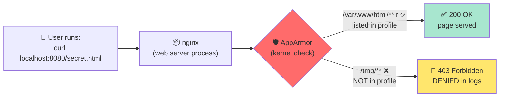

<a name="securite-systeme" id="securite-systeme"></a>

# 🔐 Module 4 - Security & MAC

---

# Security: layers like an onion 🧅

**Analogy: home security** 🏠

1. **Gate** (firewall)
2. **Strong door** (login, SSH keys)
3. **Alarm** (monitoring)
4. **Safe** (encryption)
5. **Cameras** (audit logs)

**Defense in depth:** if one layer fails, others still help. Never rely on one control alone.

---

# Unix rights vs app rules 🎫

**Unix permissions** (module 2) and **ACLs** (module 3): who can read/write a **file**.

**AppArmor (MAC):** extra rules for **each program** - what **this app** may do, even if you are root.

**Example:** `chmod` says you may run nginx. AppArmor says nginx may only read `/var/www/html/` - not `/tmp/`.

---

# How AppArmor works 🔬



---

# How AppArmor works - takeaway

The **kernel** decides, not nginx. Even if nginx tries to read `/tmp/`, AppArmor blocks it **before** the file is opened.

**On Ubuntu:** AppArmor is on by default. Profiles live in **`/etc/apparmor.d/`**. On RHEL: **SELinux** does the same job — we do not practice it here.

---

# Profile modes 🎭

**One question:** when a program breaks a rule, what does AppArmor do?

| Mode | On violation | In practice |
|------|--------------|-------------|
| **enforce** | **Blocked** · log `DENIED` | **Production** — Ubuntu default |
| **complain** | **Allowed** · log `ALLOWED` | **Testing / tuning** a profile |
| **kill** | Process **killed** (SIGKILL) | Rare — usually **0** profiles |
| **prompt** | Ask human allow/deny | Rare — usually **0** profiles |

**Lab:** switch **enforce** ↔ **complain** with `aa-enforce` / `aa-complain`. kill and prompt exist but you will almost never use them.

---

# `aa-status` & unconfined 🔓

```bash
sudo aa-status    # read the 5 count lines first — ignore the long name lists
```

**Typical Ubuntu 22.x desktop:** `102 enforce` · `2 complain` · `0 prompt` · `0 kill` · `74 unconfined`

| Count | Meaning |
|-------|---------|
| **enforce / complain** | Rules **are applied** — block or log-only |
| **prompt / kill at 0** | Normal — no profile uses these modes |
| **unconfined** | Profile file exists, app **not restricted** (Firefox, VS Code…) |

**Bottom of output:** running **processes** with an active profile (e.g. `chronyd`, `rsyslogd`) — not the same as total loaded profiles.

---

# Reading a profile 📖

**A profile lists what one program may access** — everything else is blocked in **enforce** mode.

```text
profile usr.sbin.nginx /usr/sbin/nginx {
    /etc/nginx/** r,
    /var/www/html/** r,
    /var/log/nginx/** rw,
}
```

| Syntax | Meaning |
|--------|---------|
| **r** / **w** / **rw** | read · write · both |
| **x** / **ix** | execute a program |
| **deny** | explicit block |

**Default:** path **not** listed → blocked in enforce (our lab blocks `/tmp/` this way).

---

# Profile file — header lines 📖

```text
#include <tunables/global>
profile usr.sbin.nginx /usr/sbin/nginx flags=(attach_disconnected) {
  #include <abstractions/base>
  #include <abstractions/nameservice>
```

| Line | Role |
|------|------|
| **`#include <tunables/global>`** | Shared variables used by many profiles |
| **`#include <abstractions/...>`** | Pre-built rule sets (basic libc, DNS, `/etc/hosts`…) |
| **`profile NAME /usr/sbin/nginx`** | Profile name + **binary** it applies to — **required** or nginx stays **unconfined** |
| **`flags=(attach_disconnected)`** | Keep confinement when nginx detaches from the terminal |

---

# Profile file — capabilities & paths 📖

| Line | Role |
|------|------|
| **`capability net_bind_service`** | Bind to ports (80, 8080…) |
| **`capability setuid` / `setgid`** | Switch to user **`www-data`** after start |
| **`capability dac_override`** | Needed by nginx for some file access paths |
| **`/usr/sbin/nginx mr`** | **m** = map executable in memory · **r** = read |
| **`/etc/nginx/** r`** | Read configuration |
| **`/var/www/html/** r`** | Serve the **default site** on port **80** |
| **`/var/log/nginx/** w`** | Write logs |
| **`/run/nginx/** rw`** | PID file · runtime sockets |
| **no `/tmp/**` line** | **`/tmp/` not allowed** → our secret site on **8080** blocked in enforce |

**Permissions:** **r** read · **w** write · **rw** both · **m** map (execute from memory).

---

# What the lab actually tests 🎯

We run **two nginx sites** on the **same** daemon — AppArmor only blocks what is **not** in the profile.

| Command | Port | Files nginx reads | After profile (enforce) |
|---------|------|-------------------|-------------------------|
| `curl localhost` | **80** | `/var/www/html/` ✅ in profile | **200** — site still works |
| `curl localhost:8080/secret.html` | **8080** | `/tmp/secret.html` ❌ not in profile | **403** — blocked by AppArmor |

**Not** “nginx is down for everyone” — only **`/tmp/`** is off limits. That is the MAC lesson.

---

# Commands to remember 🔧

| Command | What it does |
|---------|--------------|
| **`aa-status`** | Profile counts per mode · running confined processes |
| **`aa-enabled`** | Is AppArmor active at boot? |
| **`aa-complain`** / **`aa-enforce`** | Log-only ↔ block |
| **`apparmor_parser -r`** | Load or reload a profile after editing |

```bash
sudo aa-complain /etc/apparmor.d/usr.sbin.nginx
sudo aa-enforce  /usr/sbin/nginx
```

**Bonus (self-study):** `aa-genprof` · `aa-logprof` — auto-build profiles for unknown apps.

---
layout: new-section
---

# 🧪 Live coding - Module 4

### nginx + AppArmor — enforce → complain → enforce

**Two URLs to remember:** `:80` = normal site (stays up) · `:8080/secret.html` = reads `/tmp/` (blocked in enforce).

---

# Live lab - 1 · install & check

```bash
sudo apt install -y nginx apparmor-utils
sudo aa-enabled
sudo aa-status | grep 'profiles are'
```

---

# Live lab - 2 · secret file & nginx site

```bash
echo "TOP SECRET DATA" | sudo tee /tmp/secret.html
sudo nano /etc/nginx/sites-enabled/secret.conf
```

---

# Live lab - 2 · paste `secret.conf`

```nginx
server {
    listen 8080;
    root /tmp;
    location / { try_files $uri =404; }
}
```

---

# Live lab - 2 · save in nano

**Ctrl+O**, Enter, **Ctrl+X**.

---

# Live lab - 3 · test before AppArmor (expect 200)

```bash
sudo nginx -t && sudo systemctl reload nginx
curl localhost:8080/secret.html
curl localhost
```

---

# Live lab - 3 · before profile — expected

| URL | Expected |
|-----|----------|
| `:8080/secret.html` | `TOP SECRET DATA` |
| `localhost` (port **80**) | default nginx page |

No AppArmor profile yet → nginx can read **`/tmp/`** freely.

---

# Live lab - 4 · write the profile

Theory slides explained each line — paste the full profile from the **next slide**.

```bash
sudo nano /etc/apparmor.d/usr.sbin.nginx
```

---

# Live lab - 4 · lab rules

**No** `/tmp/**` line → port **8080** secret blocked.

**`/var/www/html/**` present** → port **80** stays OK.

---

# Live lab - 4 · paste profile

```text
#include <tunables/global>
profile usr.sbin.nginx /usr/sbin/nginx flags=(attach_disconnected) {
  #include <abstractions/base>
  #include <abstractions/nameservice>
  capability net_bind_service,
  capability setgid,
  capability setuid,
  capability dac_override,
  /usr/sbin/nginx mr,
  /usr/lib/nginx/** mr,
  /etc/nginx/** r,
  /var/log/nginx/** w,
  /var/www/html/** r,
  /run/nginx.pid rw,
  /run/nginx/** rw,
}
```

---

# Live lab - 5 · enforce — test both URLs

```bash
sudo apparmor_parser -r /etc/apparmor.d/usr.sbin.nginx
# here when you have create the profil and use apparmor_parser you are on enforced mode by default
sudo aa-status | grep nginx
curl localhost:8080/secret.html
curl localhost
sudo journalctl -k | grep DENIED
```

---

# Live lab - 5 · enforce — expected

| URL | Expected |
|-----|----------|
| `:8080/secret.html` | **403** + `DENIED` for `/tmp/secret.html` in logs |
| `localhost` (port **80**) | **200** — `/var/www/html/` is allowed |

---

# Live lab - why `restart` not `reload`?

Workers started **before** the profile was loaded stay **unconfined**.

`reload` → master sends SIGHUP → AppArmor **denies** `signal send` to unconfined workers → `kill(...) Permission denied`.

**`restart`** → new master + workers, all under **`usr.sbin.nginx`**. After that, **`reload`** works for complain/enforce switches.

---

# Live lab - 6 · complain then enforce again

```bash
sudo aa-complain /etc/apparmor.d/usr.sbin.nginx
curl localhost:8080/secret.html          # → 200 + ALLOWED in logs

sudo aa-enforce /etc/apparmor.d/usr.sbin.nginx
curl localhost:8080/secret.html          # → 403 again
```

---
layout: new-section
---

# ✅ Live coding done - Module 4

**Built:** port **80** still serves · **8080/secret** → **403** (enforce) → **200** (complain) → **403** (enforce)

**Verify:** `curl localhost` (200) · `curl localhost:8080/secret.html` (403/200/403) · `journalctl -k | grep DENIED`

**Next:** 🎯 AppArmor exercise slides · then Module 5 - Network

---

# Security best practices 📋

1. **Minimum rights** - only what is needed
2. **Regular updates** - automate security patches
3. **Strong login** - SSH keys, not passwords alone
4. **Watch logs** - `journalctl`, alerts
5. **Backups** - tested and off-site

---

# Module 4 recap ✅

- Defense in depth · Unix rights vs **app rules** (AppArmor)
- Profile anatomy: **`#include`** · **`profile … /usr/sbin/nginx`** · **`capability`** · path rules **r/w/rw/m**
- Lab: **`:80` OK** · **`:8080/secret` blocked** (no `/tmp/` in profile) · **`restart`** after first profile load
- Modes: **enforce** / **complain** · **`aa-status`** · **`aa-complain` / `aa-enforce`**

**Practice:** 🎯 exercise slides · Ex 2 = full lab alone · Ex 3 = find `DENIED` in logs

---

# Next step 🎯

**Module 5 - Network**

---
layout: default
---

# Questions? 🤔

Feel free to ask your questions now!

Post your questions on <ExternalLink href="https://questions.andromed.fr">questions.andromed.fr</ExternalLink> (access code **29062026**) so I can centralize and answer them.

The next module covers network configuration and **ufw**.
