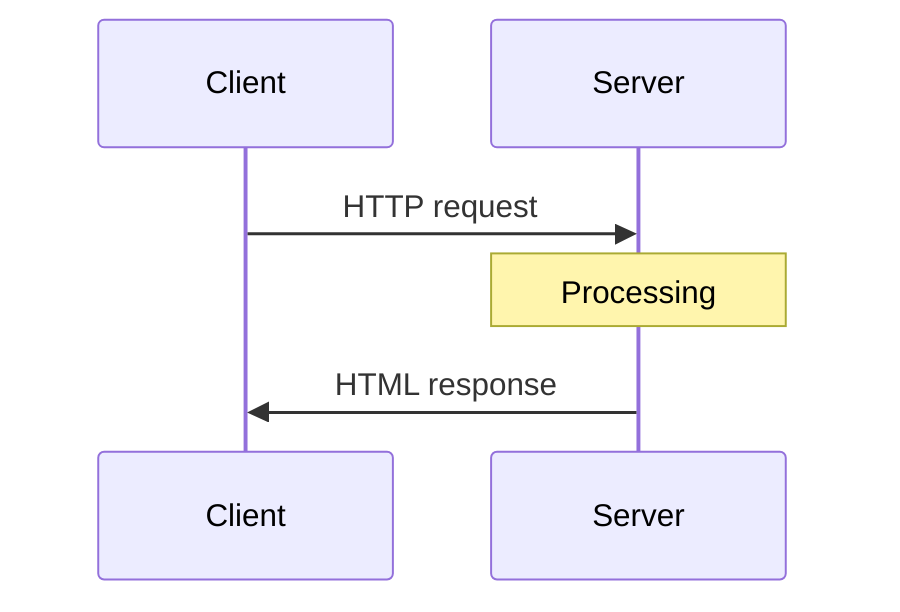
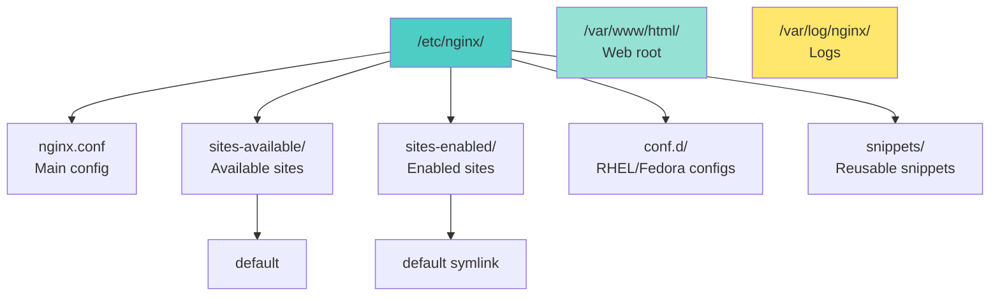
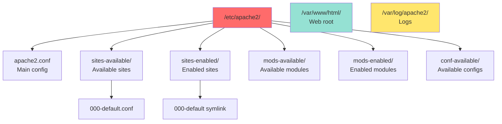

<a name="services-serveurs" id="services-serveurs"></a>

# ☁️ Module 10
## Server services

### Install and manage common services

---

# What is a server? 🖥️

**Server:** a computer that provides services to others (clients)

**Analogy: a restaurant** 🍽️
- **Web server:** brings the dishes (web pages)
- **Clients:** the guests (browsers)
- **Kitchen:** the back end (processing)
- **Menu:** the API
- **Reservations:** session handling

**Linux:** the preferred OS for servers
- Stable, performant, free
- Large community
- Powerful tooling

---

# Client–server architecture 🔄



---

**Examples:**
- **Web:** browser ↔ Nginx/Apache
- **Email:** mail client ↔ SMTP server
- **Database:** app ↔ MySQL/PostgreSQL
- **DNS:** system ↔ DNS server

---

# Web server: Nginx 🚀

**Nginx:** modern, high-performance web server

**Benefits:**
- Very fast (async)
- Low memory footprint
- Efficient reverse proxy
- Load balancing
- Simple configuration

**Use cases:**
- Serve static sites
- Reverse proxy for apps (Node, Python, etc.)
- Load balancer
- Cache

---

# Install Nginx 📥

```bash
# Debian/Ubuntu
sudo apt update
sudo apt install nginx

# RHEL/Fedora
sudo dnf install nginx

# Start
sudo systemctl start nginx
sudo systemctl enable nginx

# Verify
sudo systemctl status nginx
curl http://localhost
```

---

# Nginx layout 📁



---

# Basic Nginx configuration 📝

**File: `/etc/nginx/sites-available/default`**

```nginx
server {
    listen 80;
    listen [::]:80;

    server_name example.com www.example.com;

    root /var/www/html;
    index index.html index.htm;

    location / {
        try_files $uri $uri/ =404;
    }

    access_log /var/log/nginx/access.log;
    error_log /var/log/nginx/error.log;
}
```

---

# Create a virtual host 🌐

**1. Create the configuration**

```bash
sudo nano /etc/nginx/sites-available/my-site
```

```nginx
server {
    listen 80;
    server_name my-site.local;

    root /var/www/my-site;
    index index.html;

    location / {
        try_files $uri $uri/ =404;
    }
}
```

---

# Create a virtual host (continued) 🌐

**2. Create the directory and content**

```bash
sudo mkdir -p /var/www/my-site
echo "<h1>My Site</h1>" | sudo tee /var/www/my-site/index.html
sudo chown -R www-data:www-data /var/www/my-site
```

---

# Create a virtual host (continued) 🌐

**3. Enable the site**

```bash
# Create symlink
sudo ln -s /etc/nginx/sites-available/my-site /etc/nginx/sites-enabled/

# Test configuration
sudo nginx -t

# Reload Nginx
sudo systemctl reload nginx
```

---

# Create a virtual host (continued) 🌐

**4. Add to /etc/hosts (for local testing)**

```bash
sudo nano /etc/hosts
```

```
127.0.0.1   my-site.local
```

**Test:**

```bash
curl http://my-site.local
```

---

# Nginx as reverse proxy 🔄

**Reverse proxy:** Nginx in front of an application

```nginx
server {
    listen 80;
    server_name api.example.com;

    location / {
        proxy_pass http://localhost:3000;
        proxy_http_version 1.1;
        proxy_set_header Upgrade $http_upgrade;
        proxy_set_header Connection 'upgrade';
        proxy_set_header Host $host;
        proxy_set_header X-Real-IP $remote_addr;
        proxy_set_header X-Forwarded-For $proxy_add_x_forwarded_for;
        proxy_set_header X-Forwarded-Proto $scheme;
        proxy_cache_bypass $http_upgrade;
    }
}
```

---

# HTTPS with Let's Encrypt 🔒

**Certbot:** obtain free SSL certificates

```bash
# Install Certbot
sudo apt install certbot python3-certbot-nginx

# Obtain and install certificate
sudo certbot --nginx -d example.com -d www.example.com

# Automatic renewal
sudo systemctl status certbot.timer

# Test renewal
sudo certbot renew --dry-run
```

---

# Generated HTTPS configuration 🔐

```nginx
server {
    listen 443 ssl http2;
    listen [::]:443 ssl http2;
    server_name example.com;

    ssl_certificate /etc/letsencrypt/live/example.com/fullchain.pem;
    ssl_certificate_key /etc/letsencrypt/live/example.com/privkey.pem;
    include /etc/letsencrypt/options-ssl-nginx.conf;
    ssl_dhparam /etc/letsencrypt/ssl-dhparams.pem;

    # ... rest of config
}

server {
    listen 80;
    server_name example.com;
    return 301 https://$server_name$request_uri;
}
```

---

# Nginx: useful commands 🔧

```bash
# Test configuration
sudo nginx -t

# Reload (no downtime)
sudo systemctl reload nginx

# Restart
sudo systemctl restart nginx

# Stop
sudo systemctl stop nginx

# Tail logs
sudo tail -f /var/log/nginx/access.log
sudo tail -f /var/log/nginx/error.log
```

---

# Apache: alternative to Nginx 🪶

**Apache:** historic web server

**Benefits:**
- Very mature and stable
- Many modules
- .htaccess (per-directory config)
- Extensive documentation

```bash
# Install
sudo apt install apache2

# Start
sudo systemctl start apache2
sudo systemctl enable apache2
```

---

# Apache layout 📁



---

# Apache virtual host 🌐

**File: `/etc/apache2/sites-available/my-site.conf`**

```apache
<VirtualHost *:80>
    ServerName my-site.local
    ServerAdmin admin@my-site.local
    DocumentRoot /var/www/my-site

    <Directory /var/www/my-site>
        Options Indexes FollowSymLinks
        AllowOverride All
        Require all granted
    </Directory>

    ErrorLog ${APACHE_LOG_DIR}/my-site_error.log
    CustomLog ${APACHE_LOG_DIR}/my-site_access.log combined
</VirtualHost>
```

---

# Enable an Apache site 🔌

```bash
# Enable site
sudo a2ensite my-site.conf

# Disable default site
sudo a2dissite 000-default.conf

# Reload
sudo systemctl reload apache2

# Useful commands
sudo a2enmod rewrite    # Enable rewrite module
sudo a2dismod status    # Disable module
```

---

# PHP with Apache or Nginx 🐘

**Install PHP:**

```bash
# Debian/Ubuntu
sudo apt install php-fpm php-mysql php-cli php-curl php-gd

# RHEL/Fedora
sudo dnf install php-fpm php-mysqlnd php-cli php-curl php-gd
```

---

# PHP with Nginx ⚙️

```nginx
server {
    listen 80;
    server_name example.com;
    root /var/www/html;
    index index.php index.html;

    location ~ \.php$ {
        include snippets/fastcgi-php.conf;
        fastcgi_pass unix:/run/php/php8.1-fpm.sock;
    }

    location ~ /\.ht {
        deny all;
    }
}
```

```bash
# Restart PHP-FPM
sudo systemctl restart php8.1-fpm
```

---

# PHP with Apache ⚙️

```bash
# Install PHP module for Apache
sudo apt install libapache2-mod-php

# Restart Apache
sudo systemctl restart apache2

# Test
echo "<?php phpinfo(); ?>" | sudo tee /var/www/html/info.php
curl http://localhost/info.php
```

---

# Database: MySQL/MariaDB 🗄️

**MariaDB:** open-source MySQL fork

```bash
# Install MariaDB
sudo apt install mariadb-server

# Start
sudo systemctl start mariadb
sudo systemctl enable mariadb

# Secure installation
sudo mysql_secure_installation
```

---

# mysql_secure_installation 🔒

**Prompts:**

1. Set root password
2. Remove anonymous users
3. Disallow remote root login
4. Remove test database
5. Reload privilege tables

**Answer “Y” to all for a secure baseline**

---

# Connect to MySQL 🔗

```bash
# As root
sudo mysql

# With password
mysql -u root -p

# MySQL commands
mysql> SHOW DATABASES;
mysql> USE mysql;
mysql> SHOW TABLES;
mysql> SELECT user, host FROM user;
mysql> EXIT;
```

---

# Create a database and user 👤

```sql
-- Create database
CREATE DATABASE my_database;

-- Create user
CREATE USER 'alice'@'localhost' IDENTIFIED BY 'strong_password';

-- Grant all privileges on database
GRANT ALL PRIVILEGES ON my_database.* TO 'alice'@'localhost';

-- Apply changes
FLUSH PRIVILEGES;

-- Verify
SHOW GRANTS FOR 'alice'@'localhost';
```

---

# Backup and restore MySQL 💾

```bash
# Backup one database
mysqldump -u root -p my_database > my_database_backup.sql

# Backup all databases
mysqldump -u root -p --all-databases > all_databases.sql

# Restore one database
mysql -u root -p my_database < my_database_backup.sql

# Restore everything
mysql -u root -p < all_databases.sql
```

---

# PostgreSQL: alternative to MySQL 🐘

```bash
# Install PostgreSQL
sudo apt install postgresql postgresql-contrib

# Start
sudo systemctl start postgresql
sudo systemctl enable postgresql

# Connect
sudo -u postgres psql

# PostgreSQL commands
postgres=# \l                    -- List databases
postgres=# \c my_database        -- Connect to database
postgres=# \dt                   -- List tables
postgres=# \du                   -- List users
postgres=# \q                    -- Quit
```

---

# DNS server: BIND 🌐

**BIND:** Berkeley Internet Name Domain

```bash
# Install
sudo apt install bind9 bind9utils bind9-doc

# Start
sudo systemctl start named
sudo systemctl enable named

# Configuration
/etc/bind/
├── named.conf              # Main configuration
├── named.conf.options      # Options
├── named.conf.local        # Local zones
└── named.conf.default-zones
```

---

# Simple DNS configuration 📝

**File: `/etc/bind/named.conf.local`**

```
zone "example.local" {
    type master;
    file "/etc/bind/zones/db.example.local";
};

zone "1.168.192.in-addr.arpa" {
    type master;
    file "/etc/bind/zones/db.192.168.1";
};
```

---

# DNS zone file 🗺️

**File: `/etc/bind/zones/db.example.local`**

```
$TTL    604800
@       IN      SOA     ns1.example.local. admin.example.local. (
                              3         ; Serial
                         604800         ; Refresh
                          86400         ; Retry
                        2419200         ; Expire
                         604800 )       ; Negative Cache TTL
;
@       IN      NS      ns1.example.local.
@       IN      A       192.168.1.10
ns1     IN      A       192.168.1.10
www     IN      A       192.168.1.20
mail    IN      A       192.168.1.30
```

---

# Test DNS 🧪

```bash
# Verify configuration
sudo named-checkconf
sudo named-checkzone example.local /etc/bind/zones/db.example.local

# Restart BIND
sudo systemctl restart named

# Test with dig
dig @localhost example.local
dig @localhost www.example.local

# Test with nslookup
nslookup www.example.local localhost
```

---

# Caching DNS: dnsmasq 🚀

**dnsmasq:** lightweight DNS + DHCP

```bash
# Install
sudo apt install dnsmasq

# Simple configuration
sudo nano /etc/dnsmasq.conf
```

```
# Listen on localhost
listen-address=127.0.0.1

# Upstream DNS
server=8.8.8.8
server=1.1.1.1

# Cache size
cache-size=1000

# Local resolution
address=/my-server.local/192.168.1.10
```

---

# FTP server: vsftpd 📂

**vsftpd:** Very Secure FTP Daemon

```bash
# Install
sudo apt install vsftpd

# Backup original config
sudo cp /etc/vsftpd.conf /etc/vsftpd.conf.backup

# Edit
sudo nano /etc/vsftpd.conf
```

---

# vsftpd configuration 📝

```bash
# Disable anonymous connections
anonymous_enable=NO

# Allow local users
local_enable=YES

# Allow writes
write_enable=YES

# Chroot users to their home
chroot_local_user=YES

# Passive ports
pasv_min_port=40000
pasv_max_port=40100

# Logs
xferlog_enable=YES
xferlog_file=/var/log/vsftpd.log
```

```bash
# Restart
sudo systemctl restart vsftpd
```

---

# Mail server: Postfix 📧

**Postfix:** modern MTA (Mail Transfer Agent)

```bash
# Install
sudo apt install postfix

# During install, choose "Internet Site"
# Enter domain name

# Configuration
sudo nano /etc/postfix/main.cf
```

---

# Basic Postfix configuration 📝

```bash
myhostname = mail.example.com
mydomain = example.com
myorigin = $mydomain
inet_interfaces = all
mydestination = $myhostname, localhost.$mydomain, $mydomain
mynetworks = 127.0.0.0/8, 192.168.1.0/24
home_mailbox = Maildir/
```

```bash
# Restart
sudo systemctl restart postfix

# Test
echo "Test" | mail -s "Subject" user@example.com
```

---

# Monitoring: Netdata 📊

**Netdata:** real-time monitoring

```bash
# Automatic installation
bash <(curl -Ss https://my-netdata.io/kickstart.sh)

# Open UI
# http://localhost:19999
```

**Features:**
- CPU, RAM, disk, network
- Real time (~1 s refresh)
- No database
- Alerts

---

# Monitoring: Prometheus + Grafana 📈

**Prometheus:** metrics collection

```bash
# Install Prometheus
sudo apt install prometheus

# Start
sudo systemctl start prometheus
sudo systemctl enable prometheus

# UI: http://localhost:9090
```

---

# Grafana: visualization 📊

```bash
# Add repository
sudo apt install -y software-properties-common
wget -q -O - https://packages.grafana.com/gpg.key | sudo apt-key add -
echo "deb https://packages.grafana.com/oss/deb stable main" | \
  sudo tee /etc/apt/sources.list.d/grafana.list

# Install
sudo apt update
sudo apt install grafana

# Start
sudo systemctl start grafana-server
sudo systemctl enable grafana-server

# UI: http://localhost:3000
# Login: admin / admin
```

---

# Centralized logs: ELK Stack 📜

**ELK:** Elasticsearch + Logstash + Kibana

**Elasticsearch:** storage and search  
**Logstash:** ingest and transform  
**Kibana:** visualization  

**Modern alternative:** **Loki + Promtail + Grafana**

---

# High availability: concepts 🔄

**HA:** High Availability

**Goal:** minimize downtime

**Techniques:**
- **Load balancing:** distribute load
- **Failover:** automatic switchover
- **Replication:** multiple copies
- **Monitoring:** failure detection

**SLA:** Service Level Agreement  
- 99.9% ≈ 8 h 46 min downtime/year  
- 99.99% ≈ 52 min/year  
- 99.999% ≈ 5 min/year  

---

# Load balancing with Nginx ⚖️

```nginx
upstream backend {
    server backend1.example.com:8080;
    server backend2.example.com:8080;
    server backend3.example.com:8080;
}

server {
    listen 80;
    server_name example.com;

    location / {
        proxy_pass http://backend;
        proxy_set_header Host $host;
        proxy_set_header X-Real-IP $remote_addr;
    }
}
```

---

# Load balancing methods 🎯

```nginx
# Round-robin (default)
upstream backend {
    server backend1.example.com;
    server backend2.example.com;
}

# Least connections
upstream backend {
    least_conn;
    server backend1.example.com;
    server backend2.example.com;
}

# IP hash (sticky sessions)
upstream backend {
    ip_hash;
    server backend1.example.com;
    server backend2.example.com;
}
```

---

# Health checks 🏥

```nginx
upstream backend {
    server backend1.example.com max_fails=3 fail_timeout=30s;
    server backend2.example.com max_fails=3 fail_timeout=30s;
    server backend3.example.com backup;  # Standby server
}
```

**Options:**
- `max_fails`: failures before marking “down”
- `fail_timeout`: time before retry
- `backup`: used only if others are down

---

# Keepalived: virtual IP 🔄

**Keepalived:** IP failover between servers

```bash
# Install
sudo apt install keepalived

# Configuration
sudo nano /etc/keepalived/keepalived.conf
```

```
vrrp_instance VI_1 {
    state MASTER
    interface eth0
    virtual_router_id 51
    priority 100
    advert_int 1
    authentication {
        auth_type PASS
        auth_pass secret
    }
    virtual_ipaddress {
        192.168.1.100
    }
}
```

---

# MySQL replication 🔄

**Master–slave replication**

**On the master:**

```sql
CREATE USER 'repl'@'%' IDENTIFIED BY 'password';
GRANT REPLICATION SLAVE ON *.* TO 'repl'@'%';

SHOW MASTER STATUS;
-- Note File and Position
```

**Configuration: `/etc/mysql/my.cnf`**

```ini
[mysqld]
server-id = 1
log_bin = /var/log/mysql/mysql-bin.log
```

---

# MySQL replication (continued) 🔄

**On the slave:**

**Configuration: `/etc/mysql/my.cnf`**

```ini
[mysqld]
server-id = 2
```

```sql
CHANGE MASTER TO
    MASTER_HOST='master_ip',
    MASTER_USER='repl',
    MASTER_PASSWORD='password',
    MASTER_LOG_FILE='mysql-bin.000001',
    MASTER_LOG_POS=154;

START SLAVE;
SHOW SLAVE STATUS\G
```

---

# Containers: Docker 🐳

**Docker:** application containerization

```bash
# Install Docker
curl -fsSL https://get.docker.com -o get-docker.sh
sudo sh get-docker.sh

# Add user to docker group
sudo usermod -aG docker $USER

# Test
docker run hello-world
```

---

# Docker: basic commands 🐳

```bash
# Run a container
docker run -d -p 80:80 nginx

# List containers
docker ps

# Stop a container
docker stop <container_id>

# View logs
docker logs <container_id>

# Shell into container
docker exec -it <container_id> bash

# Remove container
docker rm <container_id>
```

---

# Docker Compose: orchestration 🎼

```bash
# Install Docker Compose
sudo apt install docker-compose
```

**File: `docker-compose.yml`**

```yaml
version: '3'
services:
  web:
    image: nginx
    ports:
      - "80:80"
    volumes:
      - ./html:/usr/share/nginx/html
  db:
    image: mariadb
    environment:
      MYSQL_ROOT_PASSWORD: example
    volumes:
      - db_data:/var/lib/mysql
volumes:
  db_data:
```

---

# Docker Compose: usage 🎮

```bash
# Start services
docker-compose up -d

# Status
docker-compose ps

# Logs
docker-compose logs -f

# Stop
docker-compose down

# Rebuild
docker-compose up -d --build
```

---

# Server best practices 📋

1. **Security**
   - Firewall enabled
   - Minimal exposed services
   - Automatic updates

2. **Monitoring**
   - Watch CPU, RAM, disk
   - Configured alerts
   - Centralized logs

3. **Backups**
   - Automatic and regular
   - Tested
   - Off-site

---

# Server best practices (continued) 📋

4. **Documentation**
   - Deployment procedures
   - Configurations
   - Contacts

5. **High availability**
   - Load balancing
   - Replication
   - Failover

6. **Performance**
   - Cache (Redis, Memcached)
   - CDN for static assets
   - Optimize DB queries

---

# Module 10 recap ✅

**What you learned:**

✅ Web servers (Nginx, Apache)

✅ Virtual hosts and HTTPS

✅ Databases (MySQL, PostgreSQL)

✅ DNS server (BIND, dnsmasq)

✅ Mail and FTP servers

✅ Monitoring (Netdata, Prometheus, Grafana)

✅ High availability and load balancing

✅ Docker and containerization

✅ Server operations best practices

---

# Congratulations! 🎉

**You completed the 9 modules of the Unix/Linux - Introduction course!**

**Skills gained:**

✅ Unix/Linux fundamentals

✅ Users and permissions

✅ System administration (processes, services, storage)

✅ Network configuration

✅ Automation and scripting

✅ System security

✅ Server service management

---

# Next step 🎯

**Module 11: System supervision and analysis**

- Monitoring with top, htop, iotop
- System log analysis
- Metrics and dashboards
- Alerts and notifications

---

#### Go further 🚀

<div class="text-xs">

**Certifications:**
- **LPIC-1:** Linux Professional Institute Certification
- **RHCSA:** Red Hat Certified System Administrator
- **CompTIA Linux+**

**Resources:**
- Linux Documentation Project
- ArchWiki (excellent docs)
- man pages and info
- Reddit: r/linux, r/linuxadmin

**Practice:**
- Install a VM or Raspberry Pi
- Contribute to open source projects
- Run your own server

</div>

---
layout: default
---

# Questions? 🤔

Feel free to ask your questions now!

Post your questions on <ExternalLink href="https://questions.andromed.fr">questions.andromed.fr</ExternalLink> (access code **29062026**) so I can centralize and answer them.

Next: hands-on exercises and the validation quiz.
