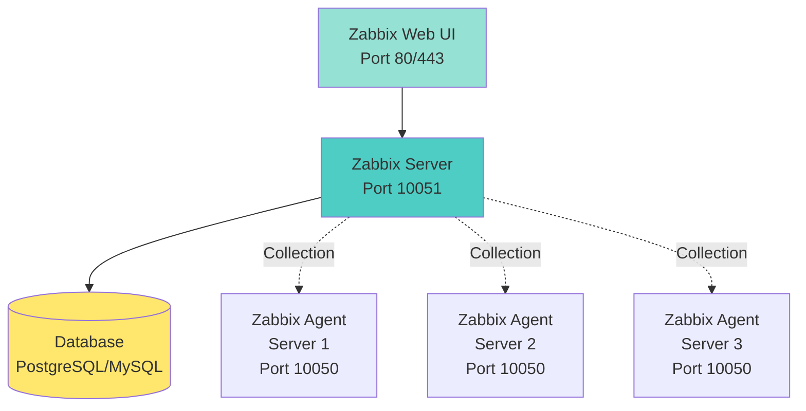

<a name="supervision-avancee" id="supervision-avancee"></a>

# 🚨 Module 5
## Advanced Monitoring & Alerts

### Professional monitoring with Zabbix

---

# Why use advanced monitoring? 🤔

**Limits of command-line tools:**
- top/htop: instantaneous data only
- No historical graphs
- No automatic alerts
- Manual monitoring
- No multi-server overview

**Solution: centralized monitoring**
- **Zabbix** ← we use this one!
- Nagios
- Prometheus + Grafana
- Munin

---

# Zabbix overview 📊

**Zabbix**: enterprise-grade open source monitoring

**Features:**
- Monitor servers, networks, applications
- History and graphs
- Automatic alerts (email, SMS, Slack…)
- Ready-made templates
- Intuitive web UI
- REST API for automation
- Auto-discovery

**Architecture:** client/server
- **Zabbix server**: collects and stores data
- **Zabbix agent**: installed on each host to monitor

---

# Zabbix architecture 🏗️



---

# Installation prerequisites 📋

**Zabbix server machine:**
- 2 CPUs minimum
- 2 GB RAM minimum (4 GB recommended)
- 10 GB disk minimum
- Debian 12 / Ubuntu 22.04+ or RHEL 9+

**Components to install:**
- Zabbix server
- Web frontend (Apache/Nginx + PHP)
- Database (PostgreSQL or MySQL/MariaDB)

**We install on Ubuntu 24.04**

---

# Install Zabbix Server 📥

```bash
# 1. Download Zabbix 7.0 LTS repo
wget https://repo.zabbix.com/zabbix/7.0/ubuntu/pool/main/z/zabbix-release/zabbix-release_latest_7.0+ubuntu24.04_all.deb
sudo dpkg -i zabbix-release_latest_7.0+ubuntu24.04_all.deb
sudo apt update

# 2. Install server, frontend, agent
sudo apt install zabbix-server-mysql zabbix-frontend-php zabbix-apache-conf zabbix-sql-scripts zabbix-agent -y

# 3. Install MariaDB
sudo apt install mariadb-server -y
```

---

# Database configuration 🗄️

```bash
# Connect to MySQL
sudo mysql

# Create database and user
CREATE DATABASE zabbix CHARACTER SET utf8mb4 COLLATE utf8mb4_bin;
CREATE USER 'zabbix'@'localhost' IDENTIFIED BY 'SecurePassword';
GRANT ALL PRIVILEGES ON zabbix.* TO 'zabbix'@'localhost';
SET GLOBAL log_bin_trust_function_creators = 1;
FLUSH PRIVILEGES;
EXIT;

# Import initial schema
sudo zcat /usr/share/zabbix-sql-scripts/mysql/server.sql.gz | mysql --default-character-set=utf8mb4 -uzabbix -p zabbix
# Enter password
```

---

# Zabbix Server configuration ⚙️

```bash
# Edit config
sudo nano /etc/zabbix/zabbix_server.conf
```

**Change these lines:**

```
DBName=zabbix
DBUser=zabbix
DBPassword=SecurePassword
```

```bash
# Restart MySQL to disable log_bin_trust
sudo mysql -e "SET GLOBAL log_bin_trust_function_creators = 0;"

# Start Zabbix
sudo systemctl restart zabbix-server zabbix-agent apache2
sudo systemctl enable zabbix-server zabbix-agent apache2
```

---

#### Web UI configuration 🌐

<div class="text-xs">

**Open the UI:**

```
http://server-ip/zabbix
```

**Installation wizard:**

1. **Welcome**: Next
2. **Pre-requisites**: verify OK → Next
3. **Database connection**:
   - Type: MySQL
   - Host: localhost
   - Database: zabbix
   - User: zabbix
   - Password: SecurePassword
4. **Settings**: name the server
5. **Summary**: Next
6. **Install**: Finish

</div>

---

# First login 🔑

**Default credentials:**
- **User:** `Admin`
- **Password:** `zabbix`

**⚠️ IMPORTANT: Change the password immediately!**

```
Administration → Users → Admin → Change password
```

**UI:** English by default

To switch to French:
```
User settings (user icon) → Language: French
```

---

# Zabbix UI: quick tour 🖥️

**Main menu:**

- **Monitoring → Hosts**: list of monitored servers
- **Monitoring → Latest data**: last collected values
- **Monitoring → Graphs**: graphs
- **Monitoring → Dashboards**: dashboards
- **Configuration → Hosts**: manage hosts
- **Configuration → Templates**: pre-built templates
- **Reports → Availability**: availability

---

# The Zabbix server monitors itself 👀

**Host "Zabbix server" is preconfigured**

**View data:**

1. Go to **Monitoring → Hosts**
2. Click "Zabbix server"
3. **Latest data** tab: CPU, RAM, disk in real time
4. **Graphs** tab: graphs for recent hours

**That’s your first monitored host!**

---

# Install Zabbix agent on a server 📡

**On the server to monitor (e.g. web server):**

```bash
# Debian/Ubuntu
wget https://repo.zabbix.com/zabbix/7.0/ubuntu/pool/main/z/zabbix-release/zabbix-release_latest_7.0+ubuntu24.04_all.deb
sudo dpkg -i zabbix-release_latest_7.0+ubuntu24.04_all.deb
sudo apt update
sudo apt install zabbix-agent -y

# Configuration
sudo nano /etc/zabbix/zabbix_agentd.conf
```

---

# Zabbix agent configuration ⚙️

```bash
sudo nano /etc/zabbix/zabbix_agentd.conf
```

**Change these lines:**

```
Server=<ZABBIX_SERVER_IP>
ServerActive=<ZABBIX_SERVER_IP>
Hostname=web-server-01
```

**Example:**
```
Server=192.168.1.10
ServerActive=192.168.1.10
Hostname=web-server-01
```

```bash
# Restart agent
sudo systemctl restart zabbix-agent
sudo systemctl enable zabbix-agent
```

---

# Add a host in Zabbix 🖥️

**In the Zabbix web UI:**

1. **Configuration → Hosts → Create host**
2. Fill in:
   - **Host name:** `web-server-01`
   - **Groups:** `Linux servers` (create if needed)
   - **Interfaces:** Add → Agent
     - IP address: `192.168.1.20` (server IP)
     - Port: `10050`
3. **Templates:** Select → search `Linux by Zabbix agent`
4. **Add** (to attach the template)
5. **Add** (bottom - create the host)

---

# Verify connectivity 🔍

**In Configuration → Hosts:**

- **Availability** column:
  - **Green (ZBX)**: agent reachable ✅
  - **Red**: connection problem ❌

**If red:**

```bash
# On the agent server, check:
sudo systemctl status zabbix-agent

# Check firewall
sudo ufw allow 10050/tcp

# Test from Zabbix server
telnet <AGENT_IP> 10050
```

---

# View collected data 📊

**Monitoring → Latest data**

1. Filter by host: select `web-server-01`
2. See all collected metrics:
   - CPU utilization
   - Memory utilization
   - Disk space usage
   - Network traffic
   - Processes
   - …

**Click "Graph"** to see trends over time

---

# Create a simple alert 🚨

**Goal:** Email if CPU > 80%

**Step 1: Create a trigger**

1. **Configuration → Hosts** → `web-server-01`
2. **Triggers** → **Create trigger**
3. Fill in:
   - **Name:** `High CPU on {HOST.NAME}`
   - **Severity:** High
   - **Expression:** Add → Select:
     - Item: `CPU utilization`
     - Function: `avg`
     - Last of (T): `5m`
     - Result: `> 80`
4. **Add**

---

# Create an alert: email setup 📧

**Step 2: Configure email delivery**

1. **Administration → Media types** → **Email**
2. **SMTP server:** `smtp.gmail.com`
3. **SMTP server port:** `587`
4. **SMTP helo:** `gmail.com`
5. **SMTP email:** `your-email@gmail.com`
6. **Connection security:** STARTTLS
7. **Authentication:** Username and password
8. **Username:** `your-email@gmail.com`
9. **Password:** (Gmail app password)
10. **Update**

**Note:** For Gmail, create an app password

---

# Create an alert: assign email 📬

**Step 3: Assign email to the user**

1. **Administration → Users** → **Admin**
2. **Media** → **Add**
3. **Type:** Email
4. **Send to:** `your-email@example.com`
5. **When active:** 1–7, 00:00–24:00 (always)
6. **Use if severity:** check all
7. **Add** → **Update**

---

# Create an alert: action 🎬

**Step 4: Create an action**

1. **Configuration → Actions** (Trigger actions tab) → **Create action**
2. **Action** tab:
   - **Name:** `High CPU alert`
   - **Conditions:** Trigger severity >= High
3. **Operations** tab → **Add**:
   - **Send to users:** Admin
   - **Send only to:** Email
   - **Add**
4. **Add** (bottom)

**Done! When CPU > 80% for 5 min → email**

---

# Test the alert 🧪

**Simulate CPU load:**

```bash
# On the monitored server
# Run stress test (install if needed)
sudo apt install stress -y

# Stress CPU for 5 minutes
stress --cpu 4 --timeout 300s
```

**Watch in Zabbix:**
- **Monitoring → Problems**: trigger fires
- **Inbox**: alert email

---

# Custom dashboards 📈

**Create a dashboard:**

1. **Monitoring → Dashboards** → **Create dashboard**
2. **Name:** `My web server`
3. **Add widget**:
   - **Type:** Graph
   - **Name:** `CPU usage`
   - **Host:** `web-server-01`
   - **Item:** `CPU utilization`
4. **Add** → **Apply**
5. Add more widgets (RAM, disk, etc.)

**Result:** Graphical overview of your server

---

# Templates: save time 📦

**Template:** pre-built set of items, triggers, and graphs

**Built-in templates:**
- `Linux by Zabbix agent`: basic Linux metrics
- `Apache by HTTP`: Apache monitoring
- `Nginx by HTTP`: Nginx monitoring
- `MySQL by Zabbix agent`: MySQL monitoring
- …

**To apply a template:**
1. **Configuration → Hosts** → click the host
2. **Templates** → **Select**
3. Find and select the template
4. **Add** → **Update**

---

# Zabbix best practices ✅

**1. Organization**
- Group hosts by role (Web servers, DB servers, etc.)
- Use clear names (web-prod-01, mysql-01)

**2. Alerts**
- Don’t alert on everything!
- Set realistic thresholds
- Test alerts

**3. Maintenance**
- Prune old history (> 90 days)
- Watch database disk space
- Keep Zabbix updated

---

# Module 5 recap ✅

**What you learned:**

✅ Zabbix architecture and concepts

✅ Server and agent installation

✅ Database configuration

✅ Adding monitored hosts

✅ Creating triggers (alerts)

✅ Email notifications

✅ Custom dashboards

✅ Using templates

---

# Next step 🎯

**Module 13 (BONUS): Optimization & performance**

- Kernel and system tuning
- Service optimization
- MySQL tuning
- System cache

---
layout: default
---

# Questions? 🤔

Feel free to ask your questions now!

Post your questions on <ExternalLink href="https://questions.andromed.fr">questions.andromed.fr</ExternalLink> (access code **29062026**) so I can centralize and answer them.

You now have a professional monitoring tool at hand.

