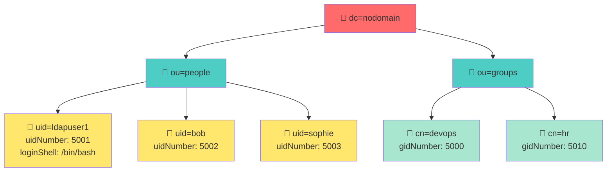
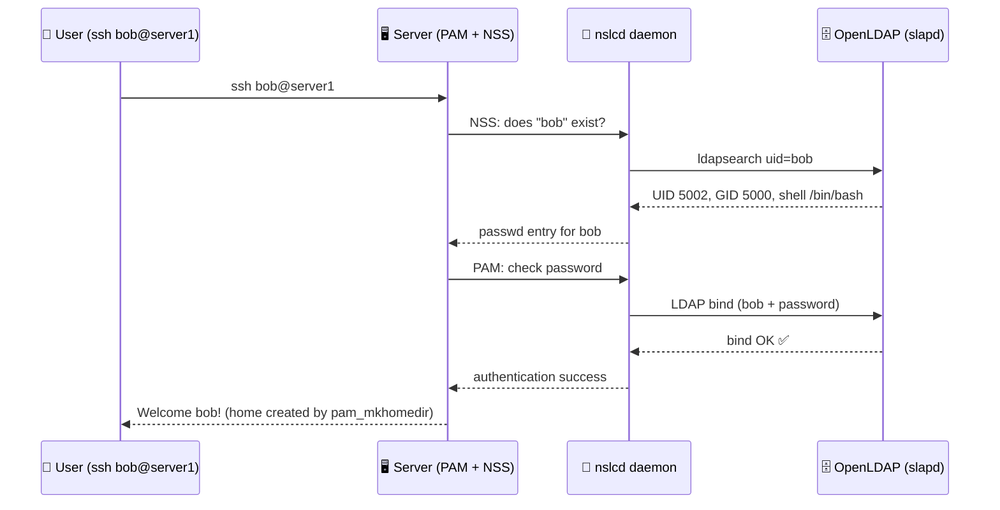
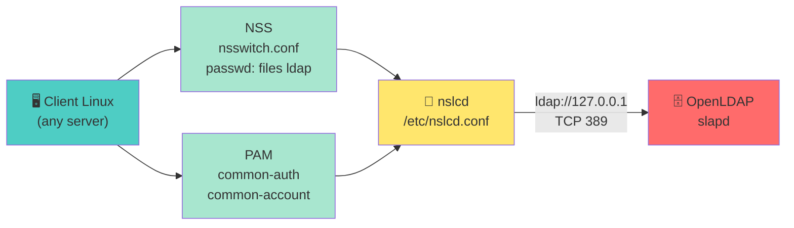

<a name="openldap-auth" id="openldap-auth"></a>

# 🗝️ Centralized authentication
## OpenLDAP + PAM (Day 3 - morning)

Goal: login on **shell + SSH** uses **OpenLDAP**, not only local `/etc/passwd`.

---

# The problem without LDAP 😩

Imagine a company with **500 employees**.

Each server keeps its **own** user accounts:

- Create `bob` on the **Git** server
- Then on **Jenkins**
- Then on the **VPN**
- Then on the **wiki**

Same person, **four passwords**, four places to update when someone leaves.

That does not scale.

---

# One directory with OpenLDAP ✅

With OpenLDAP you have a **central directory**:

```text
OpenLDAP
├── bob
├── marion
├── pierre
└── sophie
```

---

# Every server asks the directory

Every server asks OpenLDAP - not its local `/etc/passwd` - when someone logs in.

When an application or server needs to authenticate someone, it queries the directory:

- **Does `bob` exist?**
- **What is his password?**
- **Which groups is he in?**

OpenLDAP answers. The server decides whether to allow access.

---

# Same login everywhere 🔑

One identity, many services:

| Service | Username | Password |
|---------|----------|----------|
| GitLab | `bob` | `MonPassword123` |
| Nextcloud | `bob` | `MonPassword123` |
| VPN | `bob` | `MonPassword123` |
| Jenkins | `bob` | `MonPassword123` |

Apps talk to OpenLDAP in the background - the user types their password once.

---

# Phone book analogy 📒

**OpenLDAP = the company phone book.**

Instead of hunting through 50 spreadsheets:

```text
Name:     Bob
Phone:    0123456789
Dept:     IT
Manager:  Marion
```

---

# One place to look

You look in **one place**. LDAP is a **tree database** - good for fast lookups.

---

# How the directory is organized (DIT)



---

# DN - the full address of an entry 📍

Read a **DN** (Distinguished Name) **from right to left** - like a path in the tree:

```text
uid=ldapuser1 , ou=people , dc=nodomain
     │              │            │
   login        folder        root
```

| Piece | Stands for | Example in the lab |
|-------|------------|-------------------|
| **dc** | domain component (tree root) | `dc=nodomain` |
| **ou** | organizational unit (folder) | `ou=people`, `ou=groups` |
| **uid** | Unix login name | `uid=ldapuser1` |
| **cn** | common name (person or group label) | `cn=devops`, `cn=LDAP User` |

Admin account DN after `dpkg-reconfigure`: **`cn=admin,dc=nodomain`**

---

# What happens on login



No local account needed on `server1` - just NSS + PAM wired to LDAP.

---

# Logical architecture



---

# Lab setup overview

You will install **slapd**, populate **entries** (objectClasses: `inetOrgPerson` + `posixAccount` / `posixGroup` - schemas pre-loaded on Ubuntu), then wire **NSS/PAM**.

---
layout: new-section
---

# 🧪 Live coding - Day 3 · OpenLDAP

### slapd, LDIF entries, NSS/PAM - from scratch on the VM

---

# Server install (Ubuntu steps)

```bash
sudo apt install slapd ldap-utils
sudo dpkg-reconfigure slapd   # set DNS suffix & admin DN
```

Save the **admin DN** and **password** in a safe place (not in git or chat).

**Always run `dpkg-reconfigure` right after install** - otherwise the admin password is random and `ldapadd` fails.

```bash
sudo dpkg-reconfigure slapd
# Organization: nodomain  →  suffix dc=nodomain,dc=local
# Admin password: your lab password (e.g. johndoe)
```

**Verify before continuing:**

```bash
ldapsearch -x -D "cn=admin,dc=nodomain" -W -b dc=nodomain -s base dn
```

---

# ldapsearch - what each flag means 🔍

**Goal of this command:** log in as LDAP **admin**, read the **root** of the tree, show only entry names (`dn`).

| Flag / part | Meaning |
|-------------|---------|
| **`-x`** | Simple bind (login + password - no Kerberos/SASL) |
| **`-D "cn=admin,dc=nodomain"`** | **Bind DN** - *who* you authenticate as (the admin) |
| **`-W`** | Prompt for password on the keyboard (lab: `johndoe`) |
| **`-b dc=nodomain`** | **Base** - start searching from this point in the tree |
| **`-s base`** | **Scope** = only the base entry itself (not children) |
| **`dn`** | **Attribute** to print - here, just the distinguished names |

**Expected:** at least one line `dn: dc=nodomain`. Error **49** = bad admin password → `dpkg-reconfigure slapd`.

---

# ldapsearch scope - `-s base` vs default 🔍

| `-s` value | Searches | Lab example |
|------------|----------|---------------|
| **`base`** | Only the `-b` entry itself | `-b dc=nodomain -s base` → root DN only |
| **`one`** | Direct children of `-b` | `-b dc=nodomain -s one` → `ou=people`, `ou=groups` |
| **`sub`** | Whole subtree (default) | `-b ou=people,… '(uid=ldapuser1)'` → finds the user |

Admin verify uses **`base`** (quick sanity check). User lookup uses **default `sub`** under `ou=people`.

---

# Lab passwords & safety 🔐

**Ubuntu Server only.**

- Keep LDAP admin password **private** (not in chat or git).
- Change lab passwords if VMs are shared.

---

# Minimal directory content

1. **Organizational units**: `ou=people`, `ou=groups`
2. **POSIX user**: `uidNumber`, `gidNumber`, `homeDirectory`, `loginShell`
3. **POSIX group**: `gidNumber`, `memberUid`

Use **`ldapadd`** with an LDIF file - **consistent UID/GID** with local `/etc/passwd` ranges.

---

# What is LDIF? 📄

**LDIF** = **L**DAP **D**ata **I**nterchange **F**ormat - a **text file** that describes directory entries.

| Line type | Example | Meaning |
|-----------|---------|---------|
| **`dn:`** | `dn: uid=ldapuser1,ou=people,dc=nodomain` | Full address of the entry in the tree |
| **`attribute:`** | `uid: ldapuser1` | A field on that entry |
| **Blank line** | *(empty line)* | **Separates** two entries - required! |

Not a shell script - you **import** it with `ldapadd -f /tmp/people.ldif`.

---

# objectClass - what kind of entry? 🏷️

Each entry declares one or more **`objectClass`** values - they define **which attributes are allowed/required** (schema).

| objectClass | Used for | Key attributes in the lab |
|-------------|----------|---------------------------|
| **organizationalUnit** | Folder (`ou=people`) | `ou` |
| **posixGroup** | Unix group | `cn`, `gidNumber` |
| **inetOrgPerson** | Person (name, email…) | `cn`, `sn`, `givenName` |
| **posixAccount** | Unix login account | `uid`, `uidNumber`, `homeDirectory`, `loginShell` |
| **shadowAccount** | Password field | `userPassword` |

Our user entry stacks **`inetOrgPerson` + `posixAccount` + `shadowAccount`** so Linux can log in.

---

# Create the LDIF file (touch + nano)

```bash
sudo touch /tmp/people.ldif
sudo nano /tmp/people.ldif
```

---

# people.ldif - full content

**Blank line between each entry** (or `ldapadd` fails):

```bash
dn: ou=people,dc=nodomain
objectClass: organizationalUnit
ou: people

dn: ou=groups,dc=nodomain
objectClass: organizationalUnit
ou: groups

dn: cn=devops,ou=groups,dc=nodomain
objectClass: posixGroup
cn: devops
gidNumber: 5000

dn: uid=ldapuser1,ou=people,dc=nodomain
objectClass: inetOrgPerson
objectClass: posixAccount
objectClass: shadowAccount
uid: ldapuser1
sn: User
givenName: LDAP
cn: LDAP User
uidNumber: 5001
gidNumber: 5000
homeDirectory: /home/ldapuser1
loginShell: /bin/bash
userPassword: johndoe
```

---

# Import entries

```bash
sudo ldapadd -x -D "cn=admin,dc=nodomain" -W -f /tmp/people.ldif
ldapsearch -x -LLL -b ou=people,dc=nodomain '(uid=ldapuser1)' uid
```

---

# ldapadd & ldapsearch - import + verify 🔍

**ldapadd** (write to the directory):

| Part | Meaning |
|------|---------|
| **`-x` / `-D` / `-W`** | Same as before - admin bind |
| **`-f /tmp/people.ldif`** | Read entries from this LDIF file |

---

**Second command** (read one user):

```bash
ldapsearch -x -LLL -b ou=people,dc=nodomain '(uid=ldapuser1)' uid
```

| Flag / part | Meaning |
|-------------|---------|
| **`-LLL`** | **L**ess output - no comments, no wrapping (easy to read) |
| **`-b ou=people,dc=nodomain`** | Search under the `people` folder only |
| **`'(uid=ldapuser1)'`** | **Filter** - only entries whose `uid` is `ldapuser1` |
| **`uid`** | Print only the `uid` attribute (add `cn`, `uidNumber`… to see more) |

**Expected:** `uid: ldapuser1`

---

# NSS on clients

**NSS** (Name Service Switch) tells Linux **where to look up identities** - like `/etc/passwd`, but also LDAP.

`/etc/nsswitch.conf`:

```text
passwd: files ldap
group:  files ldap
```

**Question NSS answers:** *« Does `ldapuser1` exist? What uid, gid, home, shell? »* → `getent passwd ldapuser1`

---

# NSS lookup order

`files` first, then `ldap` - local accounts (`root`, `johndoe`) still work alongside directory users.

| Step | Source | Example |
|------|--------|---------|
| 1 | **files** | `/etc/passwd` |
| 2 | **ldap** | OpenLDAP via **nslcd** |

If LDAP is down but the user is only in LDAP → `getent` returns nothing.

---

# PAM - what it really is 🔐

**PAM** = **P**luggable **A**uthentication **M**odules - the **login stack** (console, SSH, `su`, GUI…).

**Question PAM answers:** *« Is this password correct for this user? »*

```text
ssh / login
    │
    ▼
/etc/pam.d/sshd  →  common-auth  →  common-account  → …
    │
    ├── pam_unix.so   → check /etc/shadow (local)
    ├── pam_ldap.so   → ask LDAP server (remote password)
    ├── pam_deny.so   → block if nothing matched
    └── pam_mkhomedir → create /home/user on first login
```

**NSS identifies** the user · **PAM authenticates** the password - **both** must work for `ssh ldapuser1`.

---

# PAM vs NSS - do not mix them up ⚠️

| | **NSS** | **PAM** |
|--|---------|---------|
| **Role** | Lookup *who* the user is | Verify *password* / authorize login |
| **Config** | `nsswitch.conf`, `nslcd` | `/etc/pam.d/common-*`, `pam-auth-update` |
| **Test** | `getent passwd ldapuser1` | `ssh ldapuser1@127.0.0.1` |
| **Fails when** | nslcd down, wrong URI | `pam_ldap` after `pam_deny`, wrong bind |

Classic lab bug: **`getent` OK, SSH refused** → PAM order wrong, not LDAP data.

---

# PAM on clients - packages

On **Ubuntu**, install client-side LDAP + PAM modules:

```bash
sudo apt install libnss-ldapd libpam-ldapd nslcd libpam-mkhomedir
```

---

# What each client package does 📦

| Package | Role |
|---------|------|
| **libnss-ldapd** | NSS plugin - resolve users/groups via LDAP |
| **libpam-ldapd** | PAM plugin - verify passwords via LDAP |
| **nslcd** | Daemon - speaks LDAP on behalf of the OS |
| **libpam-mkhomedir** | Create `/home/user` on first login |

---

# nslcd.conf - connect the client to LDAP

⚠️ **No inline comments!** `nslcd.conf` does **not** support `#` at end of line - it reads the comment as part of the value.

```text
uri ldap://127.0.0.1
base dc=nodomain
binddn cn=admin,dc=nodomain
bindpw johndoe
```

---

# NSS + PAM wiring

```bash
# /etc/nsswitch.conf → replace systemd with:
# passwd: files ldap
# group:  files ldap
# shadow: files ldap

sudo systemctl restart nslcd
sudo pam-auth-update --enable ldap --enable mkhomedir
```

**Live demo pitfall:** `pam-auth-update` can leave `pam_ldap` **after** `pam_deny` in `common-account` → `getent` works but **SSH fails**.

Fix - edit `/etc/pam.d/common-account` with **`sudo nano`**:

```
account [success=2 new_authtok_reqd=done default=ignore] pam_unix.so
account [success=1 default=ignore] pam_ldap.so minimum_uid=1000
account requisite pam_deny.so
account required pam_permit.so
```

---

# Firewall & TLS

- LDAP plain **389** → acceptable only inside a lab VLAN.
- Prefer **StartTLS or LDAPS 636** with a real cert (internal CA OK).
- Open **only** from admin subnets + client subnet.

Never expose unencrypted LDAP to the internet.

---

# Firewall example

```bash
sudo ufw allow from 10.0.40.0/24 to any port 636 proto tcp
```

---

# Validation tests

At the end of the lab, **five commands** prove the whole chain works - from the LDAP directory to SSH login.

Start with **`getent`**: that's the **NSS** test (no password involved).

---

# getent passwd - the key NSS test 🔍

**`getent`** = *get entry* - queries the **NSS** database (`nsswitch.conf`), not just `/etc/passwd`.

```bash
getent passwd ldapuser1
```

| | |
|--|--|
| **What it tests** | NSS → **nslcd** → OpenLDAP (identity: uid, gid, home, shell) |
| **What it does NOT test** | The password - that's **PAM**'s job (`ssh` below) |
| **Expected** | A line like `ldapuser1:x:5001:5000:LDAP User:/home/ldapuser1:/bin/bash` |
| **Bonus proof** | `grep ldapuser1 /etc/passwd` → **nothing** - user really comes from LDAP |

If `ldapsearch` finds the user but **`getent` returns empty** → **NSS** issue (`nslcd`, `nsswitch.conf`, URI).

---

# Validation tests - all commands

```bash
getent passwd ldapuser1          # NSS: does the OS see this user?
id ldapuser1                     # uid/gid/groups (via NSS too)
ldapsearch -x -LLL -b ou=people,dc=nodomain '(uid=ldapuser1)' uid   # direct LDAP (bypass NSS)
ssh ldapuser1@127.0.0.1          # PAM: password OK? (lab password)
sudo journalctl -u nslcd -n 5    # nslcd logs if something breaks
```

| Command | Layer tested |
|----------|---------------|
| `getent` / `id` | **NSS** - identity visible to Linux |
| `ldapsearch` | **LDAP only** - entry exists in the directory |
| `ssh` | **PAM** - password authentication |
| `journalctl -u nslcd` | **Client daemon** - LDAP connection errors |

---

# Troubleshooting login failures

If `getent` fails but `ldapsearch` works → **NSS** issue (check `nslcd`, **`nscd` cache**).

```bash
sudo journalctl -u nslcd --since "5 min ago"   # look for errors
sudo systemctl disable --now nscd               # nscd cache can mask issues
getent passwd ldapuser1
```

**Common traps:**
- `uri ldapi:///127.0.0.1` → wrong! Use `ldap://127.0.0.1` (TCP, not socket)
- Inline `#` comments in `nslcd.conf` → value corrupted (password becomes `johndoe # comment`)
- `Invalid credentials` → check `bindpw` matches the LDAP admin password exactly

If `getent` works but SSH refuses password → **PAM** / `sshd` configuration.

Check TLS trust on every client (`/etc/ssl/certs` or `/etc/pki`).

---
layout: new-section
---

# ✅ Live coding done - Day 3 · OpenLDAP

**You built on the VM:** `slapd` · LDIF entries · `nslcd` · NSS/PAM · `ssh ldapuser1@127.0.0.1`

**Verify at home:** `getent passwd ldapuser1` · user **not** in `/etc/passwd` · SSH login works

**Next:** Day-3 checklist, then SNMP

---

# OpenLDAP - go deeper (optional reading) 📚

**Not for the exam - for production and self-study after the basics.**

| Topic | Why it matters | Read more |
|-------|----------------|-----------|
| **Replication (syncrepl)** | One directory, many servers - HA and site failover | [OpenLDAP - replication](https://www.openldap.org/doc/admin26/replication.html) |
| **TLS / LDAPS** | Encrypt binds and searches on the wire | [OpenLDAP - TLS](https://www.openldap.org/doc/admin26/tls.html) |
| **SASL (EXTERNAL, GSSAPI)** | Cert- or Kerberos-based binds instead of `bindpw` | [OpenLDAP - SASL](https://www.openldap.org/doc/admin26/sasl.html) |
| **slapd access control** | Who may read/write which entries in the DIT | [OpenLDAP - access control](https://www.openldap.org/doc/admin26/slapdconfig.html#Access%20Control) |

---

# OpenLDAP - go deeper (continued) 📚

<div class="text-xs">

| Topic | Why it matters | Read more |
|-------|----------------|-----------|
| **SSSD vs nslcd** | Modern client stack (cache, SRV, failover) on RHEL/Ubuntu | [sssd(8)](https://man7.org/linux/man-pages/man8/sssd.8.html) · [sssd-ldap(5)](https://man7.org/linux/man-pages/man5/sssd-ldap.5.html) |
| **Schema & overlays** | Custom attributes, `memberOf`, password policy | [OpenLDAP - schema](https://www.openldap.org/doc/admin26/schema.html) · [overlays](https://www.openldap.org/doc/admin26/overlays.html) |
| **LDIF change types** | `changetype: modify` / `add` / `delete` for scripted updates | [ldapmodify(1)](https://man7.org/linux/man-pages/man1/ldapmodify.1.html) |
| **Directory design** | OU layout, group strategy, naming (`dc`, `ou`, `cn`) | [OpenLDAP Admin Guide](https://www.openldap.org/doc/admin26/) |

**Upstream reference:** [OpenLDAP Software 2.6 Administrator's Guide](https://www.openldap.org/doc/admin26/)

**Rule of thumb:** master **NSS + PAM + one working user** first; add TLS and replication only when the directory leaves the lab VLAN.

</div>

---

# Day-3 checklist

- [ ] Schema loaded, sample user/group import OK
- [ ] Client NSS returns LDAP identities (`getent passwd ldapuser1`)
- [ ] PAM enables console + SSH login (`ssh ldapuser1@127.0.0.1`)
- [ ] Firewall rules written down (who can reach LDAP)
- [ ] TLS certs OK on every client (`/etc/ssl/certs`) - lab uses plain LDAP on localhost

Next: **SNMP** for server monitoring.
