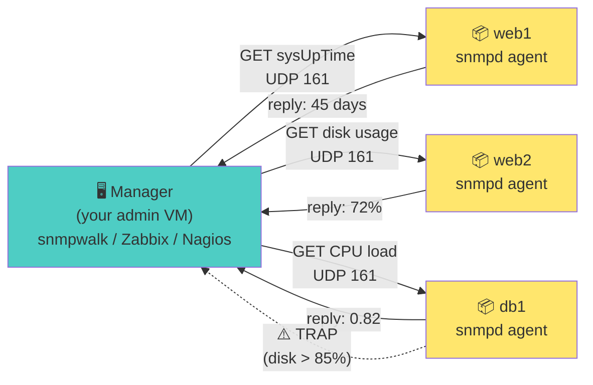
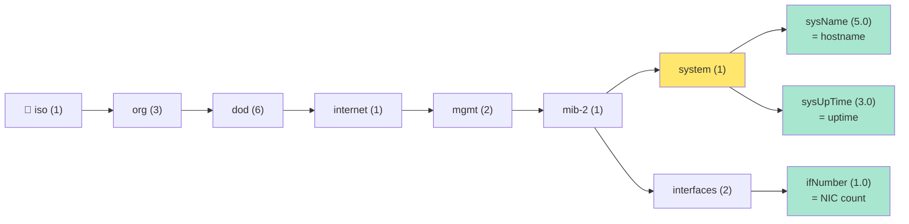

<a name="snmp-monitoring" id="snmp-monitoring"></a>

# 📡 SNMP for operators
## snmpd, MIBs, snmpwalk / snmpget (Day 3 - afternoon)

SNMP = **read numbers from servers** (CPU, disk, uptime…) + optional **traps** (alerts).

It is **not** a log tool - use **journalctl** for log lines.

---

# The problem without SNMP 😩

Imagine a rack with **50 Linux servers**.

Without SNMP you check each one **manually**:

- SSH into `web1` → run `df -h`
- SSH into `web2` → run `uptime`
- SSH into `db1` → run `free -m`
- Repeat… every hour… forever

You only notice a full disk **after** a service crashes.

---

# One protocol, many answers ✅

With SNMP each server runs an **agent** (`snmpd`).

Your monitoring tool asks the same questions to every machine:

```text
Monitoring server
      │
      ├──► web1   "How full is your disk?"
      ├──► web2   "What is your CPU load?"
      └──► db1    "How long since last reboot?"
```

Every agent replies with **numbers** - no SSH session needed.

---

# What the monitoring tool asks

Typical questions over SNMP:

- **How long have you been up?** (uptime)
- **What is your CPU load?**
- **How much disk space is left?**
- **Are your network interfaces up?**

The agent answers. Your NOC dashboard turns those answers into graphs and alerts.

---

# Concrete example 📊

Your monitoring server polls `web1.lab.local`:

| Question | SNMP answer |
|----------|-------------|
| Uptime | 45 days |
| CPU load (1 min) | 0.82 |
| Disk `/` used | 72 % |
| Interface `eth0` | up |

Rule: alert when disk **> 85 %** - you fix it **before** the crash.

Same workflow scales to 5 servers or 5 000.

---

# Dashboard analogy 🚗

**SNMP = the car dashboard for your servers.**

You do not open the engine to check speed - you glance at the dial:

- **Speedometer** → CPU load
- **Fuel gauge** → disk space
- **Engine temperature** → system health
- **Warning light** → SNMP **trap** (the server calls *you*)

SNMP gives structured readings. Logs tell the *story* - use both.

---

# Two roles: manager & agent



---

# Two roles: manager & agent (summary)

- **Agent** (`snmpd`) - listens and answers on **UDP 161**
- **Manager** - sends queries, collects replies, triggers alerts
- **Trap** - the agent calls *you* when something goes wrong (push, not pull)

You configure the agent on every monitored host; the manager lives on a jump box or monitoring VM.

---

# OIDs & MIBs - naming big numbers

Every metric has an address called an **OID** - a tree of dotted integers:



---

# MIB = the legend 📖

A **MIB** translates cryptic numbers into readable names:

```text
1.3.6.1.2.1.1.5.0  →  SNMPv2-MIB::sysName.0
1.3.6.1.2.1.1.3.0  →  SNMPv2-MIB::sysUpTime.0
```

Think of OID = street address, MIB = phone book that tells you who lives there.

Download vendor + IETF MIBs; configure `/etc/snmp/snmp.conf` with `mibs +ALL` for descriptive CLI output.

---

# Real Linux example 🐧

From your management VM:

```bash
snmpwalk -v2c -c public web1.lab.local system
```

---

# Reading the output

You get hostname, uptime, contact, location - a **quick health check** in one command.

Single metric? Use `snmpget` instead of walking the whole tree:

```bash
snmpget -v2c -c public web1.lab.local SNMPv2-MIB::sysUpTime.0
```

---

# Versions at a glance

| Ver | Notes |
|-----|------|
| **v2c** | Community strings = **shared password in cleartext** (OK in isolated lab) |
| **v3** | User + auth (`authPriv`) - use this anywhere near production |

In the lab: **set up v2c**, learn **MIB names**, then see a **short v3 example**.

---
layout: new-section
---

# 🧪 Live coding - Day 3 · SNMP

### Turn this VM into a **pollable server** - like Zabbix would, without Zabbix

**Agent** (`snmpd`) = dashboard sensor on the server  
**Manager** (you) = `snmpget` / `snmpwalk` from another host - here both roles on `127.0.0.1`

---

# Live lab - what you will prove ✅

By the end, **without SSH to read config files**, you will:

1. Run **`snmpd`** - the agent that answers on **UDP 161**
2. **Poll** it with `snmpget` / `snmpwalk` - same protocol as Centreon, Nagios, PRTG
3. **Read back** `sysContact` & `sysLocation` - strings **you** put in `snmpd.conf`

If step 3 works → this server is monitorable. Scale that to 500 machines: no manual `df -h` on each one.

---

# Same VM in the lab - why? 🤔

| | **Production** | **Lab (today)** |
|--|----------------|-----------------|
| Agent `snmpd` | on **web1**, **db1**… | on **your VM** |
| Manager | **Zabbix** on another server | **your terminal** → `127.0.0.1` |

**Not** reading a file with `cat` - `snmpget` sends **UDP to port 161**, `snmpd` answers.

The `rocommunity … 192.168.64.0/24` line is for a **real** remote poller (optional: try from your Mac).

---

# Step 1 - install agent + client tools

```bash
sudo apt install snmpd snmp snmp-mibs-downloader
# snmpd                = agent (runs on every monitored server)
# snmp                 = client tools (snmpget, snmpwalk)
# snmp-mibs-downloader = MIB dictionary for readable OID names
```

---

# Step 2 - configure the agent

```bash
sudo cp /etc/snmp/snmpd.conf /etc/snmp/snmpd.conf.bak
sudo nano /etc/snmp/snmpd.conf
```

Replace file content with:

```text
agentAddress udp:161
rocommunity training 127.0.0.1
rocommunity training 192.168.64.0/24
sysLocation Training VM
sysContact noc@lab.local
```

**`rocommunity`** = read-only password (v2c). **`sysContact` / `sysLocation`** = you will read these back via SNMP.

---

# Step 2 (continued) - start & verify

```bash
sudo systemctl enable --now snmpd
sudo systemctl restart snmpd
sudo ss -lunp | grep 161
```

**Expected:** `snmpd` listening on **UDP 161**. If `snmpwalk` times out later → check this first.

---

# Step 3 - poll with numeric OIDs (always works)

No MIB names needed - good for exams and broken clients:

```bash
snmpget -v2c -c training 127.0.0.1 1.3.6.1.2.1.1.5.0
snmpwalk -v2c -c training 127.0.0.1 1.3.6.1.2.1.1
```

**Expected:** hostname · uptime · **sysContact = noc@lab.local** · **sysLocation = Training VM**

---

# Step 4 - the MIB trap (readable names) 🪤

```bash
snmpwalk -v2c -c training 127.0.0.1 system
```

**Often fails:** *Unknown Object Identifier* - the **agent is fine**, the **client** has no MIB dictionary loaded.

---

# Step 4 (continued) - fix client MIB config

File: **`/etc/snmp/snmp.conf`** (client - not `snmpd.conf`)

```bash
sudo nano /etc/snmp/snmp.conf
# Comment out the line:  mibs :
# (that line disables ALL MIB loading on Ubuntu/Debian)
```

---

# Step 4 (continued) - readable names work

```bash
snmpwalk -v2c -c training 127.0.0.1 system
snmpget -v2c -c training 127.0.0.1 SNMPv2-MIB::sysName.0
snmpget -v2c -c training 127.0.0.1 SNMPv2-MIB::sysUpTime.0
```

**The proof:** `SNMPv2-MIB::sysContact.0 = noc@lab.local` - you never `cat` the file; SNMP served your config.

---

# Lab safety ⚠️

Never use community `public` in production · restrict `rocommunity` by source IP · firewall **UDP 161** · prefer **SNMPv3** outside the lab VLAN

---

# v3 glimpse (production)

Encrypted query - what you use once v2c leaves the lab:

```bash
snmpget -v3 -l authPriv -u monitor -a SHA -A 'AuthPass' -x AES -X 'PrivPass' \
  agent.lab.local SNMPv2-MIB::sysDescr.0
```

---
layout: new-section
---

# ✅ Live coding done - Day 3 · SNMP

**You built:** a server that answers monitoring questions on **UDP 161** - no SSH session needed

**Verify at home (concrete checks):**
- `sudo ss -lunp | grep 161` → snmpd listening
- `snmpget -v2c -c training 127.0.0.1 SNMPv2-MIB::sysName.0` → your hostname
- `snmpwalk -v2c -c training 127.0.0.1 system` → **`noc@lab.local`** & **`Training VM`**

**In a company:** Zabbix/Centreon run the same polls every 60 s - you just wired the agent side.

---

# SNMP - go deeper (optional reading) 📚

**Not for the exam - for production and self-study after the basics.**

| Topic | Why it matters | Read more |
|-------|----------------|-----------|
| **SNMPv3 / USM** | Users, auth + privacy - replace community strings | [Net-SNMP - SNMPv3 options](https://net-snmp.sourceforge.io/wiki/index.php/TUT:SNMPv3_Options) · [RFC 3414 (USM)](https://www.rfc-editor.org/rfc/rfc3414) |
| **VACM (access control)** | Restrict which OIDs each user/community may read | [Net-SNMP - VACM](https://net-snmp.sourceforge.io/wiki/index.php/Vacm) · [snmpd.conf(5)](https://www.net-snmp.org/docs/man/snmpd.conf.html) |
| **Traps & informs** | Agent pushes alerts (disk full, link down) to NMS | [Net-SNMP - traps](https://net-snmp.sourceforge.io/wiki/index.php/TUT:Configuring_Your_SNMP_Agent_(Traps%2C_etc)) · [snmptrapd(8)](https://linux.die.net/man/8/snmptrapd) |
| **Custom data (pass / extend)** | Expose app metrics via scripts | [Net-SNMP - pass_persist](https://net-snmp.sourceforge.io/wiki/index.php/TUT:Writing_a_Dynamically_Loadable_Object_that_Will_be_a_settable_OID) |

---

# SNMP - go deeper (continued) 📚

<div class="text-xs">

| Topic | Why it matters | Read more |
|-------|----------------|-----------|
| **SNMP over TLS/DTLS** | Encrypt polling outside legacy v2c | [Net-SNMP - TLS/DTLS](https://net-snmp.sourceforge.io/wiki/index.php/TLS) |
| **Agent config layout** | `includeDir`, split configs per host role | [snmpd.conf(5) - includeDir](https://www.net-snmp.org/docs/man/snmpd.conf.html) |
| **MIB loading & modules** | Load only what you need; faster walks | [snmp.conf(5)](https://linux.die.net/man/5/snmp.conf) · [Net-SNMP - MIBS](https://net-snmp.sourceforge.io/wiki/index.php/TUT:Using_MIBS) |
| **NMS integration** | Poll interval, templates, thresholds (Zabbix, LibreNMS, Prometheus snmp_exporter) | [Prometheus snmp_exporter](https://github.com/prometheus/snmp_exporter) |

**Upstream references:** [Net-SNMP wiki](https://net-snmp.sourceforge.io/wiki/) · [Net-SNMP tutorial](https://net-snmp.sourceforge.io/tutorial/)

**Rule of thumb:** master **v2c on localhost + one OID walk** first; move to **SNMPv3 authPriv + source-restricted VACM** before exposing UDP 161 beyond the lab.

</div>
