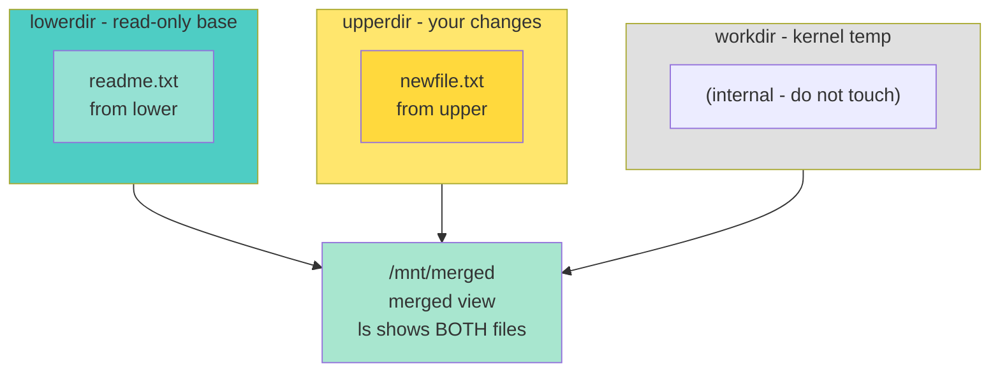
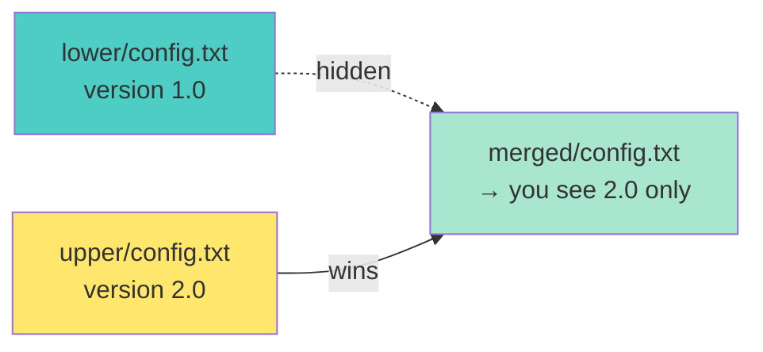

<a name="overlayfs-brief" id="overlayfs-brief"></a>

# overlayfs in 5 minutes
## How Docker stacks filesystem layers

**overlayfs** = three folders merged into one view:
- **lower** = read-only base
- **upper** = your changes (read-write)
- **work** = temp folder (required by the kernel)

What you `ls` is the **merged** view - used by **containers** and read-only roots.

---

# How the layers stack 🧱



**Live result:** `ls /mnt/merged` → `readme.txt` (from lower) + `newfile.txt` (from upper).

---

# Hide rule - upper wins 🎭



Same filename in **upper** and **lower** → the merged view shows **upper** only. Lower is unchanged.

---

# Vocabulary

| Layer | Role |
|-------|------|
| `lowerdir` | Base image (read-only) |
| `upperdir` | New and changed files |
| `workdir` | Kernel temp (same disk as upper) |
| merged mount | What you see in `/mnt/merged` |

If a file is in **upper**, it hides the same name in **lower**.

---
layout: new-section
---

# 🧪 Live coding - overlayfs

### Manual mount - lower, upper, work, merged on the VM

---

# Manual mount example

```bash
sudo mkdir -p /mnt/{lower,upper,work,merged}
sudo mount -t overlay overlay \
  -o lowerdir=/mnt/lower,upperdir=/mnt/upper,workdir=/mnt/work \
  /mnt/merged
```

Check: `findmnt /mnt/merged`

---

# /etc/fstab pattern

```ini
overlay /srv/app   overlay   lowerdir=/var/lib/app/ro,upperdir=/var/lib/app/rw,workdir=/var/lib/app/work  0 0
```

**Note:** `upper` and `work` must be on a normal Linux filesystem (often **ext4**).

---

# Why it is in the program

- **Docker** layers = overlayfs stacks.
- To debug a container: know **lower vs upper**.
- File changes live in **upper**, not in the base image.

---

# Quick checks

```bash
mount | grep overlay
ls /mnt/merged
findmnt /mnt/merged
```

**Live demo on VM:** `mkdir` lower + upper, `mount -t overlay`, check merged view at `/mnt/merged`.

---
layout: new-section
---

# ✅ Live coding done - overlayfs

**You built on the VM:** lower + upper + work dirs · overlay mount · merged view

**Verify at home:** `findmnt /mnt/merged` → type `overlay` · both files visible in merged

**Next:** Module 4 - Security & AppArmor

---

# Next step 🎯

**Module 4 - Security & AppArmor**
